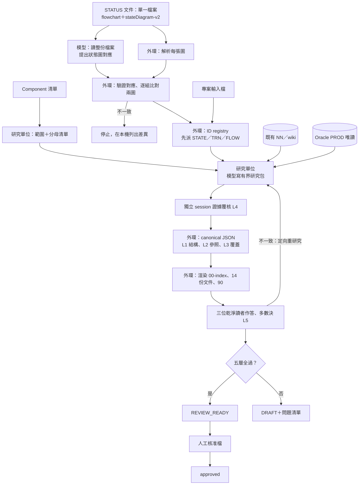
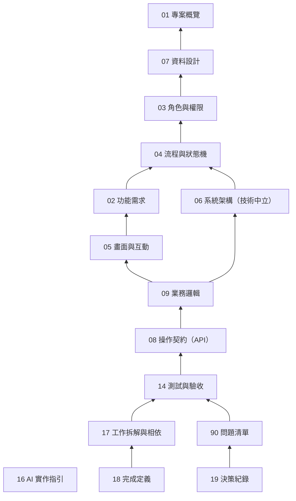

# AI 產生規格的文件契約框架——設計提案（issue #37）

> **狀態**：設計提案，待團隊審查。只定文件契約與流程，不含實作；實作另開 issue（§16）。
> **基準**：`main` @ `baae9f9`；分支 `claude/brave-dirac-4q469u`；2026-10-08。
> **範例**：全部是合成資料（`TW_DEMO_*`、狀態碼 010～090、人員 E1001 等），不含公司內容。
> **附件**：
> - [14 類文件型別定義（欄位級）](spec-schema-framework/types.md)
> - [貫穿範例：申請／審核](spec-schema-framework/walkthrough.md)
> - [JSON Schema 草案](spec-schema-framework/schemas/)
> - [範例資料與渲染樣張](spec-schema-framework/examples/)

---

## 0. 摘要

- **輸出改成分檔**：每個 job 產出 `00-index.md`、14 份文件與 `90-questions.md`。每份都由外環從 canonical JSON 產生，不再產生單一大檔。
- **模型只寫有界的研究包**：ID、反向追溯、文件狀態、檢核結果、Markdown 全部由外環確定性產生。模型不寫 canonical，也不寫 Markdown。
- **STATUS 文件是權威**：狀態與轉移以使用者提供的 Mermaid flowchart 與 stateDiagram-v2 為準，全部寫在同一份檔案。模型直接讀整份檔案，判斷每張圖屬於哪個狀態實體（主業務、子業務）；外環另外解析每張圖並驗證這份對應，解析出的狀態與轉移就是 04 文件的分母。程式或資料有、但圖上沒有的狀態與轉移，只列入問題清單並分級。
- **子業務守門與狀態活動**：子業務用畫法一畫在主業務的狀態裡（複合狀態加 `--` 平行區塊）。離開這個狀態的守門轉移，條件要逐項寫出每個區塊「每一列都到終點、一列都沒有時算不算」，以及每個要系統檢查的活動。狀態圖上描述「這個階段誰該做什麼」的文字是狀態活動，每一行都要處置。
- **原生未使用分支**：條件不是狀態碼的程式分支，能用 PROD 資料、設定值或範圍外情境證明永不執行的，不寫進規格本體，只列問題清單並附證明；證明不了的照常保留。
- **參照只准指向上游**：反向追溯與追溯矩陣由外環計算。腳本已驗證 15 種文件的相依關係沒有循環。
- **條件必須結構化**：條件只能由欄位、衍生概念、狀態、角色、常數組成。「長官」這類概念必須在 07 定義成一筆衍生概念（DRV），寫明從哪張表、哪一欄、取哪個有效日、查不到時怎麼辦。像「需要長官審核」這種寫法因此寫不進規格。
- **五層檢核**：L1 結構、L2 參照、L3 覆蓋、L4 證據覆核、L5 乾淨讀者認知一致。L5 由三個乾淨 session 只讀交付文件各自作答，以多數決判定，用來抓幻覺與過度簡略。五層全過才是 REVIEW_READY；approved 只能由人寫入核准檔。
- **技術中立**：規格不寫技術選型。06 只寫舊系統的邏輯架構，08 只寫業務操作契約。
- **範圍**：只做 Claude Code 版，目標模型 Sonnet 5。
- **已驗證的部分**（設計期用原型腳本執行；腳本沒有放進 repo）：
  - 17 份 JSON Schema 草案通過 2020-12 元驗證。
  - 合成範例共 154 個項目、15 份文件，全部通過 schema 驗證。
  - L1～L3 檢核腳本在範例上恰好抓到故意留下的兩條測試缺口。
  - 畫法一守門的第二個合成範例（案件、文件審查、付款，57 個項目）通過 schema、C01、R13 與守門的 C02、C07。
  - 對兩個範例做 18 種刻意破壞（缺欄位、把條件寫成「需要長官審核」、填充字、未標示推論、缺引用、圖外轉移、原生分支寫回正文、守門漏掉區塊或活動、沒寫 whenEmpty、狀態描述沒處置等），全部被對應的檢核擋下。
  - 範例資料、渲染樣張與本文件的表格都由同一份 schema 產生，重建結果可重現。

## 1. 前提與已定案事項

| # | 決定 | 來源 |
|---|---|---|
| D1 | 只做 Claude Code 版，目標模型 Sonnet 5；OpenCode 版維持現行 spec 流程不動 | 管理者 |
| D2 | 輸出改為 00-index＋14 份文件＋90 問題清單，不保留單一大檔 | 管理者 |
| D3 | 入口不變：使用者指定一個或多個核心 Component。範圍沿用 CORE／DEPENDENCY／EXCLUDED 與原生欄位無用判定（clone-contract） | 現行流程 |
| D4 | STATUS 流程文件是權威。提供 Mermaid flowchart（邊標籤＝情境類型）與 stateDiagram-v2（無邊標籤、較複雜），節點含狀態碼；兩圖都完整、語法合法 | 管理者 |
| D5 | 狀態圖沒有、但程式或資料有的狀態與轉移，不進主文件，只列問題清單 | 管理者 |
| D6 | Playwright 與實機比對不在本設計範圍 | 管理者 |
| D7 | 除防止模型宣稱完成外，另由不同的乾淨 agent 解讀文件、比對認知是否一致 | 管理者 |
| D8 | 技術選型屬實作者範疇，規格不寫 | 管理者 |
| D9 | 專案目標用輸入檔；「利害關係人」改為選填的決策責任，只寫職稱或單位類別 | 管理者 |
| D10 | 17、18 在 Spec 端只產確定性骨架，重建端再細化 | 管理者 |
| D11 | 完成與否只由外環判定；approved 只能由人寫入 | 現行原則延伸 |
| D12 | canonical 用 JSON。原因：PS 5.1 內建 `ConvertFrom-Json`，但沒有 YAML parser，也沒有 `Test-Json`；公司網路又擋模組下載 | 環境限制 |
| D13 | 所有狀態圖寫在同一份檔案，由模型直接讀檔判斷每張圖屬於哪個狀態實體；不另填配對表 | 管理者 |
| D14 | 狀態碼是三位數字字元，含前導 0（例：010、015、020） | 管理者 |
| D15 | 乾淨讀者 3 位、最多 2 輪，以多數決判定 | 管理者 |
| D16 | 主業務等子業務的守門用畫法一表示：主業務狀態畫成複合狀態，內含以 `--` 分隔的平行區塊，每個區塊是一個子業務 | 管理者 |
| D17 | 狀態圖上的活動（activity）是描述「這個階段誰該做什麼」的業務行為 | 管理者 |
| D18 | 非狀態的原生分支比照圖外處理：證明永不執行的只進問題清單，證明不了的保留（判斷方法見 §8.8） | 管理者 |

## 2. 整體架構



三個原則：

1. **研究單位不等於文件**：模型在一個研究單位（Component × 研究主題 × 頁）寫一份研究包，文件是外環的投影。同一份研究包的內容可能出現在好幾份文件，例如轉移的寫入欄位，在 04 是轉移明細，在 07 是欄位的反查。
2. **能確定性的不靠模型**：ID、分母、參照驗證、反查、文件狀態、Mermaid 圖、Markdown 都由外環計算。
3. **Markdown 不是第二份真相**：不在產出的 Markdown 上人工修稿。人的內容只經三個輸入進來：專案輸入檔、裁決檔、核准檔（§3）。

各方分工：

| 工作 | 模型 | 外環（確定性） | 人 |
|---|---|---|---|
| 研究事實、寫研究包 | ✓ | 驗收格式、圍欄 | |
| 派 ID、合併、反查 | | ✓ | |
| 狀態圖對應（哪張圖屬於哪個狀態實體） | 讀整份檔案提出對應 | 驗證：每張圖恰用一次、同組兩張圖一致 | 提供 STATUS 文件 |
| 分母（狀態圖、metadata 清單） | 轉抄固定查詢的結果 | 解析、比對、計數、SQL 指紋 | |
| 證據覆核（L4） | 獨立 session | 驗收覆核結果的格式 | |
| 認知一致（L5） | 三個乾淨 session 各自作答 | 出題、比對、多數決、回饋 | |
| 渲染 | | ✓ | |
| 決策、核准 | | 轉成 19 的決策與核准紀錄 | ✓ |

## 3. 輸入契約

所有輸入都放在 `.ps-private/spec/<job>/`。這個目錄已 gitignore，不進任何 git，也不推外部 remote。

### 3.1 Component 清單

沿用 ps-spec-author 的輸入規則：確切名稱、1～60 字元、只准英數、底線、`.`、`$`、`#`、`-`。清單決定 job 身分；同一份清單重送就是續跑。

### 3.2 STATUS 文件（權威）

- **一份檔案**：所有狀態圖寫在同一份 Markdown 檔（`.ps-private/spec/<job>/status.md`）。檔內可以有好幾個狀態實體（例如主業務與子業務），每個實體一組圖（只畫在主業務平行區塊內的子業務例外，§8.7）：
  - 一張 flowchart，每條邊的標籤是情境類型。
  - 一張 stateDiagram-v2，沒有邊標籤。
  - 兩張都完整、語法合法，不另做語法驗證。
- **狀態碼**：節點文字裡獨立的三位數字字元，含前導 0（例：010、015、020）。一律當文字比對，`'020'` 不等於數字 20。同一個節點文字若還有其他三位數字（例如金額門檻），取第一個。
- **虛擬節點**：不是狀態的節點，包括 flowchart 的菱形判斷、stateDiagram 的 choice／fork／join、`[*]`。
- **由模型讀檔判斷對應**：第 0 階段，模型直接讀整份檔案，寫一份「狀態圖對應」研究包：
  - 每張圖屬於哪個狀態實體（給一個大寫代號），哪一張 flowchart 與哪一張 stateDiagram 是同一組。
  - 實體之間的關係：主業務與子業務；畫法一的每個平行區塊屬於哪個子業務實體。
  - 每個實體保存狀態碼的 Record.Field。
- **狀態描述與 note**：寫的是這個階段誰該做什麼（狀態活動）。外環逐行列出，04 每一行都要處置（§8.7）。
- **外環驗證對應**（§8.3）：每張圖恰好用一次；同一組的兩張圖，狀態碼與轉移完全一致；狀態欄位的值域包含圖上每個狀態碼（R07）。分母一律取外環解析的結果，不取模型的轉述：模型讀複雜的圖可能漏一條邊，解析器不會。
- **缺 STATUS 文件**：第一次執行時建立輸入檔骨架並停止，不進研究。結論碼在實作 issue 定義。
- 解析與權威規則見 §8。

### 3.3 專案輸入檔 `project.md`

固定標題與表格，範例見 [walkthrough/input/project.md](spec-schema-framework/examples/walkthrough/input/project.md)。

| 章節 | 欄位 | 必填 | 用途 |
|---|---|---|---|
| 目標 | 目標｜成功標準 | 否：缺少時標示 NOT_PROVIDED，開一筆 INFO 問題 | 01 的 GOAL |
| 決策責任 | 範圍（SPEC_APPROVAL、QUESTION_RESOLUTION、BUSINESS_RULE_OWNER、DATA_OWNER、OTHER）｜職稱或單位類別 | 否 | 01 的 RESP；90 與 19 的裁決對象 |

不寫人名，也不寫技術選型。原本的「利害關係人」只保留決策責任：使用者類型已由 03 從程式研究出來；真正需要人提供的，只有問題卡住時該找誰。

### 3.4 既有知識與 Oracle

- **既有知識**：照知識檢索契約，以知識索引定位 NN／wiki。
- **PROD 唯讀查詢**有三個用途：
  - 原生欄位無用判定（沿用 clone-contract）。
  - 狀態欄位的 distinct 值，用於圖外狀態分級（§8.6）。
  - 分母清單：頁面欄位、Record 欄位、核心 PeopleCode 程式。
- 分母查詢用固定 SQL 樣板，外環比對 SQL 指紋；模型只轉抄結果列（§10.7 說明這個信任邊界）。

### 3.5 人工裁決檔與核准檔

| 檔案 | 欄位 | 外環的處理 |
|---|---|---|
| `decisions.md` | 問題 ID｜決定｜理由｜效果（NO_CHANGE、DROP、ADD_SCOPE、ACCEPT_GAP、AMEND_INPUT）｜決定者類別｜日期 | 轉成 19 的 DEC，對應的 Q 標成 ANSWERED 或 ACCEPTED_AS_GAP；ADD_SCOPE 會排新的研究 |
| `approvals.md` | 文件｜版本｜docHash 前 12 碼｜核准者類別｜日期 | docHash 對上本版文件才成立；文件內容改了就失效（§5.8） |

這兩個檔只有人寫，模型與外環都不寫。

## 4. 文件目錄（Document Catalog）

| 檔案 | 文件 | 目的 | 不寫什麼 | 項目型別 | 主要來源 | 產生方式 |
|---|---|---|---|---|---|---|
| `00-index.md` | 索引 | 閱讀順序、ID 前綴對照、各文件狀態與檢核、追溯矩陣、問題摘要、欄位統計 | 規格內容 | — | 外環計算 | 計算 |
| `01-overview.md` | 專案概覽 | 重建範圍、目標、決策責任 | 技術選型、細部規則 | GOAL、RESP、OBJ | 專案輸入、範圍研究 | 輸入＋研究 |
| `02-functional-requirements.md` | 功能需求 | 每一個使用者可執行的業務操作 | 畫面與條件細節 | FR | 04 的轉移與情境、Component 入口 | 模型推導 |
| `03-roles-permissions.md` | 角色與權限 | 角色、取得方式、元件權限、資料範圍、無權效果 | 誰能做某個轉移（寫在 04） | ROLE、PERM | security 研究 | 研究 |
| `04-workflow.md` | 流程與狀態機 | 狀態、轉移（觸發、操作者、守衛、寫入、實作位置；守門轉移）、情境、狀態活動（這個階段誰該做什麼） | 圖外狀態與轉移（進 90） | STATE、TRN、FLOW、ACT | STATUS 文件＋程式研究 | 權威＋研究 |
| `05-ui.md` | 畫面與互動 | 畫面、區塊、元件、綁定、顯示與可編輯條件、選項 | 會拒絕或寫資料的邏輯（寫在 09） | UI | ui 研究、metadata | 研究 |
| `06-architecture.md` | 系統架構（技術中立） | 舊系統元件地圖、介面與批次、資料流 | 技術選型、新系統模組切分 | IF＋投影視圖 | interfaces 研究 | 研究＋投影 |
| `07-database.md` | 資料設計 | 實體、欄位、值域、鍵、有效日、衍生概念、不建置欄位 | 畫面呈現、規則 | ENT、FLD、DRV、XF | data 研究、欄位判定 | 研究 |
| `08-api.md` | 操作契約（API） | 每個業務操作的輸入、輸出、授權、檢核順序、效果、交易語意 | HTTP 方法、路徑、資料格式 | OP | 02、04、09 推導＋交易研究 | 模型推導 |
| `09-business-logic.md` | 業務邏輯 | 檢核、計算、預設、副作用規則、訊息原文、PeopleCode 程式處置 | 轉移守衛（04）、畫面顯示條件（05） | MSG、BR | rules 研究 | 研究 |
| `14-testing.md` | 測試與驗收 | 正例、反例、邊界、端到端案例 | 執行結果（本設計不實跑） | TC | 02、04、05、08、09 推導 | 模型推導 |
| `16-ai-instructions.md` | AI 實作指引 | 給重建端 AI 的固定條款 | 個案內容 | AI | 框架模板 | 模板 |
| `17-tasks.md` | 工作拆解與相依 | 基礎工作＋每個 FR 一個垂直切片、順序、相依 | 進度與估時（重建端） | TASK | 外環反查 | 計算 |
| `18-definition-of-done.md` | 完成定義 | 全域與每個工作的完成條件、要交的證據 | 完成狀態（重建端） | DOD | 外環反查 | 計算 |
| `19-decision-log.md` | 決策紀錄 | 人對問題的裁決、選項、理由、影響 | 模型自己的決定 | DEC | 人工裁決檔 | 人工 |
| `90-questions.md` | 問題清單 | 圖外狀態與轉移（分級）、原生未使用分支（附證明）、找不到實作的轉移、缺口、讀者不一致、範圍候選、輸入缺漏 | — | Q | 外環彙整 | 計算 |

- **對齊原編號**：01～09、14、16～19 沿用原本的文件編號。
- **兩個不在 14 份內的檔**：
  - 00 是導覽。拆成 14 份後，讀者需要一張地圖：看到 `BR-012` 要知道去 09 找定義。
  - 90 是問題清單。D5 要求圖外內容不進主文件；19 只放人的決策。
- **每個項目末尾都有「被引用」**：列出引用它的項目，由外環反查。每份文件開頭列出影響它的未解問題。

## 5. Layer A：共同 Schema

### 5.1 兩層資料：研究包與 canonical

**研究包（packet）**是模型寫的 JSON，一個研究單位一份。

- 項目沒有 `id`，只有 `key`（自然鍵，格式見 §7.1）。
- 引用上游時，填工單「可引用清單」給的 ID。
- 需要一個還不存在的上游概念時（例如新的衍生概念），在 `requests` 提出；外環建立 PENDING 項目並排研究（§7.7）。
- 工單列出本頁必須處置的**分母鍵**，例如分到這一頁的轉移、頁面欄位、程式。每個鍵要嘛寫成項目，要嘛列入缺口，一個都不能漏，這點與現行規則相同。

**canonical** 是外環產生的 JSON，每種文件一份，格式由 `schemas/` 定義。

- 外環把通過覆核的研究包合併、派 ID、反查，再計算外殼欄位。
- 模型從不寫 canonical。

### 5.2 文件外殼（全部由外環計算）

| 欄位 | 說明 |
|---|---|
| `schemaVersion` | 目前 `1.0`；schema 改版時遞增 |
| `docType` | 15 種之一（`01-overview` … `90-questions`） |
| `docId`、`jobId`、`revision` | `<jobId>/<編號>`、`clone-<16 碼>`、`r<4 碼>` |
| `status` | `draft`、`in_review`、`approved`、`superseded`（§5.8） |
| `title`、`summary` | 固定標題；摘要是各類項目的計數加未解問題數，不是模型寫的文字 |
| `components` | 本 job 的 Component 清單 |
| `dependsOn` | 本文件項目實際引用到的文件 |
| `sources` | 來源指紋：STATUS_DOC、PROJECT_INPUT、HUMAN_DECISION、KNOWLEDGE、RESEARCH_RECEIPT、FRAMEWORK |
| `gate` | L1～L5，各為 `PASS`、`FAIL`、`NOT_RUN` 或 `NOT_APPLICABLE` |
| `openQuestions` | 影響本文件項目的未解問題（由 90 反查） |
| `approval` | 只在 approved 時出現：核准者類別、日期、docHash |
| `items` | 本文件的項目 |

01、04、09、90 另有外殼欄位，見 types.md。

### 5.3 項目共同欄位

| 欄位 | 誰寫 | 說明 |
|---|---|---|
| `id` | 外環 | `<前綴>-<序號>`，由 ID registry 派發（§7.2） |
| `key` | 模型 | 自然鍵，格式依型別固定 |
| `lifecycle` | 外環 | `ACTIVE`、`PENDING`（已派號、待研究）、`RETIRED`（自然鍵已消失） |
| `component` | 模型 | 選填：項目屬於哪個 Component |
| `basis` | 模型或外環 | 事實來自哪裡（§5.5） |
| `certainty` | 模型 | `CONFIRMED` 或 `INFERRED` |
| `inference` | 模型 | `INFERRED` 時必填：推論鏈 |
| `evidence` | 模型 | 證據 ID；需要證據的來源至少一筆 |
| `derivedFrom` | 模型 | `basis＝DERIVED` 時必填：從哪些項目推導 |

### 5.4 值的三態與禁用的填充字

- **三態**：每個欄位的值只能是下面三種之一。
  - 具體值。
  - **NOT_APPLICABLE**：`{"na": "理由", "evidence": [...]}`。表示經查證「沒有」。主張某個行為不存在時要附證據。
  - **UNRESOLVED**：`{"unresolved": "Q-012"}`。查不清，必須指向 90 的問題。研究包內寫成缺口說明，由外環轉成 Q。
- **允許哪幾態**：寫在 types.md 型別欄的「｜NA」「｜UNRESOLVED」；沒標的欄位只能是具體值。
- **禁用填充字**：敘述欄（`text` 型別）不能是空白，也不能是 `UNKNOWN`、`TODO`、`N/A`、`待確認`、`同上`、`見 NN` 這類字樣，schema 直接擋下。原文欄（`rawText`：技術名、原始訊息、畫面文字、狀態圖標籤）不做這項檢查。
- **選填欄位**：不出現表示「沒有這項資訊要表達」，不能拿來規避必填。

### 5.5 事實、推論、假設、待釐清的標示

| 類別 | 表示方式 | 規則 |
|---|---|---|
| 已確認事實 | `certainty＝CONFIRMED`＋`evidence` | 證據可解引用（L1 S04） |
| 推論 | `certainty＝INFERRED`＋`inference` | 覆核必看；讀者問卷會針對它出題 |
| 假設 | 不允許出現在規格本體 | 改開 Q；研究端的猜測只能寫在 Q 的 `proposedAnswer` |
| 待釐清 | 欄位值為 UNRESOLVED（指向 Q） | BLOCKING 的 Q 會擋住 REVIEW_READY |
| 不適用 | NOT_APPLICABLE＋理由；主張不存在時另附證據 | 不是待辦 |
| 人工未提供 | `projectInputStatus＝NOT_PROVIDED` | 只開 INFO 問題，不擋研究 |

`basis` 的值域：

| 值 | 意義 | 證據 |
|---|---|---|
| `AUTHORITATIVE_DOC` | STATUS 文件 | 必附 STATUS_DOC 行號 |
| `CODE`、`DATA`、`METADATA`、`KNOWLEDGE` | 程式、PROD 資料、metadata、已稽核的 NN／wiki | 必附 |
| `PROJECT_INPUT`、`HUMAN_DECISION` | 專案輸入檔、裁決檔 | 必附行號 |
| `DERIVED` | 模型從其他項目推導（例如 FR、OP、TC） | 必附 `derivedFrom` |
| `COMPUTED`、`TEMPLATE` | 外環計算（17、18、90）、框架模板（16） | 不需要 |

### 5.6 條件式

條件不寫成句子，而是寫成結構。這樣條件可以被機器比對，也能確定每個運算元都有定義。

```json
{"all": [
  {"left": {"ctx": "CURRENT_USER_OPRID"}, "op": "HAS_ROLE", "right": {"role": "ROLE-001"}},
  {"left": {"drv": "DRV-002"}, "op": "EQ", "right": {"ctx": "CURRENT_USER_EMPLID"}}
]}
```

外環渲染成：「（目前使用者帳號 具有角色 ROLE-001（審核主管））且（〈申請人的直屬主管〉（DRV-002） ＝ 目前使用者員工編號）」。

**組成**

- **組合子**：`all`、`any`、`not`。無條件寫 `"ALWAYS"`。
- **運算元**：
  - `fld`（欄位 ID）、`drv`（衍生概念 ID）。
  - `state`（狀態 ID，代表它的儲存碼）、`role`（角色 ID）。
  - `act`（狀態活動 ID）：只能放在左邊，搭配 `DONE` 或 `NOT_DONE`，意思是該活動的完成條件成立或不成立。
  - `const`（值＋型別）。
  - `ctx`：目前使用者帳號或員工編號、系統日期或時間、目前模式或動作。
  - `param`：操作或衍生概念的輸入參數。
- **運算子**：
  - 二元：`EQ`、`NE`、`GT`、`GE`、`LT`、`LE`、`IN`、`NOT_IN`、`BETWEEN`、`HAS_ROLE`。
  - 一元：`IS_BLANK`、`IS_NOT_BLANK`、`EXISTS`、`NOT_EXISTS`、`CHANGED`；活動專用的 `DONE`、`NOT_DONE`。
- **逐列條件**：對子資料逐列判斷，用在守門（§8.7）。範例取自 walkthrough §9：

  ```json
  {"rows": "ENT-002", "quantifier": "ALL",
   "where": {"left": {"fld": "FLD-007"}, "op": "EQ", "right": {"state": "STATE-002"}},
   "whenEmpty": "NOT_MET"}
  ```

  - `rows` 是子實體；判斷範圍是以 07 的 `parent` 鍵對應、連到「這一筆」的那些列。
  - `quantifier`：`ALL`（每一列都符合）、`ANY`（至少一列）、`NONE`（沒有任何一列）、`COUNT`（符合的列數，附 `count`）。
  - `ALL` 與 `NONE` 必須寫 `whenEmpty`：一列都沒有時算成立（MET）還是不成立（NOT_MET）。「全部完成」最常漏講的就是這一句，schema 直接擋。
- **父子欄位**：子資料的條件裡出現父實體的欄位時，指的是以 `parent` 鍵對應到的那一筆父資料。

**兩種條件**

- `condition` 可以用 `state`、`role`、`act` 與逐列條件。
- `dataCondition` 只能用 `fld`、`drv`、`const`、`ctx`、`param`。給 07 與 03 使用，避免它們往下游引用 04（§7.3）。

**空白語意（實作者照做）**

- `IS_BLANK`：字元欄為 NULL 或單一空白。
- 數值欄未輸入時存 0，用 `EQ 0` 判斷。
- 日期欄未輸入時為 NULL。

**為什麼要結構化**：運算元只能是 ID、常數或情境值，所以「長官」不可能以一個詞出現在條件裡，只能是一筆 07 的 DRV。DRV 必填查找規則（來源實體、串接、篩選、有效日、取值欄位）、查無結果時的行為、多筆時的取法。「需要長官審核」的問題在這一層被擋掉，語意上是否夠清楚則交給 L5 讀者。

### 5.7 證據

證據登錄在 `evidence.json`（`schemas/evidence.schema.json`），項目以 ID 引用。

| 種類 | 定位格式 | 規則 |
|---|---|---|
| `CHUNK` | 完整 UUID | 必須已用 PeoplecodeSource 取回精確段落（沿用現行規則） |
| `SQL` | 實際執行的 SELECT | 只准 SELECT 或 WITH；不得以分號串接 |
| `METADATA_RECEIPT` | 分母收據位置 | 固定樣板查詢的結果 |
| `NN`、`WIKI`、`STATUS_DOC`、`PROJECT_INPUT`、`HUMAN_DECISION` | `<檔>#L<行>` 或 `#L<起>-L<迄>` | — |

每筆證據的摘錄最多 5 行。證據 ID 以版本為範圍。

### 5.8 生命週期、版本與核准

**文件狀態**

| 狀態 | 條件 |
|---|---|
| `draft` | 任一適用的檢核層不是 PASS，或有影響本文件的 BLOCKING 問題 |
| `in_review` | 適用的檢核層全為 PASS（＝現行 REVIEW_READY 的文件層級） |
| `approved` | `approvals.md` 有一筆紀錄，對上本版本文件的 docHash |
| `superseded` | 已有較新的版本；舊版本的產出保留不刪 |

**job 狀態**：沿用現行的 DRAFT、BLOCKED、STALE、REVIEW_READY，另加 APPROVED（14 份全部 approved）。

**版本規則**

- **何時產生新版本**：任一來源指紋改變時（STATUS 文件、專案輸入、裁決檔、框架檔、NN），或使用者要求重新查證。舊版本的產出不可覆寫。
- **docHash**：canonical 文件正規化後的 sha256，不含 `status`、`gate`、`approval`、`revision`。
- **核准延續**：新版本中 docHash 沒變的文件維持 approved。內容有變的文件回到 in_review，00-index 列出項目層級的差異（ADDED、CHANGED、RETIRED）與受影響項目（§7.6）。

## 6. Layer B：文件型別摘要

欄位級定義、最小合法項目、完整性與審查準則見 [types.md](spec-schema-framework/types.md)。重點如下：

| 文件 | 必要內容重點 | 完整性準則（檢核代碼見 §10） |
|---|---|---|
| 01 | 範圍物件的分類、使用鏈、使用條件、理由；Record 的原生欄位判定結論 | C06；EXCLUDED 必有理由 |
| 02 | FR 種類、入口與模式、操作者、實現的轉移、前置條件、結果 | C02、C07、C08、R09 |
| 03 | 角色取得方式；權限：主體、資源、動作、資料範圍、無權效果、檢查位置 | R12 |
| 04 | 狀態碼與綁定欄位；轉移的觸發、操作者、守衛、寫入、實作位置、重入；平行區塊與守門轉移；狀態活動與狀態圖文字的處置；情境步驟 | C01、C02、R06、R07、R13 |
| 05 | 畫面的區塊與層級；元件的綁定、顯示與可編輯條件、選項、值來源 | C03、R05 |
| 06 | 介面的方向、觸發、讀寫欄位、參數、格式、錯誤處理、重送 | 覆核 |
| 07 | 實體的儲存型態、鍵、有效日；欄位的型別、值域、鍵屬性、敏感分類；DRV 的查找規則；不建置欄位 | C04、R07、R08 |
| 08 | 輸入、輸出、授權、前置條件、檢核順序、效果、交易五項 | C08、R11 |
| 09 | 規則的觸發、條件、動作、順序、邊界、模式差異、實作位置；訊息原文；程式處置（含原生未使用分支） | C05、R10、R14 |
| 14 | 類型、覆蓋項目、前置（合成資料）、步驟、預期、核對方式 | C07 |
| 16 | 固定條款 | — |
| 17 | 切片成員、順序、相依、交付物 | C10 |
| 18 | 完成條件與要交的證據 | C10 |
| 19 | 背景、選項、決定、理由、決策者類別、日期、效果 | schema |
| 90 | 類別、嚴重度、圖外分級與觀察值、原生未使用分支的證明、受影響項目、狀態 | schema、R14 |

## 7. Layer C：ID、參照與追溯

### 7.1 ID 前綴與自然鍵

層級數字越小越上游；跨文件參照只能指向層級更低者（§7.3）。

| 前綴 | 項目 | 定義所在 | 層級 | 自然鍵 |
|---|---|---|---|---|
| `GOAL` | 專案目標 | 01 專案概覽 | 0 | `GOAL:<序號>` |
| `OBJ` | 舊系統物件 | 01 專案概覽 | 0 | `<物件型別>:<原名>` |
| `RESP` | 決策責任 | 01 專案概覽 | 0 | `RESP:<範圍>` |
| `AI` | AI 指引條款 | 16 AI 實作指引 | 0 | `AI:<序號>` |
| `DRV` | 衍生概念 | 07 資料設計 | 1 | `<代號>` |
| `ENT` | 資料實體 | 07 資料設計 | 1 | `<Record 原名>` |
| `FLD` | 資料欄位 | 07 資料設計 | 1 | `<Record>.<欄位>` |
| `XF` | 不建置原生欄位 | 07 資料設計 | 1 | `<Record 原名>` |
| `PERM` | 權限 | 03 角色與權限 | 2 | `<主體鍵>><資源鍵>` |
| `ROLE` | 角色 | 03 角色與權限 | 2 | `<主體型別>:<原名>` |
| `ACT` | 狀態活動 | 04 流程與狀態機 | 3 | `<狀態實體>:<狀態碼>:<兩碼序號>` |
| `FLOW` | 情境流程 | 04 流程與狀態機 | 3 | `<狀態實體>:<情境類型原文>` |
| `STATE` | 狀態 | 04 流程與狀態機 | 3 | `<狀態實體>:<狀態碼>` |
| `TRN` | 狀態轉移 | 04 流程與狀態機 | 3 | `<狀態實體>:<起>><迄>（新建的起點寫 *）` |
| `IF` | 介面／批次 | 06 系統架構（技術中立） | 4 | `<物件型別>:<原名>` |
| `FR` | 功能需求 | 02 功能需求 | 5 | `<Component>:<操作代號>` |
| `UI` | 畫面／元件 | 05 畫面與互動 | 6 | `<Component>.<Page>[.<Record>.<欄位>]` |
| `BR` | 業務規則 | 09 業務邏輯 | 7 | `<實作位置>:<規則代號>` |
| `MSG` | 訊息 | 09 業務邏輯 | 7 | `<訊息集>,<編號>｜TEXT:<雜湊>` |
| `OP` | 操作契約 | 08 操作契約（API） | 8 | `<FR 鍵>:<操作代號>` |
| `TC` | 測試案例 | 14 測試與驗收 | 9 | `<FR 鍵>:<類型>:<代號>` |
| `TASK` | 工作項 | 17 工作拆解與相依 | 10 | `FOUNDATION:<代號>｜SLICE:<FR 鍵>` |
| `DOD` | 完成條件 | 18 完成定義 | 11 | `GLOBAL:<代號>｜TASK:<工作鍵>` |
| `Q` | 問題 | 90 問題清單 | 12 | `<類別>:<自然鍵>` |
| `DEC` | 決策 | 19 決策紀錄 | 13 | `DEC:<四位序號>` |

### 7.2 ID registry

ID 由外環依自然鍵派發，每個 job 一份 registry。

- **首次派發**：同一批新出現的自然鍵，依字元碼順序排序後給號，所以結果是確定的。順序不等於業務順序；17 另有 `order` 欄。
- **穩定**：同一個自然鍵在之後每個版本都拿到同一個 ID。名稱、說明、欄位內容改了，ID 都不變。
- **作廢**：新版本中自然鍵消失時，該 ID 標成 RETIRED，不渲染進本體，列在 00-index 的變更段。ID 永不重用。
- **延續**：自然鍵在之後的版本再出現，恢復原 ID。
- **鍵改變**：自然鍵改變就是「舊的作廢＋新的派號」，00-index 會列出來。業務規則的自然鍵含模型給的代號，所以工單會列出同一實作位置已存在的規則鍵，要求沿用；覆核抓換了代號的重複規則（`DUPLICATE_KEY`）。
- **範圍**：ID 以 job 為範圍；不同 job 的 ID 不互通（跨 job 共用實體見 §15）。

### 7.3 參照方向與允許的參照

- 每個項目只記錄自己往上游的參照。
- 同一份文件內可以互相參照，例如實體與它的鍵欄位。
- Q 與 DEC 是註記：可以參照規格本體任一項目，但本體不參照它們；各文件的 `openQuestions` 由反查計算。

下表由 schema 的參照欄位整理；設計期已用腳本驗證沒有任何跨文件參照往下游指。

| 項目 | 層級 | 可以參照（跨文件只能指向層級更低者） |
|---|---|---|
| `AI` AI 指引條款 | 0 | （無） |
| `GOAL` 專案目標 | 0 | （無） |
| `OBJ` 舊系統物件 | 0 | `OBJ` |
| `RESP` 決策責任 | 0 | （無） |
| `DRV` 衍生概念 | 1 | `OBJ`、`DRV`、`ENT`、`FLD` |
| `ENT` 資料實體 | 1 | `OBJ`、`DRV`、`ENT`、`FLD` |
| `FLD` 資料欄位 | 1 | `DRV`、`ENT`、`FLD` |
| `XF` 不建置原生欄位 | 1 | `ENT` |
| `PERM` 權限 | 2 | `OBJ`、`DRV`、`FLD`、`ROLE` |
| `ROLE` 角色 | 2 | `OBJ`、`DRV` |
| `ACT` 狀態活動 | 3 | `DRV`、`ENT`、`FLD`、`ROLE`、`ACT`、`STATE`、`TRN` |
| `FLOW` 情境流程 | 3 | `DRV`、`ENT`、`FLD`、`ROLE`、`ACT`、`STATE`、`TRN` |
| `STATE` 狀態 | 3 | `FLD`、`STATE` |
| `TRN` 狀態轉移 | 3 | `OBJ`、`DRV`、`ENT`、`FLD`、`ROLE`、`ACT`、`STATE`、`TRN` |
| `IF` 介面／批次 | 4 | `OBJ`、`DRV`、`FLD`、`TRN` |
| `FR` 功能需求 | 5 | `OBJ`、`DRV`、`ENT`、`FLD`、`ROLE`、`ACT`、`STATE`、`TRN` |
| `UI` 畫面／元件 | 6 | `OBJ`、`DRV`、`ENT`、`FLD`、`ROLE`、`ACT`、`STATE`、`FR`、`UI` |
| `BR` 業務規則 | 7 | `OBJ`、`DRV`、`ENT`、`FLD`、`ROLE`、`ACT`、`STATE`、`TRN`、`IF`、`FR`、`UI`、`MSG` |
| `MSG` 訊息 | 7 | （無） |
| `OP` 操作契約 | 8 | `OBJ`、`DRV`、`ENT`、`FLD`、`ROLE`、`ACT`、`STATE`、`TRN`、`IF`、`FR`、`UI`、`BR`、`MSG` |
| `TC` 測試案例 | 9 | `DRV`、`ENT`、`FLD`、`ROLE`、`ACT`、`FLOW`、`STATE`、`TRN`、`FR`、`UI`、`BR`、`MSG`、`OP` |
| `TASK` 工作項 | 10 | `DRV`、`ENT`、`FLD`、`ROLE`、`ACT`、`TRN`、`FR`、`UI`、`BR`、`OP`、`TC`、`TASK` |
| `DOD` 完成條件 | 11 | 規格本體任一項目、`TASK` |
| `Q` 問題 | 12 | 規格本體任一項目 |
| `DEC` 決策 | 13 | 規格本體任一項目；`Q` |

### 7.4 文件層級相依圖與產生順序



箭頭由下游指向它引用的上游（只畫直接相依，可經其他文件到達的邊省略）。腳本驗證：跨文件參照沒有往下游指的情形，文件層級無循環。

一種合法的產生順序（拓撲排序）：01 → 07 → 03 → 04 → 02 → 05 → 06 → 09 → 08 → 14 → 16 → 17 → 18 → 90 → 19。彼此沒有相依的文件可以平行產生（§9）。

### 7.5 事實的權威歸屬（Source of Truth）

| 事實 | 權威歸屬 | 其他文件怎麼表達 |
|---|---|---|
| 有哪些狀態與轉移 | STATUS 文件，落在 04 的 STATE、TRN | 用 ID |
| 狀態活動（這個階段誰該做什麼） | STATUS 文件原文，落在 04 的 ACT | 02 的 FR 以 `performs` 引用；守門轉移以 `act` 加 DONE 引用 |
| 轉移的觸發、操作者、守衛、狀態碼寫入 | 04 TRN | 08 的 OP 引用 TRN，不重寫 |
| 欄位型別、長度、值域、鍵 | 07 FLD | 05 的元件只寫綁定 ID；選項的儲存值必須屬於欄位值域（R05） |
| 「長官」等衍生概念 | 07 DRV | 04、03、09 以 `drv` 運算元引用 |
| 角色與資料範圍 | 03 ROLE、PERM | 04 的操作者條件用 `HAS_ROLE` |
| 會拒絕存檔的檢核、計算、預設、副作用 | 09 BR | 08 的 OP 依執行順序列 BR ID |
| 訊息原文 | 09 MSG | BR、OP、TC 引用 MSG ID |
| 畫面顯示與可編輯條件 | 05 UI | 09 的 BR 以觸發元件指向 UI |
| 交易邊界、併發、冪等 | 08 OP 的 transaction | 04 TRN 的 reentry 只寫業務面 |
| 介面與批次 | 06 IF | 09 的 BR（NOTIFY、INVOKE_INTERFACE）、08 OP 的 effects 引用 |
| 不建置欄位 | 07 XF | 01 的 OBJ 只寫欄數；其他文件不得出現該欄位名（R04） |
| 原生未使用分支 | 90 Q 的證明 | 09 的程式處置只標 NATIVE_UNUSED_BRANCH；本體的條件不得比對已證明不會出現的值（R14） |
| 測試期望 | 14 TC | 18 的 DOD 引用 TC |

重複定義靠三道防線擋：

1. **schema 形狀**：例如 05 的元件根本沒有型別、長度欄位，只能寫綁定 ID。
2. **L2 的一致性檢核**。
3. **L4 覆核與 L5 讀者**：抓文字裡的重寫與矛盾。

### 7.6 反向追溯、追溯矩陣與變更影響

- **反查**：每個項目的「被引用」與 00-index 的追溯矩陣，都由外環反查產生。矩陣以 FR 為列，欄是轉移、情境、元件、規則、操作、測試、工作。issue 裡「FR-001 往下展開」那棵樹就是反查的結果，範例見 walkthrough §5。
- **變更影響**：某項目在新版本內容改變時（項目 hash 不同），外環沿反向參照找出所有直接與間接引用它的項目與文件，列在 00-index。受影響的已核准文件回到 in_review。
- **下游尚未產生**：參照只往上游，所以不存在「引用一個還沒產生的下游」。反查欄在下游還沒產生時顯示「尚未產生」，不會出現猜測值。

### 7.7 上游尚未存在時（PENDING）

研究某個項目時，若需要的上游概念還不存在（最常見的是新的衍生概念），流程如下：

1. 在研究包的 `requests` 提出自然鍵與理由。
2. 外環派號，建立 PENDING 項目，排該上游的研究單位。
3. 研究包先用新 ID 引用它。
4. PENDING 的參照讓 L2 R01 不過，直到上游補成 ACTIVE。

這是「往上游補」，不是往下游引用，所以不會產生循環。

### 7.8 維護成本評估

- **參照只寫一個方向**：範例 120 個規格項目共有 632 條參照，全部只寫在引用者自己身上；反查、矩陣、`dependsOn`、`openQuestions` 都不需要維護。
- **ID 不用人管**：ID 由外環派發；改名、改內容都不影響 ID。
- **主要的維護風險**：業務規則的自然鍵。它含模型給的代號，代號一換就變成作廢加新增。對策見 §7.2：工單列出既有鍵、覆核抓 `DUPLICATE_KEY`。
- **循環不會發生**：參照方向由層級規則保證，文件層級相依圖已驗證無循環（§7.4）。

## 8. STATUS 文件解析與權威規則

### 8.1 支援的語法

解析器要支援兩種圖中**影響結構**的全部語法；樣式與註解行直接略過。

- **flowchart**：
  - 各種節點形狀。
  - 邊標籤的兩種寫法：`-->|標籤|` 與 `-- 標籤 -->`；虛線與粗線也算。
  - 連鎖邊（`A --> B --> C`）、`&` 多節點、`subgraph`。
  - 略過：`classDef`、`class`、`style`、`linkStyle`、`click`、`%%` 註解。
- **stateDiagram-v2**：
  - `state "名稱" as X`、`X : 說明`、`[*]`。
  - 巢狀複合狀態 `state X { … }`。
  - `<<choice>>`、`<<fork>>`、`<<join>>`。
  - 平行區塊 `--`。
  - `note`（單行與多行）。
  - 略過：`direction`、`classDef`、`class`、`:::`、`%%` 註解。

遇到解析器沒支援到的寫法，停止並指出檔名與行號，不會默默少算一條邊。這是解析器本身的覆蓋問題，不是懷疑輸入的語法。

### 8.2 正規化

1. **狀態碼**：取節點文字中第一個符合格式的片段，其餘文字是名稱。例：`["010 草稿"]` 的狀態碼是 010，名稱是「草稿」。
2. **虛擬節點收合**：從一個狀態經過虛擬節點到另一個狀態的每條路徑，收合成一條轉移，並記下經過的節點（`via`）。
3. **起訖**：
   - flowchart 中沒有狀態碼、也沒有入邊的節點是起點；從它出發的轉移起點寫成 `*`（新建）。
   - stateDiagram 的 `[*] --> X` 是新建，`X --> [*]` 標記 X 為終點；終點本身不是轉移。
4. **情境歸屬**：收合後的轉移，情境類型取最後一段邊的標籤；最後一段沒有標籤時取第一段。
5. **複合狀態與平行區塊（畫法一）**：
   - 複合狀態本身帶狀態碼，是主業務的一個狀態（例：040 處理中）。
   - 以 `--` 分隔的每個區塊屬於一個子業務狀態實體（由狀態圖對應指定）。區塊內的 `[*] --> X` 是子業務資料的新建，`X --> [*]` 標記該區塊的終點。
   - 指向複合狀態的箭頭是主業務進入這個狀態；從複合狀態連出的箭頭是主業務離開，是守門還是中斷由研究判定（§8.7）。
   - 會停止並報行號的寫法：從區塊內的狀態直接連到外面（或從外面連進區塊內）、巢狀的複合狀態、沒有狀態碼的複合狀態（§15 第 1 點）。
6. **狀態描述與 note**：`X : 文字` 與 note 不是轉移。外環逐行列出，連同所屬實體與狀態碼，交給 04 處置（§8.7）。

### 8.3 驗證對應與兩圖比對（研究開始前）

- 依模型提出的狀態圖對應，檔內每張圖恰好被用一次：沒有漏掉的圖，也沒有一張圖被兩個實體使用。每個平行區塊也恰好對應一個子業務實體。
- 有兩張圖的狀態實體，兩張圖的狀態碼集合必須相同，正規化後的轉移集合（起、迄）也必須相同。只畫在平行區塊內的子業務沒有 flowchart，以區塊內容為準。
- 不一致就停止，在本機列出差異，不讓模型挑邊。
- 一致後，外環依此派 STATE、TRN、FLOW 的 ID：
  - 每個狀態碼一個 STATE。
  - 每條正規化後的轉移一個 TRN。
  - 每種情境類型一個 FLOW。
  - 狀態活動（ACT）在研究時才提出；自然鍵是 `<狀態實體>:<狀態碼>:<序號>`，序號依 STATUS 檔中的出現順序。
- 這就是 04 的分母（C01）：研究只能補細節，不能增減。

### 8.4 狀態欄位綁定

- 狀態圖對應研究包提出每個實體保存狀態碼的 Record.Field。
- 外環檢查圖上每個狀態碼都在該欄位的值域內（R07）。
- 該欄位在 07 的值域只列圖上的代碼；其他代碼依 §8.6 處理。

### 8.5 權威規則

| 情況 | 處理 |
|---|---|
| 圖上有、程式找得到實作 | 正常產出 TRN，附 STATUS 文件行號與程式證據 |
| 圖上有、核心路徑找不到實作 | `implementedAt＝UNRESOLVED`，開 DIAGRAM_EDGE_UNIMPLEMENTED（BLOCKING）；可能由範圍外的 Component 執行，就再開 SCOPE_CANDIDATE |
| 程式有、圖上沒有的轉移 | 不進 04，開 OFF_DIAGRAM_TRANSITION（INFO） |
| 資料或值域有、圖上沒有的狀態碼 | 不進 04、不進 07 的值域，開 OFF_DIAGRAM_STATE（INFO），或只計數（§8.6） |
| 圖上名稱與值域的顯示文字不同 | 不擋：STATE 同時保留 `name`（圖上名稱）與 `domainLabel`（值域文字），差異交覆核確認 |

### 8.6 圖外狀態與轉移：分級

| 分級 | 條件 | 處理 |
|---|---|---|
| HIGH | PROD 資料裡有這個狀態碼，但圖上沒有 | 列入 90，附「有值」斷言（不寫筆數，避免每天漂移） |
| LOW | 核心路徑程式會賦這個值或做這個轉移，但沒有資料支持 | 列入 90，附程式位置與起迄 |
| 只計數 | 只存在於值域定義，資料沒有、核心程式也不用 | 不列題，只在 90 與 00-index 顯示個數 |

- 圖外問題都是 INFO，不擋 REVIEW_READY。
- 研究端發現圖外轉移時，只記錄位置與起迄就停，不展開守衛或副作用，不浪費研究預算。
- 人可以在裁決檔決定處理方式：DROP，或 AMEND_INPUT（補進 STATUS 文件後重跑）。

### 8.7 子業務守門與狀態活動（畫法一）

主業務停在某個狀態，要等好幾個子業務都到位，也可能要等某個活動做完，才往下走。STATUS 文件用畫法一表示（節錄自 walkthrough §9 的合成範例）：

```mermaid
stateDiagram-v2
    state "040 處理中" as M040 {
        state "010 待審查" as D010
        state "090 審查完成" as D090
        [*] --> D010
        D010 --> D090
        D090 --> [*]
        --
        state "010 待付款" as P010
        state "090 已付款" as P090
        [*] --> P010
        P010 --> P090
        P090 --> [*]
    }
    state "050 結案" as M050
    M040 --> M050
    M040 : 承辦人上傳結案報告
```

**圖上的東西在 04 怎麼表示**

| 圖上 | 04 | 檢核 |
|---|---|---|
| 帶狀態碼的複合狀態（040） | 主業務的 STATE：`stateKind＝COMPOSITE`，`regions` 依序列出每個區塊的子業務實體與終點狀態 | C01 |
| `--` 分隔的每個區塊 | 一個子業務狀態實體：自己的 STATE、TRN；`binding` 是子表的狀態欄位，`parent` 指向複合狀態 | C01 |
| 區塊內的 `[*] --> X`、`X --> [*]` | 子業務資料的新建；該區塊的終點 | C01 |
| 從複合狀態連出的箭頭 | 主業務的 TRN；`exitMode` 由研究判定：`ON_COMPLETION`（守門）或 `INTERRUPT`（不等區塊、中斷子業務），不得是 `NORMAL` | C01 |
| 狀態描述 `X : 文字`、note | 04 外殼的 `diagramTexts` 每行一筆：是活動就對應 ACT，不是就寫理由 | C01 |

**守門轉移的守衛（R13）**

- 每個區塊一個逐列條件（§5.6）：`rows` 是子實體，`quantifier` 是 `ALL`，`where` 是「子表狀態欄位＝該區塊的終點狀態」，`whenEmpty` 必填。
- 每個要系統檢查的活動（`SYSTEM_GATE`）一個 `{"left": {"act": "ACT-…"}, "op": "DONE"}`。
- 其他條件（例如金額、角色）照常放在同一個 `all` 裡。

**誰觸發、什麼時候檢查**

- 使用者按鈕結案：`trigger.kind` 是 `USER_ACTION`，守衛不成立時不准轉移。
- 系統自動轉移：`trigger.kind` 是 `COMPLETION`，必附 `evaluatedAfter`，列出系統在哪些轉移或活動之後檢查守衛。原系統若只在部分動作之後檢查（例如只在付款完成後檢查），照實寫，讀者題 T8 會問到。
- `INTERRUPT` 的轉移要在 `sideEffects` 寫明未完成的子業務資料怎麼處理（作廢、保留、或不能再操作）。

**狀態活動（ACT）**

狀態描述與 note 寫的是「這個階段誰該做什麼」。每一筆活動寫明：

| 欄位 | 內容 |
|---|---|
| `behavior` | STATUS 檔原文 |
| `actors` | 誰負責；原文的「承辦人」「長官」必須對應到角色或衍生概念 |
| `enforcement` | `BY_TRANSITION`：做了轉移就完成，`realizedBy` 列出這些轉移（須從活動所在狀態出發）。`SYSTEM_GATE`：離開狀態前系統會檢查，`completion` 必填，守門轉移以 DONE 引用。`EXPECTED_ONLY`：系統不記錄也不檢查，`completion` 寫 NA 並附查證 |
| `completion` | 系統判定完成的條件，對活動所在狀態的那筆資料求值 |

- 每行狀態描述或 note 恰好處置一次；活動的 `behavior` 必須取自該行原文，所在狀態也必須相同（C01）。
- 守門活動要有功能讓人完成（FR 的 `performs`，C02），也要有測試（C07）。
- 守門轉移要有正例與反例；逐列條件有 `whenEmpty` 時，另要「一列都沒有」的邊界例（C07）。

### 8.8 原生未使用分支（非狀態條件）

PeopleSoft 是套裝產品，程式裡有很多業務從來不會走到的分支。條件是狀態碼的分支照 §8.6 處理；其他條件的分支照本節：能證明永不執行的，不寫進規格本體。同樣的證明也適用於客製程式。

**三種可接受的證明**

| 種類 | 什麼情況 | 要附的證據 |
|---|---|---|
| `DATA_VALUE_ABSENT` | 條件比對的值在 PROD 全表 0 筆，而且沒有任何路徑會產生它：值清單已停用或頁面不提供、核心程式沒有寫入、Record 預設值不是它 | 全表分布 SQL；值清單 SQL；PeopleCode 交叉參照；分支段落 |
| `CONFIG_VALUE` | 條件依賴的設定值在 PROD 不成立，而且設定的維護不在本 job 範圍（例：安裝選項是單層簽核，分支只在多層簽核時執行） | 設定表 SQL；分支段落 |
| `OUT_OF_SCOPE_CONTEXT` | 分支只在範圍外的情境執行（例：`%Component` 等於一個不在本 job 的管理元件） | 分支段落；範圍清單 |

- **證明不了就保留**：條件取決於使用者輸入、外部資料、計算結果（例如金額、日期），或範圍內可以修改的設定，都無法證明，分支照常寫進 09。
- **複合條件**：`And` 只要其中一項被證明永不成立，整段分支就不會執行；`Or` 要每一項都被證明。`Then` 被證明不會執行時，`Else` 等於無條件：規則照寫，但不帶這個條件。

**處理方式**

- 不寫進 09 的規則與條件；該程式在 09 的程式處置加上 `NATIVE_UNUSED_BRANCH`。
- 90 開 `NATIVE_UNUSED_BRANCH`（INFO），附 `proof`：種類、原文條件、欄位與不會出現的值（或範圍外情境）、查證敘述、查詢日，以及證據。
- 分支裡的引用不算數：只被這種分支引用的 Record 不構成 DEPENDENCY；只被這種分支引用的欄位，在原生欄位判定的查法 a 視為沒有引用，並記下分支位置。
- R14：規格本體的條件不得比對已證明不會出現的值；範圍外情境的證明不能指向範圍內的物件；09 的處置與 90 的證明要互相對應。
- L4 覆核抽查證明：SQL 是否查全表，有沒有漏掉會寫入這個值的路徑。
- 人可以在裁決檔改判：`ADD_SCOPE` 把分支納入（重研究並寫成規則），該題不再適用 R14。

## 9. 產生順序

| 階段 | 動作 | 產出 | 誰 |
|---|---|---|---|
| 0 輸入檢查 | 模型讀整份 STATUS 檔提出狀態圖對應；外環解析每張圖、驗證對應並逐組比對；讀專案輸入 | STATE、TRN、FLOW 的骨架與 ID；或停止 | 模型＋外環 |
| 1 範圍 | 範圍研究、原生欄位判定、分母清單（頁面欄位、Record 欄位、PeopleCode 程式、狀態碼 distinct 值） | 01 OBJ、07 XF、分母收據 | 模型研究＋外環驗收 |
| 2 資料 | data＋衍生概念（含其他階段 requests 進來的） | 07 ENT、FLD、DRV | 模型 |
| 3 權限 | security | 03 ROLE、PERM | 模型 |
| 4 流程 | 每條轉移的觸發、操作者、守衛、寫入、實作位置；守門轉移的離開方式；狀態活動與狀態圖文字的處置；情境敘述；記錄圖外發現 | 04 細節；90 圖外問題 | 模型 |
| 5 介面 | interfaces | 06 IF | 模型 |
| 6 功能 | 由轉移、情境、Component 入口推導 | 02 FR | 模型推導 |
| 7 畫面 | ui | 05 UI | 模型 |
| 8 規則 | rules＋訊息＋程式處置；原生未使用分支的證明 | 09 BR、MSG；90 原生未使用分支 | 模型 |
| 9 操作 | 由 FR、TRN、BR 推導；交易語意研究 | 08 OP | 模型 |
| 10 測試 | acceptance | 14 TC | 模型推導 |
| 11 計算 | 工作拆解、完成定義、指引、問題彙整 | 17、18、16、90 | 外環 |
| 12 渲染與讀者 | 渲染全部文件；L5 讀者；不一致時回到對應階段 | 00-index 與全部 Markdown | 外環＋乾淨讀者 |
| 13 人工 | 裁決、核准 | 19、approved | 人 |

- **平行**：同一階段內不同 Component、不同頁可以平行，上限沿用 `-MaxSessions`。
- **往前補**：後面階段的 requests 可以重新進入第 2 階段。
- **Sonnet 5**：
  - 頁大小可從 40 調大（例如 60），JSON 研究包的寫入可靠度也比先前的小模型高。
  - 單位仍然有界、完成仍然由外環判定，這兩點不因模型變強而放寬。

## 10. 檢核與完成語意

### 10.1 L1 結構（schema＋解引用）

| 代碼 | 檢查 |
|---|---|
| S01 | 符合該文件型別的 JSON Schema：型別、必填、列舉、ID 與自然鍵格式、不得有未定義欄位 |
| S02 | 值三態合法：NOT_APPLICABLE 有理由；UNRESOLVED 指向存在的 Q |
| S03 | 敘述欄沒有填充字 |
| S04 | 證據可解引用；摘錄 ≤ 5 行；CHUNK 是完整 UUID；SQL 只能 SELECT |
| S05 | 條件式結構合法：運算元只能是 ID、常數、情境值、參數 |
| S06 | `basis` 與證據相符：需要證據的來源至少一筆；DERIVED 要有 `derivedFrom`；INFERRED 要有 `inference` |
| S07 | 警告，不擋：`CONFIRMED` 項目的文字出現推測用語（推測、猜測、應該是、大概、似乎、或許、假設、估計），交 L4 覆核確認或改開問題 |

S01～S06 不過，L1 就是 FAIL。S07 只標出來：用語比對無法證明一句話是假設。

### 10.2 L2 參照與一致性

| 代碼 | 檢查 |
|---|---|
| R01 | 參照的項目存在且為 ACTIVE（PENDING 未補齊時不過） |
| R02 | 參照目標的型別符合欄位定義（由 schema 的參照型別保證） |
| R03 | 跨文件參照只指向上游 |
| R04 | 不引用 EXCLUDED 物件；不建置欄位名不出現在 07 以外的規格本體 |
| R05 | 元件選項的儲存值屬於欄位值域 |
| R06 | 轉移寫入狀態欄位＝目標狀態碼；經 choice 收合的轉移必有守衛 |
| R07 | 狀態碼屬於綁定欄位的值域；`domainLabel` 與 07 的值域文字一致；狀態欄位值域只列圖上代碼 |
| R08 | 衍生概念對每個有效日實體都有有效日規則 |
| R09 | 功能入口與其轉移的觸發 Component 一致 |
| R10 | 規則的觸發元件屬於規則適用的功能 |
| R11 | 操作的轉移屬於其功能實現的轉移 |
| R12 | 轉移操作者條件中的角色，對觸發 Component 有權限設定 |
| R13 | 守門轉移的守衛包含每個平行區塊「每一列都到終點」的逐列條件與每個守門活動的 DONE；DONE 只能指向守門活動；逐列條件的實體以 `parent` 連到被判斷的實體；以轉移完成的活動，其轉移從活動所在狀態出發 |
| R14 | 規格本體的條件不比對已證明不會出現的值；範圍外情境的證明不指向範圍內的物件；09 的 NATIVE_UNUSED_BRANCH 處置與 90 的證明互相對應 |

### 10.3 L3 覆蓋（分母來自確定性來源）

| 代碼 | 檢查 | 分母 |
|---|---|---|
| C01 | 04 與 STATUS 文件一致：狀態碼、轉移、終點、via、情境步驟，不多不少；平行區塊、區塊終點、離開方式；每行狀態描述與 note 恰好處置一次，活動取自原文 | 狀態圖解析結果 |
| C02 | 每條轉移有功能實現（或由介面執行；自動的 COMPLETION 轉移除外）、有實作位置；每個守門活動有功能可以完成 | TRN、ACT |
| C03 | 頁面欄位（扣除不建置欄位）都有 UI 元件 | metadata 頁面欄位清單 |
| C04 | 範圍內實體表的欄位（扣除不建置欄位）都有 FLD | metadata Record 欄位清單 |
| C05 | 核心 PeopleCode 程式每支恰一筆處置 | 01 的 PEOPLECODE 物件 |
| C06 | Record 的排除欄數與 07 XF 一致（沿用 L131 的判定結論必填） | 範圍內 Record |
| C07 | 每個 FR 有正例；每條拒絕型規則有反例；條件含大小比較或區間的規則與守衛有邊界例；每條轉移、每個情境都有案例；守門轉移有正例與反例，逐列條件有 whenEmpty 時另有「一列都沒有」的邊界例；每個守門活動有案例 | FR、BR、TRN、FLOW、ACT |
| C08 | 每個 FR 有操作契約；操作的檢核清單包含所有會在該操作觸發的拒絕型規則 | FR、OP、BR |
| C09 | 沒有影響本文件的未解 BLOCKING 問題 | 90 |
| C10 | 每個 FR 恰一個切片工作；每個工作有完成條件 | FR、TASK |

### 10.4 L4 證據覆核

沿用現行的獨立 session 覆核：逐項重取決策性原始證據，用既有代碼（`MISSING_DETAIL`、`MISSING_BRANCH`、`EVIDENCE_MISMATCH`、`SCOPE_NOISE`、`CONTRADICTION`、`LANGUAGE`、`TOOL_BLOCKED`）。新增三個代碼：

- `VAGUE_TERM`：敘述用了未定義的概念。
- `INFERENCE_UNSUPPORTED`：推論缺證據鏈。
- `DUPLICATE_KEY`：同一規則換了代號。

覆核也確認圖外分級是否正確，並抽查原生未使用分支的證明（SQL 是否查全表、有沒有漏掉會寫入的路徑）。

### 10.5 L5 乾淨讀者

見 §11。

### 10.6 狀態計算

| 文件 | 適用的檢核層 |
|---|---|
| 01 | L1～L4（L5 不適用：範圍物件沒有可問的行為） |
| 02～09 | L1～L5 |
| 14 | L1～L4 |
| 16、19、90 | L1、L2 |
| 17、18 | L1～L3 |

- 適用層全為 PASS，文件才是 `in_review`；15 份都是 in_review（或 approved），job 才是 REVIEW_READY。
- L5 只在 L1～L4 都通過後才跑，否則記為 `NOT_RUN`。

### 10.7 模型無法宣稱完成的機制

1. **模型沒有寫入權**：canonical、gate、status、ID、Markdown 都不是模型寫的；hook 圍欄只開放研究包的路徑。
2. **分母不是模型列的**：狀態圖由外環解析；metadata 清單用固定 SQL 樣板＋指紋。信任邊界：查詢結果列仍由模型轉抄，靠覆核重查與讀者降低風險，無法完全消除。
3. **「沒做」必須留下封閉結論**：例如 Record 的欄位判定三擇一、程式處置每支一筆，「沒查」不能偽裝成「沒有」。
4. **未解不能被藏**：UNRESOLVED 只能指向 Q；有 BLOCKING Q 就不可能 REVIEW_READY；續頁不能洗掉缺口（沿用現行規則）。
5. **文件要讀得懂才算數**：L5 讀者以交付的 Markdown 作答，答不出來就退回。
6. **對話只轉述結論碼**：ps-spec-author 只轉述外環的結論碼與統計。實作時評估加一個 Claude Code 的 `Stop` hook：最終回覆沒有與 `current.json` 一致的結論碼時，不准結束。
7. **approved 只能由人寫**：寫在核准檔，且綁定 docHash。

### 10.8 人工審查清單（給團隊審一份產出時用）

| 面向 | 檢查 | 判定方式 |
|---|---|---|
| 結構完整性 | 00-index 每份文件的 L1、L2 為 PASS | 機器 |
| 結構完整性 | 每份文件開頭的未解問題與 90 一致 | 機器 |
| 語意一致性 | 04 重新產生的狀態圖與 STATUS 文件一致 | 機器 C01；人看一次圖 |
| 語意一致性 | 抽查 5 條轉移的守衛與寫入，對照 09、08 | 人 |
| 語意一致性 | DRV 的查找規則業務單位認得（「長官」的定義在這裡） | 人 |
| 語意一致性 | 守門轉移的條件、whenEmpty 與檢查時機，業務單位認得 | 人 |
| 語意一致性 | L5 沒有 DIVERGENT、UNDERSPECIFIED、CONTRADICTS_SOURCE | 機器 |
| 需求覆蓋 | C07 測試覆蓋全過 | 機器 |
| 需求覆蓋 | 專案目標的成功標準對得到測試案例 | 人 |
| 需求覆蓋 | 17 的切片涵蓋全部 FR | 機器 C10 |
| 待釐清問題 | BLOCKING 為 0，或有 ACCEPT_GAP 決策 | 機器 |
| 待釐清問題 | HIGH 級圖外問題逐一裁決 | 人 |
| 待釐清問題 | 原生未使用分支的證明抽查 | 人 |
| 待釐清問題 | 19 的決策都有決定者類別與日期 | 機器（schema） |

## 11. 乾淨讀者認知一致檢查（L5）

### 11.1 讀者是誰

- **代理**：新增 `ps-spec-reader`（Claude Code agent）。
  - 工具只有 Read、Grep、Glob。
  - hook 路徑設定只開放本版渲染出的 Markdown 目錄；canonical JSON、研究包、NN 都讀不到。
  - 沒有 MCP，也沒有網路。
- **每批都是新 session**：沒有研究過程的任何 context，處境與重建端 LLM 相同。
- **三位讀者，視角不同**：後端實作者、畫面實作者、測試設計者。三位才能多數決：只有兩位時意見一不同就是平手，分不出是哪一位讀錯。

### 11.2 問卷

外環從 canonical 確定性地出題；每題都有「標準答案來源」，比對才能自動化。

| 項目 | 題號 | 問題 | 標準答案來源 | 比對方式 |
|---|---|---|---|---|
| TRN | T1 | 誰能觸發？資格怎麼判定、資料從哪裡來？ | `actor` | 運算元 ID 集合 |
| TRN | T2 | 由哪個畫面、哪個動作觸發？ | `trigger` | ID＋原文 |
| TRN | T3 | 轉移條件逐項是什麼？ | `guard` | 結構 |
| TRN | T4 | 轉移後哪些欄位變成什麼值？ | `writes` | 欄位＝值集合 |
| TRN | T5 | 哪些規則會擋下這個轉移？擋下時顯示什麼？ | 反查 BR 與 MSG | ID 集合 |
| TRN | T6 | 重複觸發或兩人同時操作會怎樣？ | `reentry`＋OP 的 transaction | 文字 |
| TRN（守門） | T7 | 什麼時候能離開這個狀態？每個子業務要到哪個狀態、一筆子資料都沒有時算不算、還要等哪個活動？ | `guard` 的逐列條件與 DONE | 結構 |
| TRN（守門） | T8 | 誰觸發、什麼時候觸發？自動轉移的話，系統在哪些動作之後檢查？ | `trigger`（含 `evaluatedAfter`） | ID 集合 |
| DRV | D1 | 怎麼找出這個人或這個值？從哪些表、取哪一欄？ | `resolution` | ID 集合 |
| DRV | D2 | 有效日怎麼取？ | `resolution.effectiveDating` | 結構 |
| DRV | D3 | 查不到或查到多筆時怎樣？ | `whenNotFound`、`whenMultiple` | 文字 |
| BR | B1 | 何時觸發？ | `trigger` | ID |
| BR | B2 | 條件逐項與資料來源 | `condition` | 結構 |
| BR | B3 | 結果（拒絕或設值）與訊息原文 | `action` | ID＋原文 |
| BR | B4 | 空白、0、日期邊界怎麼算？ | `boundaries` | 文字 |
| FR | F1 | 誰、從哪個入口、在什麼狀態下可以做？ | `actors`、`entry`、`preconditions` | ID |
| FR | F2 | 做完後狀態與資料怎麼變？ | `realizes` 的 TRN 寫入 | ID 集合 |
| FLOW | W1 | 這個情境的步驟順序與每步的操作者 | `steps` 與 TRN 的 actor | 有序 ID |
| OP | O1 | 輸入、輸出、檢核順序 | `inputs`、`outputs`、`validations` | 有序 ID |
| OP | O2 | 失敗時留下什麼？併發怎麼處理？ | `transaction` | 文字 |
| UI（有條件的元件） | U1 | 什麼時候看得到、什麼時候能改？ | `visibility`、`editability` | 結構 |
| PERM | P1 | 看得到哪些資料列？ | `dataScope` | 結構 |
| IF | I1 | 何時觸發？失敗與重送怎樣？ | `trigger`、`errorHandling`、`idempotency` | 文字 |
| ACT | A1 | 這個階段誰要做什麼？系統怎麼知道做完了？沒做完會擋住哪個轉移？ | `actors`、`enforcement`、`completion`；反查守門轉移 | ID＋結構 |

### 11.3 作答格式

```json
{"item": "TRN-008", "q": "T1", "status": "ANSWERED",
 "answer": {"roles": ["ROLE-001"], "drv": ["DRV-002"], "ctx": ["CURRENT_USER_EMPLID"]},
 "text": "具審核主管角色，且是申請人的直屬主管（TW_DEMO_EMP 目前有效列的 SUPERVISOR_ID）",
 "citations": ["04-workflow.md#TRN-008", "07-database.md#DRV-002"]}
```

- 文件沒寫的，答 `"status": "NOT_IN_SPEC"`，不准用常識補。
- 每個答案都要引用文件位置。外環確定性地驗證引用：被引用的段落必須存在，且包含答案裡的 ID。

### 11.4 比對與判定（多數決）

每一題先把三位讀者的答案各自歸類：

| 歸類 | 條件 |
|---|---|
| 相符 | 引用有效，答案與標準答案一致 |
| 不符 | 引用有效，答案與標準答案不同 |
| 文件沒寫 | 答 NOT_IN_SPEC |
| 無效 | 沒有引用，或引用的段落裡找不到答案中的 ID（讀者自行腦補）。不計票，同一輪重問該讀者一次 |

再依票數判定：

| 判定 | 票數 | 意義 |
|---|---|---|
| CONSISTENT | 至少 2 票相符 | 通過。第三位的不同答案記為少數意見，給覆核參考，不擋 |
| UNDERSPECIFIED | 至少 2 票文件沒寫；或至少 2 位讀者在無效答案裡腦補了相同的內容 | 描述太簡略、省了核心（「需要長官審核」型）；文件沉默反而引人假設，要把「沒有」寫成明確的否定事實，例如「核准後不通知任何人」 |
| CONTRADICTS_SOURCE | 至少 2 票不符，而且這 2 票的答案相同 | 文件清楚地說了另一件事：渲染失真，或文件之間互相矛盾 |
| DIVERGENT | 其他情況：沒有任何一種答案拿到 2 票 | 描述有歧義 |

- **誰比對**：結構化欄位（ID 集合、運算子、值）由外環比對。文字題交給另一個乾淨的判定 session（`ps-spec-judge`），它逐一判斷每位讀者的答案是否與標準答案一致，只能回「相符」或「不符」；票數由外環計算。

### 11.5 回饋與上限

- **不是 CONSISTENT 時**：外環開工單給擁有該項目的研究單位，附上失敗的題目與讀者答案；重研究、重渲染後，只重問失敗的題目。
- **最多 2 輪**：第 1 輪沒通過的題目，修正後在第 2 輪由三位新的讀者重問。仍沒通過就開 READER_UNDERSPECIFIED、READER_DIVERGENT 或 READER_CONTRADICTION（都是 BLOCKING）。

### 11.6 範圍與成本

- **只問承載邏輯的項目**：TRN、FLOW、ACT、DRV、BR、FR、OP、有條件的 UI、PERM、IF。純結構項目由 L1～L3 檢核。
- **分批**：一個 FR 切片一批。
- **成本約為**：項目數 × 題數 × 3 位讀者。範例的轉移 10 條 × 6 題 × 3 位＝180 題，規則 6 × 4 × 3＝72 題，總量在數百題內；第 2 輪只重問沒通過的題目。

### 11.7 為什麼抓得到「需要長官審核」

- 第一道是結構：條件裡寫不出「長官」，只能引用一筆 DRV（§5.6）。
- 第二道是讀者：DRV 若只寫「從人事資料找主管」，三位讀者對 D1、D2 的答案會分歧或答不出來，投票結果是 DIVERGENT 或 UNDERSPECIFIED，退回研究補上表、欄、有效日。
- 第三道是 T4、T5：審核後狀態怎麼變、誰會擋下，都有獨立題目；寫得太簡略就答不出來。

## 12. 貫穿範例

[walkthrough.md](spec-schema-framework/walkthrough.md) 以合成的申請／審核功能示範整套流程：

- **規模**：兩個 Component、6 個狀態碼、10 條轉移、4 個情境、2 個狀態活動。
- **輸入**：兩張狀態圖如何解析、比對、派 ID。
- **反查**：從 FR-001 往下的追溯樹如何由反查產生。
- **「長官」**：如何寫成 DRV 並出現在轉移的操作者條件。
- **圖外發現**：099 的資料、030→010 的重開程式、只存在定義的 040／050，各自怎麼處理。
- **原生未使用分支**：申請類別 INT 的分支如何證明不會執行（Q-001）。
- **狀態活動**：狀態描述與 note 怎麼逐行處置。
- **子業務守門**：另一組合成資料（案件、文件審查、付款）示範畫法一、守門轉移、守門活動與對應的測試。
- **檢核結果**：範例故意少兩個測試案例，L3 抓到後 14 停在 draft，整體為 DRAFT。
- **讀者**：三位乾淨讀者多數決的判定示意。

讀者實際會看到的檔案在 [examples/walkthrough/rendered/](spec-schema-framework/examples/walkthrough/rendered/00-index.md)。

## 13. 與現行 ps-spec 流程的關係

| 類別 | 項目 |
|---|---|
| 沿用 | ps-spec-author 入口與輸入驗證；job、版本、收據、來源指紋、鎖、寫檔圍欄；ps-clone-worker 的定向委派與 DB 開線規則；獨立 session 覆核；CORE／DEPENDENCY／EXCLUDED；原生欄位無用判定（L129～L131）；結論碼對外回報方式 |
| 改動 | 研究包：項目改用自然鍵＋類型化參照＋結構化條件，加 `requests`；工單加分母鍵與可引用清單；topic 改成下表的研究單位；渲染從單一 spec.md 改成 00-index＋14＋90；原生欄位判定的查法 a 不計已證明不會執行的分支 |
| 新增 | STATUS 文件解析（含畫法一的平行區塊與狀態描述）與兩圖比對；ID registry；canonical 與 schema 驗證器；L2、L3 檢核（含守門 R13、原生分支 R14）；乾淨讀者與判定 agent（Claude Code）及其 hook 路徑設定；人工裁決檔、核准檔；版本差異與影響 |
| 淘汰 | 單一 `spec.md`、`trace.md`；證據改由 evidence.json 與各文件的證據 ID 承載 |

| 現行 topic | 新研究單位 | 產出項目 |
|---|---|---|
| scope | 範圍（加分母清單） | OBJ、XF |
| data | 資料 | ENT、FLD、DRV |
| security | 權限 | ROLE、PERM |
| states、flows | 流程（以狀態圖為分母） | STATE、TRN、FLOW、ACT 的細節；狀態圖文字的處置 |
| interfaces | 介面 | IF |
| （新） | 功能 | FR |
| ui | 畫面 | UI |
| rules | 規則 | BR、MSG、程式處置；原生未使用分支的證明 |
| transactions | 操作 | OP 的 transaction |
| （新） | 操作 | OP |
| acceptance | 測試 | TC |

**只做 Claude Code 版的配套**：AGENTS.md 現在規定「兩版對應檔都要改」，`test-claude-variant.ps1` 也驗兩版一一對應。實作時要在 AGENTS.md 與 applied.md 寫明這條流程只有 Claude Code 版，並調整對應測試；OpenCode 版的現行 spec 流程保持不動。

## 14. 設計取捨

| 決定 | 替代方案 | 理由 |
|---|---|---|
| canonical JSON，Markdown 由外環渲染 | YAML；或模型直接寫 Markdown | PS 5.1 沒有 YAML parser；單一真相；渲染失真可被 L5 抓到 |
| 序號 ID＋自然鍵 registry | 自然鍵直接當 ID | 好讀、短；直接用自然鍵會產生冗長重複的 ID |
| 參照只往上游，反向由外環算 | 雙向都手寫 | 反查零維護，結構上不可能循環 |
| 條件結構化 | 自由文字＋覆核 | 擋得住模糊敘述，也能機器比對；Sonnet 寫得出結構 |
| FR＝一個業務操作（Component＋動作） | FR＝一個情境 | 情境跨好幾個操作；17 以 FR 切片才不會重疊 |
| 14 份照 issue 固定 | 合併內容少的 06、16 | 對齊 issue 的編號；薄文件的成本很低 |
| 90 問題清單獨立成檔 | 放進 19 或 00-index | D5：圖外只進問題清單；19 只放人的決策 |
| 讀者讀 Markdown，不讀 JSON | 讀 canonical | 測的是交付物本身，渲染失真也抓得到 |
| 三位讀者多數決 | 兩位讀者 | 兩位意見不同就是平手；三位能把單一讀者的雜訊和文件真的有歧義分開 |
| 模型讀檔提出狀態圖對應，外環解析分母並驗證 | 只靠模型讀圖；或要求人另填配對表 | 人不用多填表；分母不靠模型轉述，漏一條邊也會被抓到 |
| BLOCKING 問題擋 REVIEW_READY；人可 ACCEPT_GAP | 允許帶缺口 READY | 不讓模型宣稱完成，同時給人出口 |
| 分母查詢由模型轉抄 | 外環直接連 Oracle | scripts 不呼叫 MCP 是現行邊界；以 SQL 指紋＋覆核＋讀者降低風險 |
| 狀態欄位值域只列圖上代碼 | 列出全部值域 | 圖是權威；其餘進 90，或只計數 |
| 每份文件附反查的「被引用」 | 只有 00-index 有矩陣 | 讀者在任一文件都能往下追，不必回索引 |
| 守門寫成逐列條件，ALL／NONE 必寫 whenEmpty | 用文字描述「等全部完成」；或把子業務的組合展開成主業務的狀態 | 可機器比對每個區塊有沒有寫到；逼出「一列都沒有時算不算」；狀態數不會爆炸 |
| 從複合狀態離開的箭頭由研究判定守門或中斷 | 依 UML 慣例一律當守門 | 圖上分不出來（stateDiagram 沒有邊標籤）；撤案這類箭頭不等子業務，當守門會寫錯 |
| 狀態描述與 note 逐行處置 | 當成註解略過 | 「誰在這個階段該做什麼」常常就是需求；逐行處置讓漏掉的描述被 C01 抓到 |
| 原生分支要有證明才排除 | 覆蓋率低就排除；或全部保留 | 證明可以重查；證明不了就保留，不會把真的會發生的分支丟掉 |

## 15. 待決問題

1. **畫法一的校準**（第一份真實檔案確認後再定）：
   - 子業務在 flowchart 怎麼畫：subgraph、另一張圖，或不畫。
   - 有沒有從區塊內直接連到外面的箭頭、巢狀的複合狀態、沒有狀態碼的複合狀態。目前這些寫法會停止並報行號。
2. **活動文字的位置**：活動若寫在狀態描述與 note 以外（例如圖下方的表格或段落），解析器列不到。目前允許處置指向 STATUS 檔圖外的說明文字行，但有沒有漏掉只能靠讀者題 A1。
3. **活動序號的穩定性**：ACT 的序號依 STATUS 檔出現順序；在中間插入一行描述，後面活動的自然鍵都會改變。要不要讓 registry 以原文比對沿用舊 ID。
4. **業務規則自然鍵的穩定性**：代號由模型給，§7.2 的對策是否足夠，要看首跑。
5. **證據摘錄給人工稽核**：要不要另外渲染成 `evidence/` 目錄。
6. **跨 job 共用實體的 ID 對應**：例如兩個 job 都用到同一個 Record。
7. **rebuild-kit 改讀固定格式**：rebuild-kit 目前不假設 Spec 格式；格式固定後可直接以 ID 建需求索引（另開 issue）。
8. **頁大小**：Sonnet 5 下 `maxItemsPerPage` 的建議值。

## 16. 後續實作拆分（建議另開 issue）

| # | 範圍 | 主要位置 | 依賴 |
|---|---|---|---|
| I1 | canonical schema 與驗證器（PS 5.1 子集）、ID registry | `scripts/ps-spec-*` | — |
| I2 | STATUS 文件解析（含畫法一的平行區塊與狀態描述）、兩圖比對、圖外分級 | `scripts/ps-spec-*` | I1 |
| I3 | 研究單位與工單改版：研究包加 key、refs、requests；分母工單 | `claude-code/.claude/agents`、`.claude/peoplesoft/spec` | I1、I2 |
| I4 | 渲染器：00-index、14 份、90、Mermaid | `scripts/ps-spec-*` | I1 |
| I5 | L2、L3 檢核（含 R13、R14） | `scripts/ps-spec-*` | I1、I4 |
| I6 | 乾淨讀者與判定：agent、hook 路徑設定、問卷、比對 | `claude-code/.claude/agents`、`hooks`、`scripts` | I4 |
| I7 | 人工裁決檔、核准檔、版本差異與影響 | `scripts/ps-spec-*` | I4 |
| I8 | rebuild-kit 讀固定格式 | `rebuild-kit/` | I4 |

設計期用來驗證的原型腳本沒有放進 repo。`examples/` 的資料與兩份檢核報告（`gate-report.json`、`negative-report.json`）可以當成實作時的測試資料與預期結果。

## 17. 對照 issue #37 的交付與完成標準

| issue 要求 | 本提案位置 |
|---|---|
| Document Catalog | §4；types.md 各節的用途、輸入、時機 |
| Common Schema | §5；`schemas/common.schema.json` |
| 14 個 Type Schema 草案（欄位層級） | types.md；`schemas/<文件>.schema.json` |
| Reference／Traceability Rules | §7 |
| Document Generation Order | §7.4、§9 |
| Quality／Review Checklist | §10（含 §10.8 人工審查清單）、§11 |
| 至少一個貫穿範例 | walkthrough.md；`examples/walkthrough/`；畫法一守門另有 `examples/gate/` |
| 設計取捨及待決問題 | §14、§15 |
| 完成標準：14 份契約有明確欄位定義 | types.md＋schemas；範例 15 份全部通過 schema |
| 完成標準：能檢查缺欄位、缺引用、未確認假設 | 機制：L1（缺欄位、填充字、未標示推論、推測用語警告、沒寫 whenEmpty）、L2（缺引用、錯方向、不建置欄位、守門漏項、原生分支寫回正文）、L3（圖外內容、狀態描述沒處置）、§5.5（假設不入本體）。驗證：對兩個範例做 18 種刻意破壞，全部被擋下（walkthrough §10；`examples/negative-report.json`） |
| 完成標準：來源歸屬與 Traceability | §7.5、§7.6 |
| 完成標準：範例與未定決策清單 | §12、§15 |
| 完成標準：以設計審查結論為終點 | 本文件；實作見 §16 |
