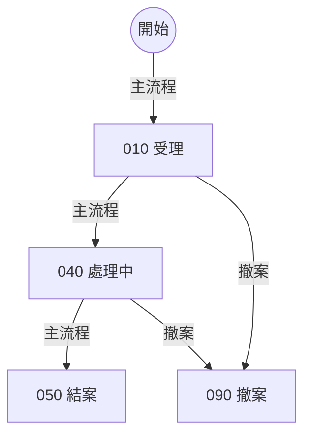

# 案件狀態流程（合成範例：畫法一守門）

本檔是 STATUS 權威文件的合成範例。案件進入 040 後，文件審查與付款兩個子業務同時進行；兩者都到終點，而且承辦人已上傳結案報告，案件才進入 050。040 以複合狀態加平行區塊（畫法一）表示，子業務只畫在區塊內。

## 情境流程



## 狀態圖

```mermaid
stateDiagram-v2
    state "010 受理" as M010
    state "040 處理中" as M040 {
        state "010 待審查" as D010
        state "090 審查完成" as D090
        [*] --> D010
        D010 --> D090
        D090 --> [*]
        --
        state "010 待付款" as P010
        state "090 已付款" as P090
        [*] --> P010
        P010 --> P090
        P090 --> [*]
    }
    state "050 結案" as M050
    state "090 撤案" as M090
    [*] --> M010
    M010 --> M040
    M040 --> M050
    M010 --> M090
    M040 --> M090
    M050 --> [*]
    M090 --> [*]
    M040 : 承辦人上傳結案報告
    D010 : 審查人員逐份審查文件
    P010 : 會計人員依核定金額付款
    note right of M050 : 結案後由系統寄發結案通知
```
