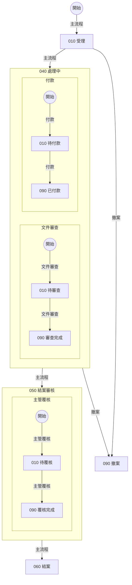
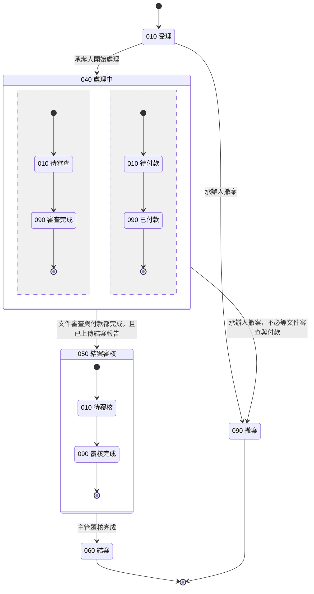
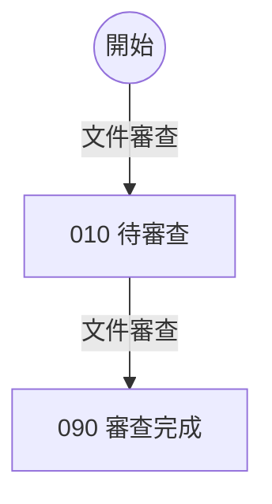
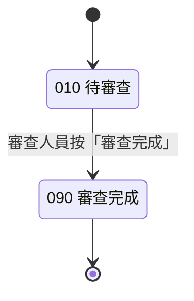

# 案件狀態流程（合成範例：畫法一守門）

本檔是 STATUS 權威文件的合成範例：主業務的每個階段畫成大框框，框內以平行區塊畫子業務，大框框之間的線上寫明往下走的條件。

## 主流程

## 子業務：文件審查

文件審查另有獨立的圖，內容與大圖 040 的第一個區塊相同。

## 說明

- 040 處理中：承辦人追蹤文件審查與付款，並上傳結案報告。
- 文件審查 010 待審查：審查人員逐份審查文件。
- 付款 010 待付款：會計人員依核定金額付款。
- 050 結案審核：主管確認案件資料完整後按「覆核完成」。
- 結案後由系統寄發結案通知給承辦人。
