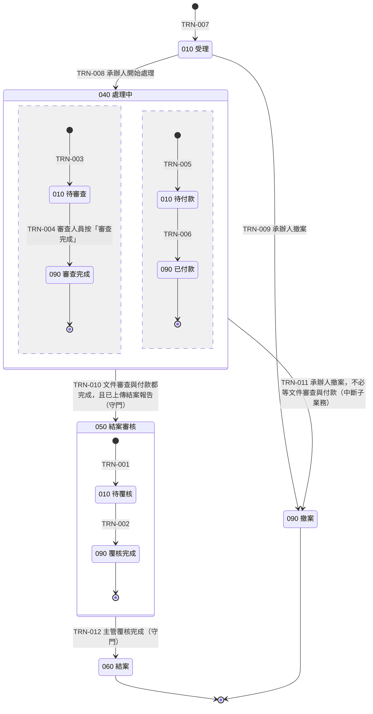
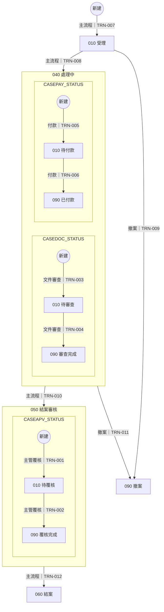

# 04 流程與狀態機

> `clone-fedcba9876543210/04`｜版本 r0001｜狀態 **draft**｜L1 NOT_RUN · L2 NOT_RUN · L3 NOT_RUN · L4 NOT_RUN · L5 NOT_RUN
> 依賴文件：01、03、07｜未解問題：無
> 狀態 11、轉移 12、情境 5、活動 5（守門範例，只跑部分檢核）
> 本檔由 canonical JSON 以程式產生，請勿手改；修改走研究重跑或 19 的決策。

## 狀態圖（由 STATE／TRN 重新產生）

## 情境流程圖（由 FLOW 重新產生）

解析設定：各段圖比對 STRICT（各段完全一致）；說明範圍：全檔。

來源圖（每個狀態實體由哪幾段圖組成）：

- CASE_STATUS：flowchart status-CASE_STATUS.md#L7-L31（最外層）；stateDiagram status-CASE_STATUS.md#L33-L66（最外層）
- CASEDOC_STATUS：flowchart status-CASE_STATUS.md#L7-L31（subgraph DOCS）；stateDiagram status-CASE_STATUS.md#L33-L66（STATE-008（040 處理中） 的第 1 個平行區塊）；flowchart status-CASE_STATUS.md#L72-L76（最外層）；stateDiagram status-CASE_STATUS.md#L78-L85（最外層）
- CASEPAY_STATUS：flowchart status-CASE_STATUS.md#L7-L31（subgraph PAYS）；stateDiagram status-CASE_STATUS.md#L33-L66（STATE-008（040 處理中） 的第 2 個平行區塊）
- CASEAPV_STATUS：flowchart status-CASE_STATUS.md#L7-L31（subgraph APVS）；stateDiagram status-CASE_STATUS.md#L33-L66（STATE-009（050 結案審核） 的第 1 個平行區塊）

## STATUS 文字的處置

STATUS 檔圖外的每一行說明，以及圖上的狀態描述與 note，都要處置：寫進了哪些項目，或為什麼沒有規格內容。

| 位置 | 原文 | 處置 | 寫進的項目或理由 |
|---|---|---|---|
| status-CASE_STATUS.md#L3 | 本檔是 STATUS 權威文件的合成範例：主業務的每個階段畫成大框框，框內以平行區塊畫子業務，大框框之間的線上寫明往下走的條件。 | NO_SPEC_CONTENT | 說明這份檔案的畫法，沒有規格內容。 |
| status-CASE_STATUS.md#L70 | 文件審查另有獨立的圖，內容與大圖 040 的第一個區塊相同。 | NO_SPEC_CONTENT | 說明圖的位置；兩段圖是否一致由外環比對。 |
| status-CASE_STATUS.md#L89 | 040 處理中：承辦人追蹤文件審查與付款，並上傳結案報告。 | MAPPED | ACT-004（追蹤文件審查與付款）、ACT-005（上傳結案報告） |
| status-CASE_STATUS.md#L90 | 文件審查 010 待審查：審查人員逐份審查文件。 | MAPPED | ACT-002（審查文件） |
| status-CASE_STATUS.md#L91 | 付款 010 待付款：會計人員依核定金額付款。 | MAPPED | ACT-003（付款） |
| status-CASE_STATUS.md#L92 | 050 結案審核：主管確認案件資料完整後按「覆核完成」。 | MAPPED | ACT-001（主管覆核） |
| status-CASE_STATUS.md#L93 | 結案後由系統寄發結案通知給承辦人。 | MAPPED | TRN-012（050→060）；系統的副作用，寫在 050→060 轉移的 sideEffects。 |

## 狀態（STATE）

### STATE-001　010 待覆核

- 自然鍵：`CASEAPV_STATUS:010`
- 狀態實體代號（狀態圖對應研究包給的大寫代號）：CASEAPV_STATUS
- 狀態種類：SIMPLE
- 狀態碼（儲存值）：010
- 狀態圖上的名稱：010 待覆核
- 所屬複合狀態（平行區塊內的子業務狀態也填）：STATE-009（050 結案審核）
- 保存狀態碼的欄位：FLD-001（TW_DEMO_CASE.APV_STATUS）
- 值域中的顯示文字（Translate／對照表）：待覆核
- 是否由 [*] 進入（新建；區塊內的 [*] 表示子業務資料的新建）：是
- 是否為終點（→[*]；區塊內的 →[*] 表示該區塊的終點）：否
- PROD 是否有此狀態碼的資料：HAS_DATA
- 來源：狀態權威文件；證據 EV-0028、EV-0005
- 被引用（外環反查）：ACT-001；TRN-001、TRN-002；FR-001

### STATE-002　090 覆核完成

- 自然鍵：`CASEAPV_STATUS:090`
- 狀態實體代號（狀態圖對應研究包給的大寫代號）：CASEAPV_STATUS
- 狀態種類：SIMPLE
- 狀態碼（儲存值）：090
- 狀態圖上的名稱：090 覆核完成
- 所屬複合狀態（平行區塊內的子業務狀態也填）：STATE-009（050 結案審核）
- 保存狀態碼的欄位：FLD-001（TW_DEMO_CASE.APV_STATUS）
- 值域中的顯示文字（Translate／對照表）：覆核完成
- 是否由 [*] 進入（新建；區塊內的 [*] 表示子業務資料的新建）：否
- 是否為終點（→[*]；區塊內的 →[*] 表示該區塊的終點）：是
- PROD 是否有此狀態碼的資料：HAS_DATA
- 來源：狀態權威文件；證據 EV-0029、EV-0005
- 被引用（外環反查）：FLOW-001；STATE-009；TRN-002、TRN-012

### STATE-003　010 待審查

- 自然鍵：`CASEDOC_STATUS:010`
- 狀態實體代號（狀態圖對應研究包給的大寫代號）：CASEDOC_STATUS
- 狀態種類：SIMPLE
- 狀態碼（儲存值）：010
- 狀態圖上的名稱：010 待審查
- 所屬複合狀態（平行區塊內的子業務狀態也填）：STATE-008（040 處理中）
- 保存狀態碼的欄位：FLD-008（TW_DEMO_CASEDOC.DOC_STATUS）
- 值域中的顯示文字（Translate／對照表）：待審查
- 是否由 [*] 進入（新建；區塊內的 [*] 表示子業務資料的新建）：是
- 是否為終點（→[*]；區塊內的 →[*] 表示該區塊的終點）：否
- PROD 是否有此狀態碼的資料：HAS_DATA
- 來源：狀態權威文件；證據 EV-0024、EV-0006
- 被引用（外環反查）：ACT-002；TRN-003、TRN-004；FR-003

### STATE-004　090 審查完成

- 自然鍵：`CASEDOC_STATUS:090`
- 狀態實體代號（狀態圖對應研究包給的大寫代號）：CASEDOC_STATUS
- 狀態種類：SIMPLE
- 狀態碼（儲存值）：090
- 狀態圖上的名稱：090 審查完成
- 所屬複合狀態（平行區塊內的子業務狀態也填）：STATE-008（040 處理中）
- 保存狀態碼的欄位：FLD-008（TW_DEMO_CASEDOC.DOC_STATUS）
- 值域中的顯示文字（Translate／對照表）：審查完成
- 是否由 [*] 進入（新建；區塊內的 [*] 表示子業務資料的新建）：否
- 是否為終點（→[*]；區塊內的 →[*] 表示該區塊的終點）：是
- PROD 是否有此狀態碼的資料：HAS_DATA
- 來源：狀態權威文件；證據 EV-0025、EV-0006
- 被引用（外環反查）：FLOW-002；STATE-008；TRN-004、TRN-010

### STATE-005　010 待付款

- 自然鍵：`CASEPAY_STATUS:010`
- 狀態實體代號（狀態圖對應研究包給的大寫代號）：CASEPAY_STATUS
- 狀態種類：SIMPLE
- 狀態碼（儲存值）：010
- 狀態圖上的名稱：010 待付款
- 所屬複合狀態（平行區塊內的子業務狀態也填）：STATE-008（040 處理中）
- 保存狀態碼的欄位：FLD-012（TW_DEMO_CASEPAY.PAY_STATUS）
- 值域中的顯示文字（Translate／對照表）：待付款
- 是否由 [*] 進入（新建；區塊內的 [*] 表示子業務資料的新建）：是
- 是否為終點（→[*]；區塊內的 →[*] 表示該區塊的終點）：否
- PROD 是否有此狀態碼的資料：HAS_DATA
- 來源：狀態權威文件；證據 EV-0026、EV-0007
- 被引用（外環反查）：ACT-003；TRN-005、TRN-006；FR-004

### STATE-006　090 已付款

- 自然鍵：`CASEPAY_STATUS:090`
- 狀態實體代號（狀態圖對應研究包給的大寫代號）：CASEPAY_STATUS
- 狀態種類：SIMPLE
- 狀態碼（儲存值）：090
- 狀態圖上的名稱：090 已付款
- 所屬複合狀態（平行區塊內的子業務狀態也填）：STATE-008（040 處理中）
- 保存狀態碼的欄位：FLD-012（TW_DEMO_CASEPAY.PAY_STATUS）
- 值域中的顯示文字（Translate／對照表）：已付款
- 是否由 [*] 進入（新建；區塊內的 [*] 表示子業務資料的新建）：否
- 是否為終點（→[*]；區塊內的 →[*] 表示該區塊的終點）：是
- PROD 是否有此狀態碼的資料：HAS_DATA
- 來源：狀態權威文件；證據 EV-0027、EV-0007
- 被引用（外環反查）：FLOW-003；STATE-008；TRN-006、TRN-010

### STATE-007　010 受理

- 自然鍵：`CASE_STATUS:010`
- 狀態實體代號（狀態圖對應研究包給的大寫代號）：CASE_STATUS
- 狀態種類：SIMPLE
- 狀態碼（儲存值）：010
- 狀態圖上的名稱：010 受理
- 保存狀態碼的欄位：FLD-003（TW_DEMO_CASE.CASE_STATUS）
- 值域中的顯示文字（Translate／對照表）：受理
- 是否由 [*] 進入（新建；區塊內的 [*] 表示子業務資料的新建）：是
- 是否為終點（→[*]；區塊內的 →[*] 表示該區塊的終點）：否
- PROD 是否有此狀態碼的資料：HAS_DATA
- 來源：狀態權威文件；證據 EV-0019、EV-0004
- 被引用（外環反查）：FLOW-005；TRN-007、TRN-008、TRN-009

### STATE-008　040 處理中

- 自然鍵：`CASE_STATUS:040`
- 狀態實體代號（狀態圖對應研究包給的大寫代號）：CASE_STATUS
- 狀態種類：COMPOSITE
- 狀態碼（儲存值）：040
- 狀態圖上的名稱：040 處理中
- 平行區塊（畫法一）：子業務狀態實體與它的終點狀態（區塊內 →[*] 的狀態）：
  - 狀態實體：CASEDOC_STATUS；終點狀態：STATE-004（090 審查完成）
  - 狀態實體：CASEPAY_STATUS；終點狀態：STATE-006（090 已付款）
- 保存狀態碼的欄位：FLD-003（TW_DEMO_CASE.CASE_STATUS）
- 值域中的顯示文字（Translate／對照表）：處理中
- 是否由 [*] 進入（新建；區塊內的 [*] 表示子業務資料的新建）：否
- 是否為終點（→[*]；區塊內的 →[*] 表示該區塊的終點）：否
- PROD 是否有此狀態碼的資料：HAS_DATA
- 來源：狀態權威文件；證據 EV-0020、EV-0004
- 被引用（外環反查）：ACT-004、ACT-005；FLOW-005；STATE-003、STATE-004、STATE-005、STATE-006；TRN-003、TRN-004、TRN-005、TRN-006、TRN-008、TRN-010、TRN-011；FR-002、FR-003、FR-004；TC-003、TC-004、TC-005、TC-006、TC-007

### STATE-009　050 結案審核

- 自然鍵：`CASE_STATUS:050`
- 狀態實體代號（狀態圖對應研究包給的大寫代號）：CASE_STATUS
- 狀態種類：COMPOSITE
- 狀態碼（儲存值）：050
- 狀態圖上的名稱：050 結案審核
- 平行區塊（畫法一）：子業務狀態實體與它的終點狀態（區塊內 →[*] 的狀態）：
  - 狀態實體：CASEAPV_STATUS；終點狀態：STATE-002（090 覆核完成）
- 保存狀態碼的欄位：FLD-003（TW_DEMO_CASE.CASE_STATUS）
- 值域中的顯示文字（Translate／對照表）：結案審核
- 是否由 [*] 進入（新建；區塊內的 [*] 表示子業務資料的新建）：否
- 是否為終點（→[*]；區塊內的 →[*] 表示該區塊的終點）：否
- PROD 是否有此狀態碼的資料：HAS_DATA
- 來源：狀態權威文件；證據 EV-0021、EV-0004
- 被引用（外環反查）：STATE-001、STATE-002；TRN-002、TRN-010、TRN-012；FR-001；TC-001、TC-002、TC-004、TC-007

### STATE-010　060 結案

- 自然鍵：`CASE_STATUS:060`
- 狀態實體代號（狀態圖對應研究包給的大寫代號）：CASE_STATUS
- 狀態種類：SIMPLE
- 狀態碼（儲存值）：060
- 狀態圖上的名稱：060 結案
- 保存狀態碼的欄位：FLD-003（TW_DEMO_CASE.CASE_STATUS）
- 值域中的顯示文字（Translate／對照表）：結案
- 是否由 [*] 進入（新建；區塊內的 [*] 表示子業務資料的新建）：否
- 是否為終點（→[*]；區塊內的 →[*] 表示該區塊的終點）：是
- PROD 是否有此狀態碼的資料：HAS_DATA
- 來源：狀態權威文件；證據 EV-0022、EV-0004
- 被引用（外環反查）：FLOW-004；TRN-012；TC-002

### STATE-011　090 撤案

- 自然鍵：`CASE_STATUS:090`
- 狀態實體代號（狀態圖對應研究包給的大寫代號）：CASE_STATUS
- 狀態種類：SIMPLE
- 狀態碼（儲存值）：090
- 狀態圖上的名稱：090 撤案
- 保存狀態碼的欄位：FLD-003（TW_DEMO_CASE.CASE_STATUS）
- 值域中的顯示文字（Translate／對照表）：撤案
- 是否由 [*] 進入（新建；區塊內的 [*] 表示子業務資料的新建）：否
- 是否為終點（→[*]；區塊內的 →[*] 表示該區塊的終點）：是
- PROD 是否有此狀態碼的資料：HAS_DATA
- 來源：狀態權威文件；證據 EV-0023、EV-0004
- 被引用（外環反查）：FLOW-005；TRN-009、TRN-011

## 狀態轉移（TRN）

### TRN-001　新建→010

- 自然鍵：`CASEAPV_STATUS:*>010`
- 狀態實體：CASEAPV_STATUS
- 起始狀態（新建為 INITIAL）：（新建）
- 目標狀態：STATE-001（010 待覆核）
- 離開方式：NORMAL
- 觸發方式、所在物件與動作原名（COMPLETION＝條件成立時由系統自動轉移）：
  - 種類：SYSTEM_EVENT
  - 物件：OBJ-005（TW_DEMO_CASEWRK.CHKCLOSE.FieldFormula）
  - 動作：案件轉入 050 時，同一段程式把主管覆核狀態設為 010
  - 在這些之後檢查：TRN-010（040→050）
- 誰能觸發（角色、資格的判定方式）：不適用：隨 040→050 的自動轉移一起執行，沒有操作者
- 轉移條件（選擇此目標的條件；守門轉移要含每個區塊與守門活動，R13）：不適用：起點只有這一個目標，沒有條件分岔
- 轉移時寫入的欄位與值：FLD-001（TW_DEMO_CASE.APV_STATUS） ← '010'
- 其他副作用（通知、介面等於 06／09 反查；INTERRUPT 要寫明未完成的子業務資料怎麼處理）：不適用：轉移本身沒有其他副作用
- 原系統實作位置：
  - 物件：OBJ-005（TW_DEMO_CASEWRK.CHKCLOSE.FieldFormula）；事件：FieldFormula（與 040→050 同一個 UPDATE）
- 重複觸發或同時操作時的行為：只在轉入 050 時設定一次。
- 來源：狀態權威文件；證據 EV-0050、EV-0051、EV-0010
- 被引用（外環反查）：FLOW-001

### TRN-002　010→090

- 自然鍵：`CASEAPV_STATUS:010>090`
- 狀態實體：CASEAPV_STATUS
- 起始狀態（新建為 INITIAL）：STATE-001（010 待覆核）
- 目標狀態：STATE-002（090 覆核完成）
- 離開方式：NORMAL
- 觸發方式、所在物件與動作原名（COMPLETION＝條件成立時由系統自動轉移）：
  - 種類：USER_ACTION
  - 物件：OBJ-001（TW_DEMO_CASE）
  - 動作：按「覆核完成」（TW_DEMO_CASEWRK.APVOK_PB）
  - 事件：FIELD_CHANGE
- 誰能觸發（角色、資格的判定方式）：目前使用者帳號 具有角色 ROLE-004（主管）
- 轉移條件（選擇此目標的條件；守門轉移要含每個區塊與守門活動，R13）：FLD-003（TW_DEMO_CASE.CASE_STATUS） ＝ '050'（STATE-009 結案審核）
- 轉移時寫入的欄位與值：FLD-001（TW_DEMO_CASE.APV_STATUS） ← '090'
- 其他副作用（通知、介面等於 06／09 反查；INTERRUPT 要寫明未完成的子業務資料怎麼處理）：不適用：轉移本身沒有其他副作用
- 原系統實作位置：
  - 物件：OBJ-004（TW_DEMO_CASEWRK.APVOK_PB.FieldChange）；事件：FieldChange
- 重複觸發或同時操作時的行為：覆核完成後按鈕隱藏；同一段程式接著把案件改為 060（見 050→060）。
- 來源：狀態權威文件；證據 EV-0052、EV-0053、EV-0012
- 被引用（外環反查）：ACT-001；FLOW-001；TRN-012；FR-001；TC-001、TC-002

### TRN-003　新建→010

- 自然鍵：`CASEDOC_STATUS:*>010`
- 狀態實體：CASEDOC_STATUS
- 起始狀態（新建為 INITIAL）：（新建）
- 目標狀態：STATE-003（010 待審查）
- 離開方式：NORMAL
- 觸發方式、所在物件與動作原名（COMPLETION＝條件成立時由系統自動轉移）：
  - 種類：USER_ACTION
  - 物件：OBJ-001（TW_DEMO_CASE）
  - 動作：在「文件」區新增一列並存檔
- 誰能觸發（角色、資格的判定方式）：目前使用者帳號 具有角色 ROLE-002（承辦人）
- 轉移條件（選擇此目標的條件；守門轉移要含每個區塊與守門活動，R13）：FLD-003（TW_DEMO_CASE.CASE_STATUS） ＝ '040'（STATE-008 處理中）
- 轉移時寫入的欄位與值：FLD-008（TW_DEMO_CASEDOC.DOC_STATUS） ← '010'
- 其他副作用（通知、介面等於 06／09 反查；INTERRUPT 要寫明未完成的子業務資料怎麼處理）：不適用：轉移本身沒有其他副作用
- 原系統實作位置：
  - 物件：OBJ-001（TW_DEMO_CASE）；事件：Save（新增文件列；DOC_STATUS 取 Record 預設值）
- 重複觸發或同時操作時的行為：每新增一列就是一筆新的文件；重複存檔不會重複新增。
- 來源：狀態權威文件；證據 EV-0042、EV-0043、EV-0015
- 被引用（外環反查）：FLOW-002

### TRN-004　010→090

- 自然鍵：`CASEDOC_STATUS:010>090`
- 狀態實體：CASEDOC_STATUS
- 起始狀態（新建為 INITIAL）：STATE-003（010 待審查）
- 目標狀態：STATE-004（090 審查完成）
- 狀態圖上這條線的描述原文；守衛與觸發必須與它一致：審查人員按「審查完成」
- 離開方式：NORMAL
- 觸發方式、所在物件與動作原名（COMPLETION＝條件成立時由系統自動轉移）：
  - 種類：USER_ACTION
  - 物件：OBJ-002（TW_DEMO_DOCREV）
  - 動作：按「審查完成」（TW_DEMO_CASEWRK.DOCOK_PB）
  - 事件：FIELD_CHANGE
- 誰能觸發（角色、資格的判定方式）：目前使用者帳號 具有角色 ROLE-003（審查人員）
- 轉移條件（選擇此目標的條件；守門轉移要含每個區塊與守門活動，R13）：FLD-003（TW_DEMO_CASE.CASE_STATUS） ＝ '040'（STATE-008 處理中）
- 轉移時寫入的欄位與值：FLD-008（TW_DEMO_CASEDOC.DOC_STATUS） ← '090'
- 其他副作用（通知、介面等於 06／09 反查；INTERRUPT 要寫明未完成的子業務資料怎麼處理）：不適用：轉移本身沒有其他副作用
- 原系統實作位置：
  - 物件：OBJ-002（TW_DEMO_DOCREV）；事件：TW_DEMO_CASEWRK.DOCOK_PB.FieldChange
- 重複觸發或同時操作時的行為：按下後按鈕隱藏；存檔後由守門檢查決定案件是否轉入 050（見 040→050）。
- 來源：狀態權威文件；證據 EV-0044、EV-0045、EV-0016
- 被引用（外環反查）：ACT-002；FLOW-002；TRN-010；FR-003

### TRN-005　新建→010

- 自然鍵：`CASEPAY_STATUS:*>010`
- 狀態實體：CASEPAY_STATUS
- 起始狀態（新建為 INITIAL）：（新建）
- 目標狀態：STATE-005（010 待付款）
- 離開方式：NORMAL
- 觸發方式、所在物件與動作原名（COMPLETION＝條件成立時由系統自動轉移）：
  - 種類：USER_ACTION
  - 物件：OBJ-001（TW_DEMO_CASE）
  - 動作：在「付款」區新增一列並存檔
- 誰能觸發（角色、資格的判定方式）：目前使用者帳號 具有角色 ROLE-002（承辦人）
- 轉移條件（選擇此目標的條件；守門轉移要含每個區塊與守門活動，R13）：FLD-003（TW_DEMO_CASE.CASE_STATUS） ＝ '040'（STATE-008 處理中）
- 轉移時寫入的欄位與值：FLD-012（TW_DEMO_CASEPAY.PAY_STATUS） ← '010'
- 其他副作用（通知、介面等於 06／09 反查；INTERRUPT 要寫明未完成的子業務資料怎麼處理）：不適用：轉移本身沒有其他副作用
- 原系統實作位置：
  - 物件：OBJ-001（TW_DEMO_CASE）；事件：Save（新增付款列；PAY_STATUS 取 Record 預設值）
- 重複觸發或同時操作時的行為：每新增一列就是一筆新的付款；重複存檔不會重複新增。
- 來源：狀態權威文件；證據 EV-0046、EV-0047、EV-0015
- 被引用（外環反查）：FLOW-003

### TRN-006　010→090

- 自然鍵：`CASEPAY_STATUS:010>090`
- 狀態實體：CASEPAY_STATUS
- 起始狀態（新建為 INITIAL）：STATE-005（010 待付款）
- 目標狀態：STATE-006（090 已付款）
- 離開方式：NORMAL
- 觸發方式、所在物件與動作原名（COMPLETION＝條件成立時由系統自動轉移）：
  - 種類：USER_ACTION
  - 物件：OBJ-003（TW_DEMO_PAYMNT）
  - 動作：按「付款完成」（TW_DEMO_CASEWRK.PAYOK_PB）
  - 事件：FIELD_CHANGE
- 誰能觸發（角色、資格的判定方式）：目前使用者帳號 具有角色 ROLE-001（會計人員）
- 轉移條件（選擇此目標的條件；守門轉移要含每個區塊與守門活動，R13）：FLD-003（TW_DEMO_CASE.CASE_STATUS） ＝ '040'（STATE-008 處理中）
- 轉移時寫入的欄位與值：FLD-012（TW_DEMO_CASEPAY.PAY_STATUS） ← '090'
- 其他副作用（通知、介面等於 06／09 反查；INTERRUPT 要寫明未完成的子業務資料怎麼處理）：不適用：轉移本身沒有其他副作用
- 原系統實作位置：
  - 物件：OBJ-003（TW_DEMO_PAYMNT）；事件：TW_DEMO_CASEWRK.PAYOK_PB.FieldChange
- 重複觸發或同時操作時的行為：按下後按鈕隱藏；存檔後由守門檢查決定案件是否轉入 050（見 040→050）。
- 來源：狀態權威文件；證據 EV-0048、EV-0049、EV-0017
- 被引用（外環反查）：ACT-003；FLOW-003；TRN-010；FR-004；TC-005、TC-007

### TRN-007　新建→010

- 自然鍵：`CASE_STATUS:*>010`
- 狀態實體：CASE_STATUS
- 起始狀態（新建為 INITIAL）：（新建）
- 目標狀態：STATE-007（010 受理）
- 離開方式：NORMAL
- 觸發方式、所在物件與動作原名（COMPLETION＝條件成立時由系統自動轉移）：
  - 種類：USER_ACTION
  - 物件：OBJ-001（TW_DEMO_CASE）
  - 動作：儲存（新增模式）
- 誰能觸發（角色、資格的判定方式）：目前使用者帳號 具有角色 ROLE-002（承辦人）
- 轉移條件（選擇此目標的條件；守門轉移要含每個區塊與守門活動，R13）：不適用：起點只有這一個目標，沒有條件分岔
- 轉移時寫入的欄位與值：FLD-003（TW_DEMO_CASE.CASE_STATUS） ← '010'
- 其他副作用（通知、介面等於 06／09 反查；INTERRUPT 要寫明未完成的子業務資料怎麼處理）：不適用：轉移本身沒有其他副作用
- 原系統實作位置：
  - 物件：OBJ-001（TW_DEMO_CASE）；事件：Save（ADD 模式；CASE_STATUS 取 Record 預設值）
- 重複觸發或同時操作時的行為：存檔後畫面轉為修改模式，再按儲存不會建立第二個案件。
- 來源：狀態權威文件；證據 EV-0030、EV-0031、EV-0001
- 被引用（外環反查）：FLOW-004

### TRN-008　010→040

- 自然鍵：`CASE_STATUS:010>040`
- 狀態實體：CASE_STATUS
- 起始狀態（新建為 INITIAL）：STATE-007（010 受理）
- 目標狀態：STATE-008（040 處理中）
- 狀態圖上這條線的描述原文；守衛與觸發必須與它一致：承辦人開始處理
- 離開方式：NORMAL
- 觸發方式、所在物件與動作原名（COMPLETION＝條件成立時由系統自動轉移）：
  - 種類：USER_ACTION
  - 物件：OBJ-001（TW_DEMO_CASE）
  - 動作：按「開始處理」（TW_DEMO_CASEWRK.START_PB）
  - 事件：FIELD_CHANGE
- 誰能觸發（角色、資格的判定方式）：目前使用者帳號 具有角色 ROLE-002（承辦人）
- 轉移條件（選擇此目標的條件；守門轉移要含每個區塊與守門活動，R13）：不適用：起點只有這一個目標，沒有條件分岔
- 轉移時寫入的欄位與值：FLD-003（TW_DEMO_CASE.CASE_STATUS） ← '040'
- 其他副作用（通知、介面等於 06／09 反查；INTERRUPT 要寫明未完成的子業務資料怎麼處理）：不適用：轉移本身沒有其他副作用
- 原系統實作位置：
  - 物件：OBJ-001（TW_DEMO_CASE）；事件：TW_DEMO_CASEWRK.START_PB.FieldChange
- 重複觸發或同時操作時的行為：轉為 040 後按鈕隱藏，不會重複觸發。
- 來源：狀態權威文件；證據 EV-0032、EV-0033、EV-0013
- 被引用（外環反查）：FLOW-004

### TRN-009　010→090

- 自然鍵：`CASE_STATUS:010>090`
- 狀態實體：CASE_STATUS
- 起始狀態（新建為 INITIAL）：STATE-007（010 受理）
- 目標狀態：STATE-011（090 撤案）
- 狀態圖上這條線的描述原文；守衛與觸發必須與它一致：承辦人撤案
- 離開方式：NORMAL
- 觸發方式、所在物件與動作原名（COMPLETION＝條件成立時由系統自動轉移）：
  - 種類：USER_ACTION
  - 物件：OBJ-001（TW_DEMO_CASE）
  - 動作：按「撤案」（TW_DEMO_CASEWRK.CANCEL_PB）
  - 事件：FIELD_CHANGE
- 誰能觸發（角色、資格的判定方式）：目前使用者帳號 具有角色 ROLE-002（承辦人）
- 轉移條件（選擇此目標的條件；守門轉移要含每個區塊與守門活動，R13）：不適用：010 的撤案沒有條件
- 轉移時寫入的欄位與值：FLD-003（TW_DEMO_CASE.CASE_STATUS） ← '090'
- 其他副作用（通知、介面等於 06／09 反查；INTERRUPT 要寫明未完成的子業務資料怎麼處理）：不適用：轉移本身沒有其他副作用
- 原系統實作位置：
  - 物件：OBJ-001（TW_DEMO_CASE）；事件：TW_DEMO_CASEWRK.CANCEL_PB.FieldChange
- 重複觸發或同時操作時的行為：撤案是終點；撤案後按鈕隱藏。
- 來源：狀態權威文件；證據 EV-0038、EV-0039、EV-0014
- 被引用（外環反查）：FLOW-005

### TRN-010　040→050

- 自然鍵：`CASE_STATUS:040>050`
- 狀態實體：CASE_STATUS
- 起始狀態（新建為 INITIAL）：STATE-008（040 處理中）
- 目標狀態：STATE-009（050 結案審核）
- 狀態圖上這條線的描述原文；守衛與觸發必須與它一致：文件審查與付款都完成，且已上傳結案報告
- 離開方式：ON_COMPLETION
- 觸發方式、所在物件與動作原名（COMPLETION＝條件成立時由系統自動轉移）：
  - 種類：COMPLETION
  - 物件：OBJ-005（TW_DEMO_CASEWRK.CHKCLOSE.FieldFormula）
  - 動作：共用函式 TW_DEMO_CHKCLOSE 檢查守門條件，成立時把案件改為 050
  - 在這些之後檢查：TRN-004（010→090）、TRN-006（010→090）、ACT-005（上傳結案報告）
- 誰能觸發（角色、資格的判定方式）：不適用：條件成立時由系統自動轉移，沒有操作者
- 轉移條件（選擇此目標的條件；守門轉移要含每個區塊與守門活動，R13）：（ENT-002（TW_DEMO_CASEDOC） 中對應這一筆的每一列都符合（FLD-008（TW_DEMO_CASEDOC.DOC_STATUS） ＝ '090'（STATE-004 審查完成））；沒有任何對應的列時視為不成立）且（ENT-003（TW_DEMO_CASEPAY） 中對應這一筆的每一列都符合（FLD-012（TW_DEMO_CASEPAY.PAY_STATUS） ＝ '090'（STATE-006 已付款））；沒有任何對應的列時視為成立）且（活動 ACT-005（上傳結案報告） 已完成）
- 轉移時寫入的欄位與值：FLD-003（TW_DEMO_CASE.CASE_STATUS） ← '050'
- 其他副作用（通知、介面等於 06／09 反查；INTERRUPT 要寫明未完成的子業務資料怎麼處理）：不適用：轉入 050 時同一段程式把主管覆核狀態設為 010，寫在主管覆核的新建轉移
- 原系統實作位置：
  - 物件：OBJ-005（TW_DEMO_CASEWRK.CHKCLOSE.FieldFormula）；事件：FieldFormula（由 TW_DEMO_DOCREV、TW_DEMO_PAYMNT、TW_DEMO_CASE 的 SavePostChange 呼叫）
- 重複觸發或同時操作時的行為：只在案件仍為 040 時轉移；轉為 050 之後再存檔不會重複轉移。
- 來源：狀態權威文件；證據 EV-0034、EV-0035、EV-0009、EV-0010、EV-0011、EV-0008
- 被引用（外環反查）：FLOW-004；TRN-001；TC-003、TC-004、TC-005、TC-006、TC-007

### TRN-011　040→090

- 自然鍵：`CASE_STATUS:040>090`
- 狀態實體：CASE_STATUS
- 起始狀態（新建為 INITIAL）：STATE-008（040 處理中）
- 目標狀態：STATE-011（090 撤案）
- 狀態圖上這條線的描述原文；守衛與觸發必須與它一致：承辦人撤案，不必等文件審查與付款
- 離開方式：INTERRUPT
- 觸發方式、所在物件與動作原名（COMPLETION＝條件成立時由系統自動轉移）：
  - 種類：USER_ACTION
  - 物件：OBJ-001（TW_DEMO_CASE）
  - 動作：按「撤案」（TW_DEMO_CASEWRK.CANCEL_PB）
  - 事件：FIELD_CHANGE
- 誰能觸發（角色、資格的判定方式）：目前使用者帳號 具有角色 ROLE-002（承辦人）
- 轉移條件（選擇此目標的條件；守門轉移要含每個區塊與守門活動，R13）：不適用：撤案不看子業務進度；040 的另一個離開方式是自動轉入 050
- 轉移時寫入的欄位與值：FLD-003（TW_DEMO_CASE.CASE_STATUS） ← '090'
- 其他副作用（通知、介面等於 06／09 反查；INTERRUPT 要寫明未完成的子業務資料怎麼處理）：
  - 說明：未完成的文件與付款列維持原狀態，不另外作廢；案件為 090 後，這些列因子業務轉移要求案件為 040 而不能再審查或付款。；欄位：FLD-008（TW_DEMO_CASEDOC.DOC_STATUS）、FLD-012（TW_DEMO_CASEPAY.PAY_STATUS）
- 原系統實作位置：
  - 物件：OBJ-001（TW_DEMO_CASE）；事件：TW_DEMO_CASEWRK.CANCEL_PB.FieldChange
- 重複觸發或同時操作時的行為：同 010→090。
- 來源：狀態權威文件；證據 EV-0040、EV-0041、EV-0014
- 被引用（外環反查）：FLOW-005

### TRN-012　050→060

- 自然鍵：`CASE_STATUS:050>060`
- 狀態實體：CASE_STATUS
- 起始狀態（新建為 INITIAL）：STATE-009（050 結案審核）
- 目標狀態：STATE-010（060 結案）
- 狀態圖上這條線的描述原文；守衛與觸發必須與它一致：主管覆核完成
- 離開方式：ON_COMPLETION
- 觸發方式、所在物件與動作原名（COMPLETION＝條件成立時由系統自動轉移）：
  - 種類：COMPLETION
  - 物件：OBJ-004（TW_DEMO_CASEWRK.APVOK_PB.FieldChange）
  - 動作：主管按「覆核完成」的同一段程式把案件改為 060
  - 在這些之後檢查：TRN-002（010→090）
- 誰能觸發（角色、資格的判定方式）：不適用：條件成立時由系統自動轉移，沒有操作者
- 轉移條件（選擇此目標的條件；守門轉移要含每個區塊與守門活動，R13）：FLD-001（TW_DEMO_CASE.APV_STATUS） ＝ '090'（STATE-002 覆核完成）
- 轉移時寫入的欄位與值：FLD-003（TW_DEMO_CASE.CASE_STATUS） ← '060'、FLD-004（TW_DEMO_CASE.CLOSE_DT） ← 系統日期
- 其他副作用（通知、介面等於 06／09 反查；INTERRUPT 要寫明未完成的子業務資料怎麼處理）：
  - 說明：寄發結案通知給案件的承辦人；寄送失敗不影響結案。；欄位：（無）
- 原系統實作位置：
  - 物件：OBJ-004（TW_DEMO_CASEWRK.APVOK_PB.FieldChange）；事件：FieldChange
- 重複觸發或同時操作時的行為：覆核完成後按鈕隱藏，不會重複結案，也不會重寄通知。
- 來源：狀態權威文件；證據 EV-0036、EV-0037、EV-0012
- 被引用（外環反查）：FLOW-004；TC-001、TC-002

## 情境流程（FLOW）

### FLOW-001　主管覆核

- 自然鍵：`CASEAPV_STATUS:主管覆核`
- 狀態實體：CASEAPV_STATUS
- 情境類型：主管覆核
- 情境說明：案件轉入 050 時開始，主管確認後按覆核完成。
- 情境步驟（依拓撲順序）：
  - 序：1；轉移：TRN-001（新建→010）；說明：開始
  - 序：2；轉移：TRN-002（010→090）；說明：覆核完成
- 進入此情境的狀態：（新建）
- 離開此情境的狀態：STATE-002（090 覆核完成）
- 前置條件：不適用：進入條件即各步驟轉移的起點狀態
- 例外與中斷：不適用：子業務沒有其他分岔
- 來源：狀態權威文件；證據 EV-0058

### FLOW-002　文件審查

- 自然鍵：`CASEDOC_STATUS:文件審查`
- 狀態實體：CASEDOC_STATUS
- 情境類型：文件審查
- 情境說明：承辦人新增文件，審查人員逐份審查。
- 情境步驟（依拓撲順序）：
  - 序：1；轉移：TRN-003（新建→010）；說明：開始
  - 序：2；轉移：TRN-004（010→090）；說明：審查完成
- 進入此情境的狀態：（新建）
- 離開此情境的狀態：STATE-004（090 審查完成）
- 前置條件：不適用：進入條件即各步驟轉移的起點狀態
- 例外與中斷：不適用：子業務沒有其他分岔
- 來源：狀態權威文件；證據 EV-0056

### FLOW-003　付款

- 自然鍵：`CASEPAY_STATUS:付款`
- 狀態實體：CASEPAY_STATUS
- 情境類型：付款
- 情境說明：承辦人新增付款，會計人員依核定金額付款。
- 情境步驟（依拓撲順序）：
  - 序：1；轉移：TRN-005（新建→010）；說明：開始
  - 序：2；轉移：TRN-006（010→090）；說明：付款完成
- 進入此情境的狀態：（新建）
- 離開此情境的狀態：STATE-006（090 已付款）
- 前置條件：不適用：進入條件即各步驟轉移的起點狀態
- 例外與中斷：不適用：子業務沒有其他分岔
- 來源：狀態權威文件；證據 EV-0057

### FLOW-004　主流程

- 自然鍵：`CASE_STATUS:主流程`
- 狀態實體：CASE_STATUS
- 情境類型：主流程
- 情境說明：承辦人受理並開始處理；文件審查、付款與結案報告都完成後自動轉入結案審核；主管覆核完成後自動結案。
- 情境步驟（依拓撲順序）：
  - 序：1；轉移：TRN-007（新建→010）；說明：承辦人受理案件
  - 序：2；轉移：TRN-008（010→040）；說明：承辦人開始處理
  - 序：3；轉移：TRN-010（040→050）；說明：040 的守門條件全部成立時自動轉入結案審核
  - 序：4；轉移：TRN-012（050→060）；說明：主管覆核完成時自動結案
- 進入此情境的狀態：（新建）
- 離開此情境的狀態：STATE-010（060 結案）
- 前置條件：不適用：進入條件即各步驟轉移的起點狀態
- 例外與中斷：承辦人可在受理或處理中撤案，轉入「撤案」。
- 來源：狀態權威文件；證據 EV-0054

### FLOW-005　撤案

- 自然鍵：`CASE_STATUS:撤案`
- 狀態實體：CASE_STATUS
- 情境類型：撤案
- 情境說明：承辦人在受理或處理中撤案；處理中撤案不等文件審查與付款完成。
- 情境步驟（依拓撲順序）：
  - 序：1；轉移：TRN-009（010→090）；說明：受理中撤案
  - 序：2；轉移：TRN-011（040→090）；說明：處理中撤案（中斷子業務）
- 進入此情境的狀態：STATE-007（010 受理）、STATE-008（040 處理中）
- 離開此情境的狀態：STATE-011（090 撤案）
- 前置條件：不適用：進入條件即各步驟轉移的起點狀態
- 例外與中斷：不適用：撤案是終點
- 來源：狀態權威文件；證據 EV-0055

## 狀態活動（ACT）

### ACT-001　主管覆核

- 自然鍵：`CASEAPV_STATUS:010:01`
- 狀態實體：CASEAPV_STATUS
- 活動所在的狀態：STATE-001（010 待覆核）
- 活動名稱：主管覆核
- 「這個階段誰該做什麼」的 STATUS 檔原文（說明區域，或圖上的狀態描述與 note）：主管確認案件資料完整後按「覆核完成」
- 誰負責：原文的「承辦人」「長官」必須對應到角色或衍生概念：ROLE-004（主管）
- 系統怎麼落實：做了轉移就算完成／離開狀態前系統檢查／系統不記錄也不檢查：BY_TRANSITION
- 完成此活動的轉移（須從活動所在狀態出發，R13）：TRN-002（010→090）
- 系統判定活動已完成的條件（對活動所在狀態的那筆資料求值；守門轉移以 DONE 引用）：不適用：按「覆核完成」（離開 010）即完成
- 來源：狀態權威文件；證據 EV-0063、EV-0012

### ACT-002　審查文件

- 自然鍵：`CASEDOC_STATUS:010:01`
- 狀態實體：CASEDOC_STATUS
- 活動所在的狀態：STATE-003（010 待審查）
- 活動名稱：審查文件
- 「這個階段誰該做什麼」的 STATUS 檔原文（說明區域，或圖上的狀態描述與 note）：審查人員逐份審查文件
- 誰負責：原文的「承辦人」「長官」必須對應到角色或衍生概念：ROLE-003（審查人員）
- 系統怎麼落實：做了轉移就算完成／離開狀態前系統檢查／系統不記錄也不檢查：BY_TRANSITION
- 完成此活動的轉移（須從活動所在狀態出發，R13）：TRN-004（010→090）
- 系統判定活動已完成的條件（對活動所在狀態的那筆資料求值；守門轉移以 DONE 引用）：不適用：按「審查完成」（離開 010）即完成
- 來源：狀態權威文件；證據 EV-0061、EV-0016

### ACT-003　付款

- 自然鍵：`CASEPAY_STATUS:010:01`
- 狀態實體：CASEPAY_STATUS
- 活動所在的狀態：STATE-005（010 待付款）
- 活動名稱：付款
- 「這個階段誰該做什麼」的 STATUS 檔原文（說明區域，或圖上的狀態描述與 note）：會計人員依核定金額付款
- 誰負責：原文的「承辦人」「長官」必須對應到角色或衍生概念：ROLE-001（會計人員）
- 系統怎麼落實：做了轉移就算完成／離開狀態前系統檢查／系統不記錄也不檢查：BY_TRANSITION
- 完成此活動的轉移（須從活動所在狀態出發，R13）：TRN-006（010→090）
- 系統判定活動已完成的條件（對活動所在狀態的那筆資料求值；守門轉移以 DONE 引用）：不適用：按「付款完成」（離開 010）即完成
- 來源：狀態權威文件；證據 EV-0062、EV-0017

### ACT-004　追蹤文件審查與付款

- 自然鍵：`CASE_STATUS:040:01`
- 狀態實體：CASE_STATUS
- 活動所在的狀態：STATE-008（040 處理中）
- 活動名稱：追蹤文件審查與付款
- 「這個階段誰該做什麼」的 STATUS 檔原文（說明區域，或圖上的狀態描述與 note）：承辦人追蹤文件審查與付款
- 誰負責：原文的「承辦人」「長官」必須對應到角色或衍生概念：ROLE-002（承辦人）
- 系統怎麼落實：做了轉移就算完成／離開狀態前系統檢查／系統不記錄也不檢查：EXPECTED_ONLY
- 系統判定活動已完成的條件（對活動所在狀態的那筆資料求值；守門轉移以 DONE 引用）：不適用：系統沒有記錄追蹤進度，守門檢查也不看這件事
- 來源：狀態權威文件；證據 EV-0059、EV-0010

### ACT-005　上傳結案報告

- 自然鍵：`CASE_STATUS:040:02`
- 狀態實體：CASE_STATUS
- 活動所在的狀態：STATE-008（040 處理中）
- 活動名稱：上傳結案報告
- 「這個階段誰該做什麼」的 STATUS 檔原文（說明區域，或圖上的狀態描述與 note）：上傳結案報告
- 誰負責：原文的「承辦人」「長官」必須對應到角色或衍生概念：ROLE-002（承辦人）
- 系統怎麼落實：做了轉移就算完成／離開狀態前系統檢查／系統不記錄也不檢查：SYSTEM_GATE
- 系統判定活動已完成的條件（對活動所在狀態的那筆資料求值；守門轉移以 DONE 引用）：FLD-005（TW_DEMO_CASE.CLOSE_RPT_ATT） 不為空白
- 來源：狀態權威文件；證據 EV-0060、EV-0018、EV-0010
- 被引用（外環反查）：TRN-010；FR-002；TC-003、TC-004、TC-006
