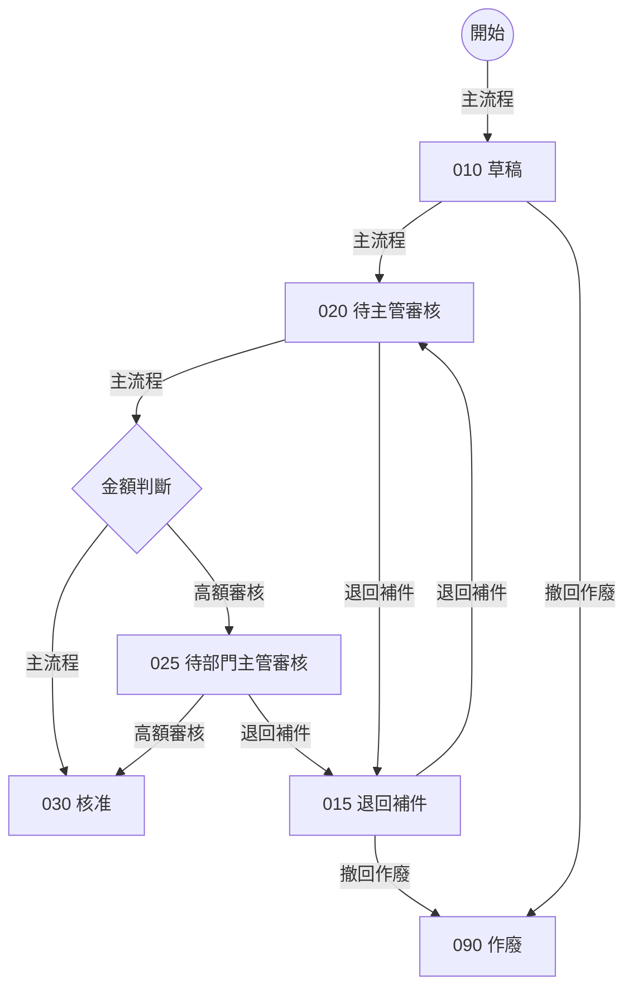
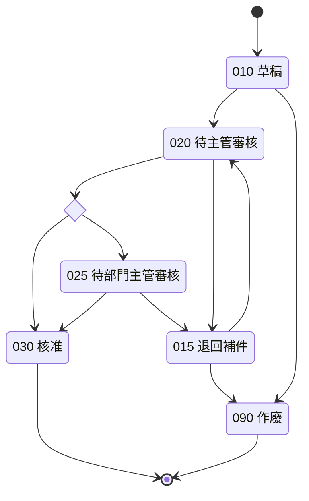

# 申請單狀態流程（合成範例）

本檔是 STATUS 權威文件的合成範例。所有狀態圖寫在同一份檔案；這個範例只有一個狀態實體（申請單的狀態），同時提供 flowchart 與 stateDiagram-v2。

## 情境流程

## 狀態圖

## 說明

- 020 待主管審核：直屬主管審核申請內容。
- 025 待部門主管審核：部門主管審核。
- 090 作廢：作廢的申請單不能再修改。
