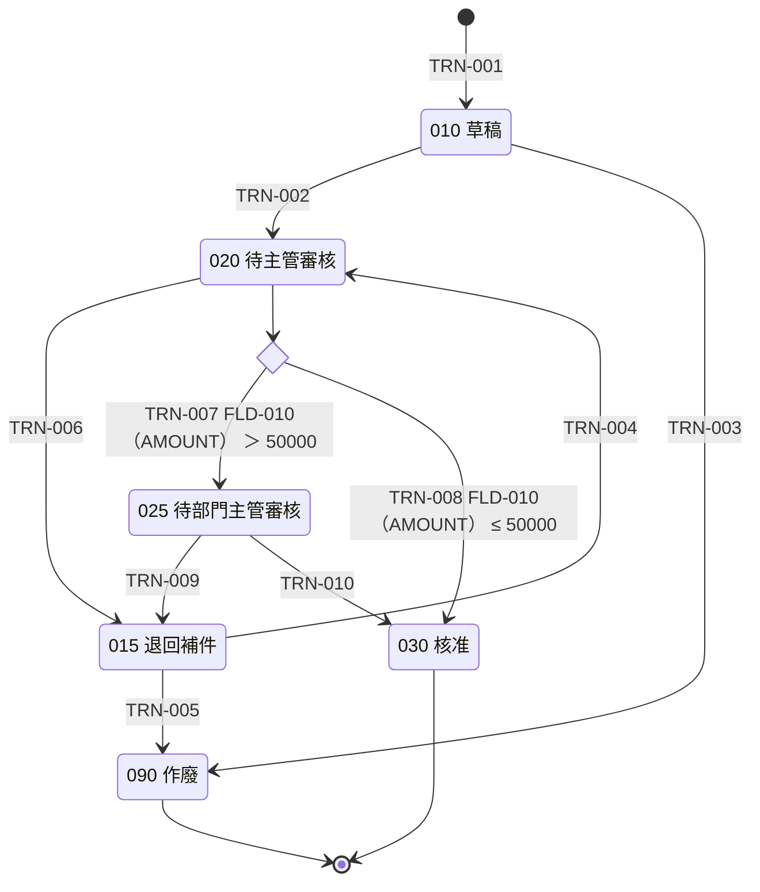
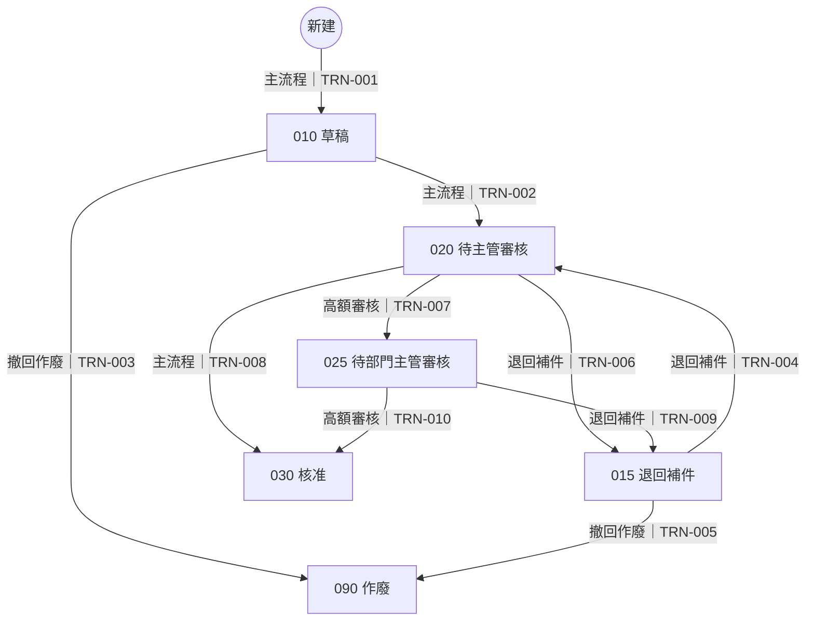

# 04 流程與狀態機

> `clone-0123456789abcdef/04`｜版本 r0001｜狀態 **in_review**｜L1 PASS · L2 PASS · L3 PASS · L4 PASS · L5 PASS
> 依賴文件：01、03、07｜未解問題：無
> 狀態 6、轉移 10、情境 4、活動 2；未解問題 0
> 本檔由 canonical JSON 以程式產生，請勿手改；修改走研究重跑或 19 的決策。

## 狀態圖（由 STATE／TRN 重新產生）

## 情境流程圖（由 FLOW 重新產生）

解析設定：各段圖比對 STRICT（各段完全一致）；說明範圍：全檔。

來源圖（每個狀態實體由哪幾段圖組成）：

- REQ_STATUS：flowchart status-REQ_STATUS.md#L7-L20（最外層）；stateDiagram status-REQ_STATUS.md#L24-L46（最外層）

## STATUS 文字的處置

STATUS 檔圖外的每一行說明，以及圖上的狀態描述與 note，都要處置：寫進了哪些項目，或為什麼沒有規格內容。

| 位置 | 原文 | 處置 | 寫進的項目或理由 |
|---|---|---|---|
| status-REQ_STATUS.md#L3 | 本檔是 STATUS 權威文件的合成範例。所有狀態圖寫在同一份檔案；這個範例只有一個狀態實體（申請單的狀態），同時提供 flowchart 與 stateDiagram-v2。 | NO_SPEC_CONTENT | 說明這份檔案的內容，沒有規格內容。 |
| status-REQ_STATUS.md#L50 | 020 待主管審核：直屬主管審核申請內容。 | MAPPED | ACT-001（直屬主管審核申請） |
| status-REQ_STATUS.md#L51 | 025 待部門主管審核：部門主管審核。 | MAPPED | ACT-002（部門主管審核高額申請） |
| status-REQ_STATUS.md#L52 | 090 作廢：作廢的申請單不能再修改。 | MAPPED | STATE-006（090 作廢）；090 是終點；畫面在 090 不顯示送出與撤回按鈕（見 05）。 |

## 狀態（STATE）

### STATE-001　010 草稿

- 自然鍵：`REQ_STATUS:010`
- 狀態實體代號（狀態圖對應研究包給的大寫代號）：REQ_STATUS
- 狀態種類：SIMPLE
- 狀態碼（儲存值）：010
- 狀態圖上的名稱：010 草稿
- 保存狀態碼的欄位：FLD-017（TW_DEMO_REQHDR.REQ_STATUS）
- 值域中的顯示文字（Translate／對照表）：草稿
- 是否由 [*] 進入（新建；區塊內的 [*] 表示子業務資料的新建）：是
- 是否為終點（→[*]；區塊內的 →[*] 表示該區塊的終點）：否
- PROD 是否有此狀態碼的資料：HAS_DATA
- 來源：狀態權威文件；證據 EV-0038、EV-0011
- 被引用（外環反查）：FLOW-002；TRN-001、TRN-002、TRN-003；FR-004、FR-005；UI-008、UI-009、UI-011、UI-012、UI-013；OP-004、OP-005；TC-007、TC-009、TC-011、TC-013、TC-014

### STATE-002　015 退回補件

- 自然鍵：`REQ_STATUS:015`
- 狀態實體代號（狀態圖對應研究包給的大寫代號）：REQ_STATUS
- 狀態種類：SIMPLE
- 狀態碼（儲存值）：015
- 狀態圖上的名稱：015 退回補件
- 保存狀態碼的欄位：FLD-017（TW_DEMO_REQHDR.REQ_STATUS）
- 值域中的顯示文字（Translate／對照表）：退回補件
- 是否由 [*] 進入（新建；區塊內的 [*] 表示子業務資料的新建）：否
- 是否為終點（→[*]；區塊內的 →[*] 表示該區塊的終點）：否
- PROD 是否有此狀態碼的資料：HAS_DATA
- 來源：狀態權威文件；證據 EV-0039、EV-0011
- 被引用（外環反查）：FLOW-002；TRN-004、TRN-005、TRN-006、TRN-009；FR-004、FR-005；UI-008、UI-009、UI-011、UI-012、UI-013；OP-004、OP-005；TC-006

### STATE-003　020 待主管審核

- 自然鍵：`REQ_STATUS:020`
- 狀態實體代號（狀態圖對應研究包給的大寫代號）：REQ_STATUS
- 狀態種類：SIMPLE
- 狀態碼（儲存值）：020
- 狀態圖上的名稱：020 待主管審核
- 保存狀態碼的欄位：FLD-017（TW_DEMO_REQHDR.REQ_STATUS）
- 值域中的顯示文字（Translate／對照表）：待主管審核
- 是否由 [*] 進入（新建；區塊內的 [*] 表示子業務資料的新建）：否
- 是否為終點（→[*]；區塊內的 →[*] 表示該區塊的終點）：否
- PROD 是否有此狀態碼的資料：HAS_DATA
- 來源：狀態權威文件；證據 EV-0040、EV-0011
- 被引用（外環反查）：ACT-001；FLOW-003、FLOW-004；TRN-002、TRN-004、TRN-006、TRN-007、TRN-008；FR-001、FR-002；UI-003、UI-005、UI-006；BR-001；OP-001、OP-002；TC-001、TC-002、TC-003、TC-004、TC-005、TC-006、TC-012、TC-013

### STATE-004　025 待部門主管審核

- 自然鍵：`REQ_STATUS:025`
- 狀態實體代號（狀態圖對應研究包給的大寫代號）：REQ_STATUS
- 狀態種類：SIMPLE
- 狀態碼（儲存值）：025
- 狀態圖上的名稱：025 待部門主管審核
- 保存狀態碼的欄位：FLD-017（TW_DEMO_REQHDR.REQ_STATUS）
- 值域中的顯示文字（Translate／對照表）：待部門主管審核
- 是否由 [*] 進入（新建；區塊內的 [*] 表示子業務資料的新建）：否
- 是否為終點（→[*]；區塊內的 →[*] 表示該區塊的終點）：否
- PROD 是否有此狀態碼的資料：HAS_DATA
- 來源：狀態權威文件；證據 EV-0041、EV-0011
- 被引用（外環反查）：ACT-002；FLOW-003；TRN-007、TRN-009、TRN-010；FR-001、FR-002；UI-003、UI-005、UI-006；OP-001、OP-002；TC-002

### STATE-005　030 核准

- 自然鍵：`REQ_STATUS:030`
- 狀態實體代號（狀態圖對應研究包給的大寫代號）：REQ_STATUS
- 狀態種類：SIMPLE
- 狀態碼（儲存值）：030
- 狀態圖上的名稱：030 核准
- 保存狀態碼的欄位：FLD-017（TW_DEMO_REQHDR.REQ_STATUS）
- 值域中的顯示文字（Translate／對照表）：核准
- 是否由 [*] 進入（新建；區塊內的 [*] 表示子業務資料的新建）：否
- 是否為終點（→[*]；區塊內的 →[*] 表示該區塊的終點）：是
- PROD 是否有此狀態碼的資料：HAS_DATA
- 來源：狀態權威文件；證據 EV-0042、EV-0011
- 被引用（外環反查）：FLOW-001、FLOW-004；TRN-008、TRN-010；TC-001、TC-004、TC-010

### STATE-006　090 作廢

- 自然鍵：`REQ_STATUS:090`
- 狀態實體代號（狀態圖對應研究包給的大寫代號）：REQ_STATUS
- 狀態種類：SIMPLE
- 狀態碼（儲存值）：090
- 狀態圖上的名稱：090 作廢
- 保存狀態碼的欄位：FLD-017（TW_DEMO_REQHDR.REQ_STATUS）
- 值域中的顯示文字（Translate／對照表）：作廢
- 是否由 [*] 進入（新建；區塊內的 [*] 表示子業務資料的新建）：否
- 是否為終點（→[*]；區塊內的 →[*] 表示該區塊的終點）：是
- PROD 是否有此狀態碼的資料：HAS_DATA
- 來源：狀態權威文件；證據 EV-0043、EV-0011
- 被引用（外環反查）：FLOW-002；TRN-003、TRN-005；TC-014

## 狀態轉移（TRN）

### TRN-001　新建→010

- 自然鍵：`REQ_STATUS:*>010`
- 狀態實體：REQ_STATUS
- 起始狀態（新建為 INITIAL）：（新建）
- 目標狀態：STATE-001（010 草稿）
- 離開方式：NORMAL
- 觸發方式、所在物件與動作原名（COMPLETION＝條件成立時由系統自動轉移）：
  - 種類：USER_ACTION
  - 物件：OBJ-003（TW_DEMO_REQ）
  - 動作：儲存（新增模式）
- 誰能觸發（角色、資格的判定方式）：目前使用者帳號 具有角色 ROLE-002（申請人）
- 轉移條件（選擇此目標的條件；守門轉移要含每個區塊與守門活動，R13）：不適用：起點只有這一個目標，沒有條件分岔
- 轉移時寫入的欄位與值：FLD-017（TW_DEMO_REQHDR.REQ_STATUS） ← '010'
- 其他副作用（通知、介面等於 06／09 反查；INTERRUPT 要寫明未完成的子業務資料怎麼處理）：不適用：轉移本身沒有其他副作用；送出通知由 09 的規則觸發
- 原系統實作位置：
  - 物件：OBJ-003（TW_DEMO_REQ）；事件：Save（ADD 模式；REQ_STATUS 取 Record 預設值）
- 重複觸發或同時操作時的行為：同一張新單存檔後畫面轉為修改模式；再按儲存是一般存檔，不會再建立一張。
- 來源：狀態權威文件；證據 EV-0044、EV-0045、EV-0004
- 被引用（外環反查）：FLOW-001；FR-003；BR-002；OP-003；TC-009、TC-010；TASK-004；DOD-005

### TRN-002　010→020

- 自然鍵：`REQ_STATUS:010>020`
- 狀態實體：REQ_STATUS
- 起始狀態（新建為 INITIAL）：STATE-001（010 草稿）
- 目標狀態：STATE-003（020 待主管審核）
- 離開方式：NORMAL
- 觸發方式、所在物件與動作原名（COMPLETION＝條件成立時由系統自動轉移）：
  - 種類：USER_ACTION
  - 物件：OBJ-003（TW_DEMO_REQ）
  - 動作：按「送出」（TW_DEMO_REQWRK.SUBMIT_PB）
  - 事件：FIELD_CHANGE
- 誰能觸發（角色、資格的判定方式）：（目前使用者帳號 具有角色 ROLE-002（申請人））且（FLD-015（TW_DEMO_REQHDR.REQUESTER_EMPLID） ＝ 目前使用者員工編號）
- 轉移條件（選擇此目標的條件；守門轉移要含每個區塊與守門活動，R13）：不適用：起點只有這一個目標，沒有條件分岔
- 轉移時寫入的欄位與值：FLD-017（TW_DEMO_REQHDR.REQ_STATUS） ← '020'、FLD-019（TW_DEMO_REQHDR.SUBMIT_DT） ← 系統日期
- 其他副作用（通知、介面等於 06／09 反查；INTERRUPT 要寫明未完成的子業務資料怎麼處理）：不適用：轉移本身沒有其他副作用；送出通知由 09 的規則觸發
- 原系統實作位置：
  - 物件：OBJ-014（TW_DEMO_REQWRK.SUBMIT_PB.FieldChange）；事件：FieldChange
- 重複觸發或同時操作時的行為：送出後按鈕隱藏（見 05）；兩個視窗重複送出時，後存檔者因資料已被更新而被拒絕，狀態不變。
- 來源：狀態權威文件；證據 EV-0046、EV-0047、EV-0016
- 被引用（外環反查）：OBJ-014；FLOW-001；IF-001；FR-004；BR-001、BR-006；OP-004；TC-010、TC-013；TASK-005；DOD-006

### TRN-003　010→090

- 自然鍵：`REQ_STATUS:010>090`
- 狀態實體：REQ_STATUS
- 起始狀態（新建為 INITIAL）：STATE-001（010 草稿）
- 目標狀態：STATE-006（090 作廢）
- 離開方式：NORMAL
- 觸發方式、所在物件與動作原名（COMPLETION＝條件成立時由系統自動轉移）：
  - 種類：USER_ACTION
  - 物件：OBJ-003（TW_DEMO_REQ）
  - 動作：按「撤回」（TW_DEMO_REQWRK.WITHDRAW_PB）
  - 事件：FIELD_CHANGE
- 誰能觸發（角色、資格的判定方式）：（目前使用者帳號 具有角色 ROLE-002（申請人））且（FLD-015（TW_DEMO_REQHDR.REQUESTER_EMPLID） ＝ 目前使用者員工編號）
- 轉移條件（選擇此目標的條件；守門轉移要含每個區塊與守門活動，R13）：不適用：起點只有這一個目標，沒有條件分岔
- 轉移時寫入的欄位與值：FLD-017（TW_DEMO_REQHDR.REQ_STATUS） ← '090'
- 其他副作用（通知、介面等於 06／09 反查；INTERRUPT 要寫明未完成的子業務資料怎麼處理）：不適用：轉移本身沒有其他副作用；送出通知由 09 的規則觸發
- 原系統實作位置：
  - 物件：OBJ-015（TW_DEMO_REQWRK.WITHDRAW_PB.FieldChange）；事件：FieldChange
- 重複觸發或同時操作時的行為：作廢是終點；撤回後按鈕隱藏，不能再操作。
- 來源：狀態權威文件；證據 EV-0050、EV-0051、EV-0017
- 被引用（外環反查）：OBJ-015；FLOW-002；FR-005；OP-005；TC-014；TASK-006；DOD-007

### TRN-004　015→020

- 自然鍵：`REQ_STATUS:015>020`
- 狀態實體：REQ_STATUS
- 起始狀態（新建為 INITIAL）：STATE-002（015 退回補件）
- 目標狀態：STATE-003（020 待主管審核）
- 離開方式：NORMAL
- 觸發方式、所在物件與動作原名（COMPLETION＝條件成立時由系統自動轉移）：
  - 種類：USER_ACTION
  - 物件：OBJ-003（TW_DEMO_REQ）
  - 動作：按「送出」（TW_DEMO_REQWRK.SUBMIT_PB）
  - 事件：FIELD_CHANGE
- 誰能觸發（角色、資格的判定方式）：（目前使用者帳號 具有角色 ROLE-002（申請人））且（FLD-015（TW_DEMO_REQHDR.REQUESTER_EMPLID） ＝ 目前使用者員工編號）
- 轉移條件（選擇此目標的條件；守門轉移要含每個區塊與守門活動，R13）：不適用：起點只有這一個目標，沒有條件分岔
- 轉移時寫入的欄位與值：FLD-017（TW_DEMO_REQHDR.REQ_STATUS） ← '020'、FLD-019（TW_DEMO_REQHDR.SUBMIT_DT） ← 系統日期
- 其他副作用（通知、介面等於 06／09 反查；INTERRUPT 要寫明未完成的子業務資料怎麼處理）：不適用：轉移本身沒有其他副作用；送出通知由 09 的規則觸發
- 原系統實作位置：
  - 物件：OBJ-014（TW_DEMO_REQWRK.SUBMIT_PB.FieldChange）；事件：FieldChange
- 重複觸發或同時操作時的行為：同 010→020；重新送出會覆寫送出日。
- 來源：狀態權威文件；證據 EV-0048、EV-0049、EV-0016
- 被引用（外環反查）：OBJ-014；FLOW-003；IF-001；FR-004；BR-001、BR-006；OP-004；TC-012；TASK-005；DOD-006

### TRN-005　015→090

- 自然鍵：`REQ_STATUS:015>090`
- 狀態實體：REQ_STATUS
- 起始狀態（新建為 INITIAL）：STATE-002（015 退回補件）
- 目標狀態：STATE-006（090 作廢）
- 離開方式：NORMAL
- 觸發方式、所在物件與動作原名（COMPLETION＝條件成立時由系統自動轉移）：
  - 種類：USER_ACTION
  - 物件：OBJ-003（TW_DEMO_REQ）
  - 動作：按「撤回」（TW_DEMO_REQWRK.WITHDRAW_PB）
  - 事件：FIELD_CHANGE
- 誰能觸發（角色、資格的判定方式）：（目前使用者帳號 具有角色 ROLE-002（申請人））且（FLD-015（TW_DEMO_REQHDR.REQUESTER_EMPLID） ＝ 目前使用者員工編號）
- 轉移條件（選擇此目標的條件；守門轉移要含每個區塊與守門活動，R13）：不適用：起點只有這一個目標，沒有條件分岔
- 轉移時寫入的欄位與值：FLD-017（TW_DEMO_REQHDR.REQ_STATUS） ← '090'
- 其他副作用（通知、介面等於 06／09 反查；INTERRUPT 要寫明未完成的子業務資料怎麼處理）：不適用：轉移本身沒有其他副作用；送出通知由 09 的規則觸發
- 原系統實作位置：
  - 物件：OBJ-015（TW_DEMO_REQWRK.WITHDRAW_PB.FieldChange）；事件：FieldChange
- 重複觸發或同時操作時的行為：同 010→090。
- 來源：狀態權威文件；證據 EV-0052、EV-0053、EV-0017
- 被引用（外環反查）：OBJ-015；FLOW-002；FR-005；OP-005；TASK-006；DOD-007

### TRN-006　020→015

- 自然鍵：`REQ_STATUS:020>015`
- 狀態實體：REQ_STATUS
- 起始狀態（新建為 INITIAL）：STATE-003（020 待主管審核）
- 目標狀態：STATE-002（015 退回補件）
- 離開方式：NORMAL
- 觸發方式、所在物件與動作原名（COMPLETION＝條件成立時由系統自動轉移）：
  - 種類：USER_ACTION
  - 物件：OBJ-002（TW_DEMO_APV）
  - 動作：按「退回」（TW_DEMO_REQWRK.RETURN_PB）
  - 事件：FIELD_CHANGE
- 誰能觸發（角色、資格的判定方式）：（目前使用者帳號 具有角色 ROLE-001（審核主管））且（〈申請人的直屬主管〉（DRV-002） ＝ 目前使用者員工編號）
- 轉移條件（選擇此目標的條件；守門轉移要含每個區塊與守門活動，R13）：不適用：起點只有這一個目標，沒有條件分岔
- 轉移時寫入的欄位與值：FLD-017（TW_DEMO_REQHDR.REQ_STATUS） ← '015'
- 其他副作用（通知、介面等於 06／09 反查；INTERRUPT 要寫明未完成的子業務資料怎麼處理）：不適用：轉移本身沒有其他副作用；送出通知由 09 的規則觸發
- 原系統實作位置：
  - 物件：OBJ-013（TW_DEMO_REQWRK.RETURN_PB.FieldChange）；事件：FieldChange
- 重複觸發或同時操作時的行為：退回後按鈕隱藏；申請人可修改後重新送出。
- 來源：狀態權威文件；證據 EV-0060、EV-0061、EV-0020、EV-0019
- 被引用（外環反查）：OBJ-013；ACT-001；FLOW-003；FR-002；BR-005；OP-002；TC-006、TC-012；TASK-003；DOD-004

### TRN-007　020→025

- 自然鍵：`REQ_STATUS:020>025`
- 狀態實體：REQ_STATUS
- 起始狀態（新建為 INITIAL）：STATE-003（020 待主管審核）
- 目標狀態：STATE-004（025 待部門主管審核）
- 收合掉的 choice／fork／join 節點：amount_check
- 離開方式：NORMAL
- 觸發方式、所在物件與動作原名（COMPLETION＝條件成立時由系統自動轉移）：
  - 種類：USER_ACTION
  - 物件：OBJ-002（TW_DEMO_APV）
  - 動作：按「核准」（TW_DEMO_REQWRK.APPROVE_PB）
  - 事件：FIELD_CHANGE
- 誰能觸發（角色、資格的判定方式）：（目前使用者帳號 具有角色 ROLE-001（審核主管））且（〈申請人的直屬主管〉（DRV-002） ＝ 目前使用者員工編號）
- 轉移條件（選擇此目標的條件；守門轉移要含每個區塊與守門活動，R13）：FLD-010（TW_DEMO_REQHDR.AMOUNT） ＞ 50000
- 轉移時寫入的欄位與值：FLD-017（TW_DEMO_REQHDR.REQ_STATUS） ← '025'
- 其他副作用（通知、介面等於 06／09 反查；INTERRUPT 要寫明未完成的子業務資料怎麼處理）：不適用：轉移本身沒有其他副作用；送出通知由 09 的規則觸發
- 原系統實作位置：
  - 物件：OBJ-012（TW_DEMO_REQWRK.APPROVE_PB.FieldChange）；事件：FieldChange
- 重複觸發或同時操作時的行為：轉入 025 後由部門主管審核；直屬主管不能再操作。
- 來源：狀態權威文件；證據 EV-0056、EV-0057、EV-0018、EV-0019
- 被引用（外環反查）：OBJ-012；ACT-001；FLOW-004；FR-001；OP-001；TC-002、TC-004；TASK-002；DOD-003

### TRN-008　020→030

- 自然鍵：`REQ_STATUS:020>030`
- 狀態實體：REQ_STATUS
- 起始狀態（新建為 INITIAL）：STATE-003（020 待主管審核）
- 目標狀態：STATE-005（030 核准）
- 收合掉的 choice／fork／join 節點：amount_check
- 離開方式：NORMAL
- 觸發方式、所在物件與動作原名（COMPLETION＝條件成立時由系統自動轉移）：
  - 種類：USER_ACTION
  - 物件：OBJ-002（TW_DEMO_APV）
  - 動作：按「核准」（TW_DEMO_REQWRK.APPROVE_PB）
  - 事件：FIELD_CHANGE
- 誰能觸發（角色、資格的判定方式）：（目前使用者帳號 具有角色 ROLE-001（審核主管））且（〈申請人的直屬主管〉（DRV-002） ＝ 目前使用者員工編號）
- 轉移條件（選擇此目標的條件；守門轉移要含每個區塊與守門活動，R13）：FLD-010（TW_DEMO_REQHDR.AMOUNT） ≤ 50000
- 轉移時寫入的欄位與值：FLD-017（TW_DEMO_REQHDR.REQ_STATUS） ← '030'、FLD-011（TW_DEMO_REQHDR.APPROVER_EMPLID） ← 目前使用者員工編號、FLD-012（TW_DEMO_REQHDR.APPROVE_DT） ← 系統日期
- 其他副作用（通知、介面等於 06／09 反查；INTERRUPT 要寫明未完成的子業務資料怎麼處理）：不適用：轉移本身沒有其他副作用；送出通知由 09 的規則觸發
- 原系統實作位置：
  - 物件：OBJ-012（TW_DEMO_REQWRK.APPROVE_PB.FieldChange）；事件：FieldChange
- 重複觸發或同時操作時的行為：核准後按鈕隱藏；兩位審核者同時核准時，後存檔者被拒絕（見 08 的併發行為）。
- 來源：狀態權威文件；證據 EV-0054、EV-0055、EV-0018、EV-0019
- 被引用（外環反查）：OBJ-012；ACT-001；FLOW-001；FR-001；OP-001；TC-001、TC-003、TC-010；TASK-002；DOD-003

### TRN-009　025→015

- 自然鍵：`REQ_STATUS:025>015`
- 狀態實體：REQ_STATUS
- 起始狀態（新建為 INITIAL）：STATE-004（025 待部門主管審核）
- 目標狀態：STATE-002（015 退回補件）
- 離開方式：NORMAL
- 觸發方式、所在物件與動作原名（COMPLETION＝條件成立時由系統自動轉移）：
  - 種類：USER_ACTION
  - 物件：OBJ-002（TW_DEMO_APV）
  - 動作：按「退回」（TW_DEMO_REQWRK.RETURN_PB）
  - 事件：FIELD_CHANGE
- 誰能觸發（角色、資格的判定方式）：（目前使用者帳號 具有角色 ROLE-001（審核主管））且（〈申請人的部門主管〉（DRV-001） ＝ 目前使用者員工編號）
- 轉移條件（選擇此目標的條件；守門轉移要含每個區塊與守門活動，R13）：不適用：起點只有這一個目標，沒有條件分岔
- 轉移時寫入的欄位與值：FLD-017（TW_DEMO_REQHDR.REQ_STATUS） ← '015'
- 其他副作用（通知、介面等於 06／09 反查；INTERRUPT 要寫明未完成的子業務資料怎麼處理）：不適用：轉移本身沒有其他副作用；送出通知由 09 的規則觸發
- 原系統實作位置：
  - 物件：OBJ-013（TW_DEMO_REQWRK.RETURN_PB.FieldChange）；事件：FieldChange
- 重複觸發或同時操作時的行為：同 020→015；重新送出後回到 020，由直屬主管重新審核。
- 來源：狀態權威文件；證據 EV-0062、EV-0063、EV-0020、EV-0019
- 被引用（外環反查）：OBJ-013；ACT-002；FLOW-003；FR-002；BR-005；OP-002；TASK-003；DOD-004

### TRN-010　025→030

- 自然鍵：`REQ_STATUS:025>030`
- 狀態實體：REQ_STATUS
- 起始狀態（新建為 INITIAL）：STATE-004（025 待部門主管審核）
- 目標狀態：STATE-005（030 核准）
- 離開方式：NORMAL
- 觸發方式、所在物件與動作原名（COMPLETION＝條件成立時由系統自動轉移）：
  - 種類：USER_ACTION
  - 物件：OBJ-002（TW_DEMO_APV）
  - 動作：按「核准」（TW_DEMO_REQWRK.APPROVE_PB）
  - 事件：FIELD_CHANGE
- 誰能觸發（角色、資格的判定方式）：（目前使用者帳號 具有角色 ROLE-001（審核主管））且（〈申請人的部門主管〉（DRV-001） ＝ 目前使用者員工編號）
- 轉移條件（選擇此目標的條件；守門轉移要含每個區塊與守門活動，R13）：不適用：025 按核准只有一個目標
- 轉移時寫入的欄位與值：FLD-017（TW_DEMO_REQHDR.REQ_STATUS） ← '030'、FLD-011（TW_DEMO_REQHDR.APPROVER_EMPLID） ← 目前使用者員工編號、FLD-012（TW_DEMO_REQHDR.APPROVE_DT） ← 系統日期
- 其他副作用（通知、介面等於 06／09 反查；INTERRUPT 要寫明未完成的子業務資料怎麼處理）：不適用：轉移本身沒有其他副作用；送出通知由 09 的規則觸發
- 原系統實作位置：
  - 物件：OBJ-012（TW_DEMO_REQWRK.APPROVE_PB.FieldChange）；事件：FieldChange
- 重複觸發或同時操作時的行為：核准者欄位記錄部門主管；同 020→030 的併發行為。
- 來源：狀態權威文件；證據 EV-0058、EV-0059、EV-0018、EV-0019
- 被引用（外環反查）：OBJ-012；ACT-002；FLOW-004；FR-001；OP-001；TC-004；TASK-002；DOD-003

## 情境流程（FLOW）

### FLOW-001　主流程

- 自然鍵：`REQ_STATUS:主流程`
- 狀態實體：REQ_STATUS
- 情境類型：主流程
- 情境說明：申請人建立並送出，直屬主管核准；金額不超過 50000 時一次核准結案。
- 情境步驟（依拓撲順序）：
  - 序：1；轉移：TRN-001（新建→010）；說明：申請人建立草稿
  - 序：2；轉移：TRN-002（010→020）；說明：申請人送出
  - 序：3；轉移：TRN-008（020→030）；說明：直屬主管核准（金額 ≤ 50000）
- 進入此情境的狀態：（新建）
- 離開此情境的狀態：STATE-005（030 核准）
- 前置條件：不適用：進入條件即各步驟轉移的起點狀態
- 例外與中斷：金額超過 50000 轉入「高額審核」；主管退回轉入「退回補件」；草稿可轉入「撤回作廢」。
- 來源：狀態權威文件；證據 EV-0064
- 被引用（外環反查）：TC-010

### FLOW-002　撤回作廢

- 自然鍵：`REQ_STATUS:撤回作廢`
- 狀態實體：REQ_STATUS
- 情境類型：撤回作廢
- 情境說明：申請人在送出前或被退回後撤回，申請單作廢結束。
- 情境步驟（依拓撲順序）：
  - 序：1；轉移：TRN-003（010→090）；說明：撤回草稿
  - 序：2；轉移：TRN-005（015→090）；說明：撤回退回中的申請
- 進入此情境的狀態：STATE-001（010 草稿）、STATE-002（015 退回補件）
- 離開此情境的狀態：STATE-006（090 作廢）
- 前置條件：不適用：進入條件即各步驟轉移的起點狀態
- 例外與中斷：不適用：作廢是終點
- 來源：狀態權威文件；證據 EV-0067
- 被引用（外環反查）：TC-014

### FLOW-003　退回補件

- 自然鍵：`REQ_STATUS:退回補件`
- 狀態實體：REQ_STATUS
- 情境類型：退回補件
- 情境說明：審核者退回後，申請人補件重新送出，回到直屬主管審核。
- 情境步驟（依拓撲順序）：
  - 序：1；轉移：TRN-006（020→015）；說明：直屬主管退回
  - 序：2；轉移：TRN-009（025→015）；說明：部門主管退回
  - 序：3；轉移：TRN-004（015→020）；說明：申請人修改後重新送出
- 進入此情境的狀態：STATE-003（020 待主管審核）、STATE-004（025 待部門主管審核）
- 離開此情境的狀態：STATE-003（020 待主管審核）
- 前置條件：不適用：進入條件即各步驟轉移的起點狀態
- 例外與中斷：退回補件中的申請人也可撤回，轉入「撤回作廢」。
- 來源：狀態權威文件；證據 EV-0066
- 被引用（外環反查）：TC-012

### FLOW-004　高額審核

- 自然鍵：`REQ_STATUS:高額審核`
- 狀態實體：REQ_STATUS
- 情境類型：高額審核
- 情境說明：金額超過 50000 時，直屬主管核准後再由部門主管核准。
- 情境步驟（依拓撲順序）：
  - 序：1；轉移：TRN-007（020→025）；說明：直屬主管核准（金額 > 50000），轉部門主管
  - 序：2；轉移：TRN-010（025→030）；說明：部門主管核准
- 進入此情境的狀態：STATE-003（020 待主管審核）
- 離開此情境的狀態：STATE-005（030 核准）
- 前置條件：不適用：進入條件即各步驟轉移的起點狀態
- 例外與中斷：部門主管可退回，轉入「退回補件」。
- 來源：狀態權威文件；證據 EV-0065
- 被引用（外環反查）：TC-004

## 狀態活動（ACT）

### ACT-001　直屬主管審核申請

- 自然鍵：`REQ_STATUS:020:01`
- 狀態實體：REQ_STATUS
- 活動所在的狀態：STATE-003（020 待主管審核）
- 活動名稱：直屬主管審核申請
- 「這個階段誰該做什麼」的 STATUS 檔原文（說明區域，或圖上的狀態描述與 note）：直屬主管審核申請內容
- 誰負責：原文的「承辦人」「長官」必須對應到角色或衍生概念：〈申請人的直屬主管〉（DRV-002）
- 系統怎麼落實：做了轉移就算完成／離開狀態前系統檢查／系統不記錄也不檢查：BY_TRANSITION
- 完成此活動的轉移（須從活動所在狀態出發，R13）：TRN-008（020→030）、TRN-007（020→025）、TRN-006（020→015）
- 系統判定活動已完成的條件（對活動所在狀態的那筆資料求值；守門轉移以 DONE 引用）：不適用：核准或退回（離開 020）即完成；系統沒有另外記錄審核進度
- 來源：狀態權威文件；證據 EV-0068、EV-0019
- 被引用（外環反查）：TASK-002、TASK-003；DOD-003、DOD-004

### ACT-002　部門主管審核高額申請

- 自然鍵：`REQ_STATUS:025:01`
- 狀態實體：REQ_STATUS
- 活動所在的狀態：STATE-004（025 待部門主管審核）
- 活動名稱：部門主管審核高額申請
- 「這個階段誰該做什麼」的 STATUS 檔原文（說明區域，或圖上的狀態描述與 note）：部門主管審核
- 誰負責：原文的「承辦人」「長官」必須對應到角色或衍生概念：〈申請人的部門主管〉（DRV-001）
- 系統怎麼落實：做了轉移就算完成／離開狀態前系統檢查／系統不記錄也不檢查：BY_TRANSITION
- 完成此活動的轉移（須從活動所在狀態出發，R13）：TRN-010（025→030）、TRN-009（025→015）
- 系統判定活動已完成的條件（對活動所在狀態的那筆資料求值；守門轉移以 DONE 引用）：不適用：核准或退回（離開 025）即完成；系統沒有另外記錄審核進度
- 來源：狀態權威文件；證據 EV-0069、EV-0019
- 被引用（外環反查）：TASK-002、TASK-003；DOD-003、DOD-004
