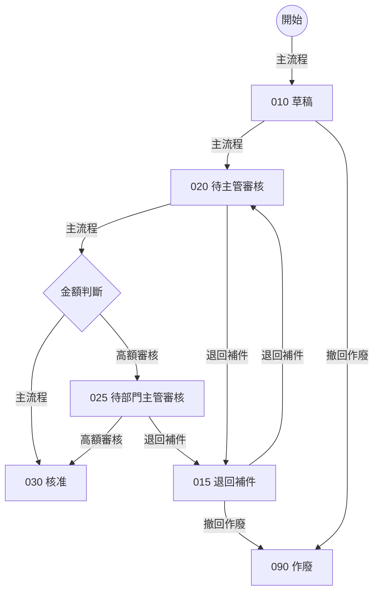
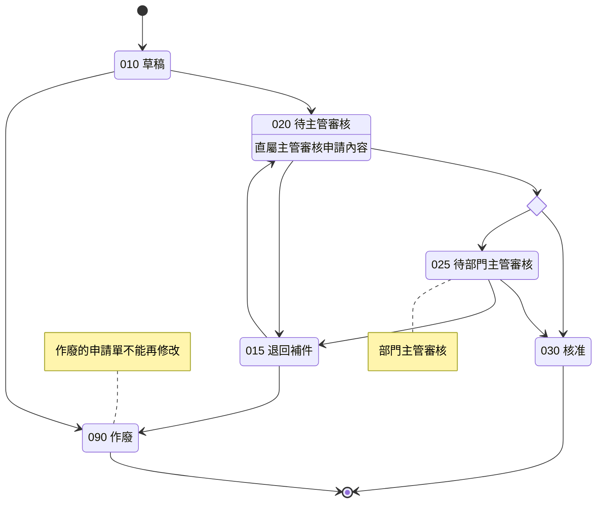
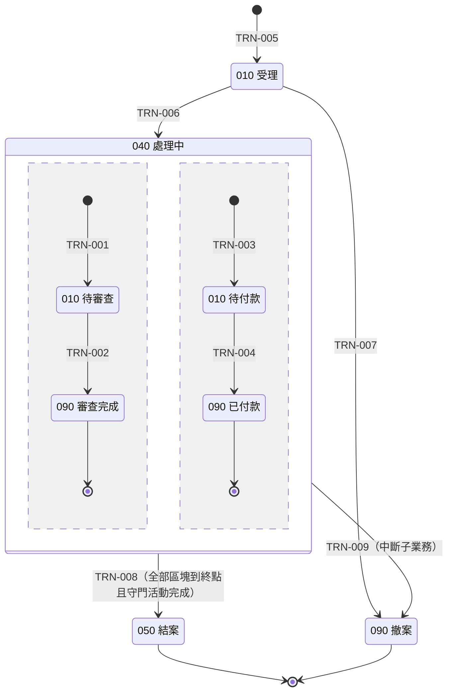

# 貫穿範例：申請／審核（合成）

> [設計提案](../spec-schema-framework.md)的附件。全部是合成資料：
>
> - Component：`TW_DEMO_REQ`（申請）、`TW_DEMO_APV`（審核）。
> - 狀態碼：010～090。
> - 人員：E1001 申請人、E2001 直屬主管、E3001 部門主管。
>
> 本範例的檔案：
>
> - [input/](examples/walkthrough/input/)：使用者提供的輸入。
> - [canonical/](examples/walkthrough/canonical/)：外環產生的 JSON。
> - [rendered/](examples/walkthrough/rendered/00-index.md)：讀者看到的 Markdown。
> - [gate-report.json](examples/walkthrough/gate-report.json)：檢核結果。
>
> §9 另用第二組合成資料示範子業務守門（畫法一），檔案在 [examples/gate/](examples/gate/)。
>
> 以上都由同一份 schema 與範例定義產生並驗證（設計期腳本，未放進 repo）；本頁的表格與程式碼區塊也是同一次產生的。

## 1. 情境

- **主流程**：員工在申請畫面建立申請單（金額、事由），存檔後是草稿（010）。送出後（020）由直屬主管審核：
  - 金額不超過 50000：核准即結案（030）。
  - 金額超過 50000：轉給部門主管再審（025），部門主管核准後結案（030）。
- **退回**：審核者可以填意見退回（015）；申請人補件後重新送出，回到直屬主管審核。
- **撤回**：草稿或退回中的申請單可以撤回作廢（090）。

舊系統另有幾個「產品內建、業務沒在用」或「圖上沒有」的東西，用來示範主文件 §8.6、§8.8 的處理（本頁 §8）：

- 審核 Component 載入時，有一段程式在特殊參數下會把核准單改回草稿（030→010），狀態圖沒有這條轉移。
- PROD 還有舊制的狀態碼 099 的資料。
- 狀態欄位的值域另定義了 040、050，但沒有資料，也沒有核心程式使用。
- 申請單主檔有兩個原生欄位（`OLD_REF_NO`、`PRIORITY_CD`）全表沒有值，核心程式也沒有引用。
- 金額檢核程式有一段原生分支：申請類別是 INT（內部）時略過檢核。PROD 沒有 INT 的資料，INT 在值清單也已停用。

狀態圖上另有三行文字（一行狀態描述、兩個 note），用來示範狀態活動的處置（本頁 §7）。

## 2. 輸入

[STATUS 文件](examples/walkthrough/input/status-REQ_STATUS.md)內有兩張圖。flowchart 的邊標情境類型：



stateDiagram-v2 沒有邊標籤，金額分岔用 `<<choice>>`。最後三行是一行狀態描述與兩個 note，寫的是「這個階段誰該做什麼」（§7）：



[專案輸入檔](examples/walkthrough/input/project.md)提供目標與決策責任（業務單位主管、業務承辦窗口）。

狀態圖全部在同一份 STATUS 檔。這個範例只有一個狀態實體，模型讀檔後提出的對應是：兩張圖都屬於 `REQ_STATUS`，狀態欄位是 `TW_DEMO_REQHDR.REQ_STATUS`。外環再驗證這份對應：兩張圖各用一次、狀態碼與轉移一致、欄位值域包含圖上每個狀態碼。

## 3. 外環先做的事：解析與比對

研究開始前，外環解析檔內每張圖，並依模型提出的對應逐組比對。收合時：

- `D1{金額判斷}` 與 `amount_check` 都是虛擬節點，會被收合。
- 收合後的情境類型取最後一段邊的標籤；例如 `N020 →（主流程）D1 →（高額審核）N025` 歸「高額審核」。
- 狀態描述與 note 不是轉移；解析器逐行列出它們（含所屬狀態），交給 04 處置（§7）。

| 項目 | 結果 |
|---|---|
| flowchart 邊數 | 11 |
| stateDiagram-v2 邊數（含 [*] 與 choice） | 13 |
| 狀態碼 | 010、015、020、025、030、090 |
| 正規化後的狀態轉移 | *>010、010>020、010>090、015>020、015>090、020>015、020>025、020>030、025>015、025>030（共 10 條） |
| 終點狀態 | 030、090 |
| 兩圖狀態碼一致 | 是 |
| 兩圖轉移一致 | 是 |
| 情境「主流程」 | *>010、010>020、020>030 |
| 情境「撤回作廢」 | 010>090、015>090 |
| 情境「退回補件」 | 015>020、020>015、025>015 |
| 情境「高額審核」 | 020>025、025>030 |
| 狀態描述（L46，020） | 直屬主管審核申請內容 |
| note（L47，025） | 部門主管審核 |
| note（L48，090） | 作廢的申請單不能再修改 |

兩圖一致，所以研究可以開始。這 10 條轉移與 4 種情境就是 04 的分母：研究只能補細節，不能增減。

## 4. ID 派發

外環依自然鍵的字元碼順序派號（主文件 §7.2）。所以 FR-001 是「核准」而不是「建立」：ID 不代表順序，17 另有 `order` 欄。

| ID | 自然鍵 | 名稱 |
|---|---|---|
| STATE-001 | `REQ_STATUS:010` | 010 草稿 |
| STATE-002 | `REQ_STATUS:015` | 015 退回補件 |
| STATE-003 | `REQ_STATUS:020` | 020 待主管審核 |
| STATE-004 | `REQ_STATUS:025` | 025 待部門主管審核 |
| STATE-005 | `REQ_STATUS:030` | 030 核准 |
| STATE-006 | `REQ_STATUS:090` | 090 作廢 |
| TRN-001 | `REQ_STATUS:*>010` | 新建→010 |
| TRN-002 | `REQ_STATUS:010>020` | 010→020 |
| TRN-003 | `REQ_STATUS:010>090` | 010→090 |
| TRN-004 | `REQ_STATUS:015>020` | 015→020 |
| TRN-005 | `REQ_STATUS:015>090` | 015→090 |
| TRN-006 | `REQ_STATUS:020>015` | 020→015 |
| TRN-007 | `REQ_STATUS:020>025` | 020→025 |
| TRN-008 | `REQ_STATUS:020>030` | 020→030 |
| TRN-009 | `REQ_STATUS:025>015` | 025→015 |
| TRN-010 | `REQ_STATUS:025>030` | 025→030 |
| FLOW-001 | `REQ_STATUS:主流程` | 主流程 |
| FLOW-002 | `REQ_STATUS:撤回作廢` | 撤回作廢 |
| FLOW-003 | `REQ_STATUS:退回補件` | 退回補件 |
| FLOW-004 | `REQ_STATUS:高額審核` | 高額審核 |
| ACT-001 | `REQ_STATUS:020:01` | 直屬主管審核申請 |
| ACT-002 | `REQ_STATUS:025:01` | 部門主管審核高額申請 |
| FR-001 | `TW_DEMO_APV:APPROVE` | 核准申請 |
| FR-002 | `TW_DEMO_APV:RETURN` | 退回申請 |
| FR-003 | `TW_DEMO_REQ:CREATE` | 建立申請 |
| FR-004 | `TW_DEMO_REQ:SUBMIT` | 送出申請 |
| FR-005 | `TW_DEMO_REQ:WITHDRAW` | 撤回申請 |

## 5. 從一個功能往下看（反向追溯）

issue 裡「FR-001 往下展開」的樹，在這套設計中不是誰手寫的。FR-001 只記錄自己往上游的參照：實現的轉移、操作者。下面這棵樹由外環從下游項目的參照反查得到，00-index 的追溯矩陣也是同樣算法。

```text
FR-001 核准申請
 ├─ 角色：ROLE-001 審核主管
 ├─ 衍生概念：DRV-002 申請人的直屬主管、DRV-001 申請人的部門主管
 ├─ 狀態轉移：TRN-007 020→025、TRN-008 020→030、TRN-010 025→030
 ├─ 狀態活動：ACT-001 直屬主管審核申請、ACT-002 部門主管審核高額申請
 ├─ 情境：FLOW-001 主流程、FLOW-004 高額審核
 ├─ 畫面元件：UI-001 申請單審核、UI-002 金額、UI-003 審核意見、UI-004 申請事由、UI-005 核准
 ├─ 操作契約：OP-001 核准申請
 ├─ 寫入／讀取的欄位（經 TRN、OP）：FLD-010 TW_DEMO_REQHDR.AMOUNT、FLD-011 TW_DEMO_REQHDR.APPROVER_EMPLID、FLD-012 TW_DEMO_REQHDR.APPROVE_DT、FLD-013 TW_DEMO_REQHDR.COMMENTS、FLD-016 TW_DEMO_REQHDR.REQ_ID、FLD-017 TW_DEMO_REQHDR.REQ_STATUS
 ├─ 測試案例：TC-001 金額剛好 50000 時一次核准、TC-002 金額 50000.01 時轉部門主管、TC-003 具審核角色但不是直屬主管者看不到申請單、TC-004 高額案件兩段核准
 └─ 工作項：TASK-002 核准申請
```

## 6. 「長官」怎麼寫

轉移 020→030（TRN-008）的操作者條件不寫「需要長官審核」，而是兩個運算元：

- 使用者具有審核主管角色（ROLE-001）。
- 使用者是〈申請人的直屬主管〉（DRV-002）。

```json
{
  "id": "TRN-008",
  "key": "REQ_STATUS:020>030",
  "lifecycle": "ACTIVE",
  "basis": "AUTHORITATIVE_DOC",
  "certainty": "CONFIRMED",
  "evidence": [
    "EV-0054",
    "EV-0055",
    "EV-0018",
    "EV-0019"
  ],
  "entityKey": "REQ_STATUS",
  "from": "STATE-003",
  "to": "STATE-005",
  "via": [
    "amount_check"
  ],
  "exitMode": "NORMAL",
  "trigger": {
    "kind": "USER_ACTION",
    "object": "OBJ-002",
    "action": "按「核准」（TW_DEMO_REQWRK.APPROVE_PB）",
    "event": "FIELD_CHANGE"
  },
  "actor": {
    "all": [
      {
        "left": {
          "ctx": "CURRENT_USER_OPRID"
        },
        "op": "HAS_ROLE",
        "right": {
          "role": "ROLE-001"
        }
      },
      {
        "left": {
          "drv": "DRV-002"
        },
        "op": "EQ",
        "right": {
          "ctx": "CURRENT_USER_EMPLID"
        }
      }
    ]
  },
  "guard": {
    "left": {
      "fld": "FLD-010"
    },
    "op": "LE",
    "right": {
      "const": "50000",
      "type": "NUMBER"
    }
  },
  "writes": [
    {
      "field": "FLD-017",
      "value": {
        "const": "030",
        "type": "CHAR"
      }
    },
    {
      "field": "FLD-011",
      "value": {
        "ctx": "CURRENT_USER_EMPLID"
      }
    },
    {
      "field": "FLD-012",
      "value": {
        "ctx": "CURRENT_DATE"
      }
    }
  ],
  "sideEffects": {
    "na": "轉移本身沒有其他副作用；送出通知由 09 的規則觸發"
  },
  "implementedAt": [
    {
      "object": "OBJ-012",
      "event": "FieldChange"
    }
  ],
  "reentry": "核准後按鈕隱藏；兩位審核者同時核准時，後存檔者被拒絕（見 08 的併發行為）。"
}
```

「申請人的直屬主管」在 07 定義成一筆衍生概念，寫明：

- 從哪張表、用什麼串接、取哪一欄。
- 有效日怎麼取（目前有效列、只取有效狀態）。
- 查不到時結果為空，由 09 的規則在送出時擋下。
- 為什麼不會有多筆。

```json
{
  "id": "DRV-002",
  "key": "REQUESTER_SUPERVISOR",
  "lifecycle": "ACTIVE",
  "basis": "CODE",
  "certainty": "CONFIRMED",
  "evidence": [
    "EV-0030",
    "EV-0014"
  ],
  "name": "申請人的直屬主管",
  "meaning": "申請人目前任職資料上登記的直屬主管；送出時必須存在，020 由此人審核。",
  "inputs": [
    {
      "name": "REQUESTER",
      "from": {
        "fld": "FLD-015"
      }
    }
  ],
  "resultType": "PERSON_ID",
  "resolution": {
    "sources": [
      "ENT-002"
    ],
    "joins": [
      {
        "left": "FLD-008",
        "right": {
          "param": "REQUESTER"
        }
      }
    ],
    "filter": "ALWAYS",
    "effectiveDating": [
      {
        "entity": "ENT-002",
        "rule": "CURRENT_ROW",
        "asOf": {
          "ctx": "CURRENT_DATE"
        },
        "effStatusActiveOnly": true
      }
    ],
    "pick": "FLD-009",
    "tieBreak": {
      "na": "鍵（EMPLID＋EFFDT）加目前有效列規則保證只有一列"
    }
  },
  "whenNotFound": {
    "result": "EMPTY",
    "note": "查無目前有效的任職列，或 SUPERVISOR_ID 為空白時結果為空；送出時由 09 的規則擋下。"
  },
  "whenMultiple": {
    "rule": "UNIQUE_BY_KEY",
    "note": "目前有效列規則下每位員工只有一列。"
  },
  "implementedAt": [
    "OBJ-014",
    "OBJ-012",
    "OBJ-013"
  ]
}
```

讀者在 04 看到的是外環渲染出的句子：

```markdown
### TRN-008　020→030

- 自然鍵：`REQ_STATUS:020>030`
- 狀態實體：REQ_STATUS
- 起始狀態（新建為 INITIAL）：STATE-003（020 待主管審核）
- 目標狀態：STATE-005（030 核准）
- 收合掉的 choice／fork／join 節點：amount_check
- 離開方式：NORMAL
- 觸發方式、所在物件與動作原名（COMPLETION＝條件成立時由系統自動轉移）：
  - 種類：USER_ACTION
  - 物件：OBJ-002（TW_DEMO_APV）
  - 動作：按「核准」（TW_DEMO_REQWRK.APPROVE_PB）
  - 事件：FIELD_CHANGE
- 誰能觸發（角色、資格的判定方式）：（目前使用者帳號 具有角色 ROLE-001（審核主管））且（〈申請人的直屬主管〉（DRV-002） ＝ 目前使用者員工編號）
- 轉移條件（選擇此目標的條件；守門轉移要含每個區塊與守門活動，R13）：FLD-010（TW_DEMO_REQHDR.AMOUNT） ≤ 50000
- 轉移時寫入的欄位與值：FLD-017（TW_DEMO_REQHDR.REQ_STATUS） ← '030'、FLD-011（TW_DEMO_REQHDR.APPROVER_EMPLID） ← 目前使用者員工編號、FLD-012（TW_DEMO_REQHDR.APPROVE_DT） ← 系統日期
- 其他副作用（通知、介面等於 06／09 反查；INTERRUPT 要寫明未完成的子業務資料怎麼處理）：不適用：轉移本身沒有其他副作用；送出通知由 09 的規則觸發
- 原系統實作位置：
  - 物件：OBJ-012（TW_DEMO_REQWRK.APPROVE_PB.FieldChange）；事件：FieldChange
- 重複觸發或同時操作時的行為：核准後按鈕隱藏；兩位審核者同時核准時，後存檔者被拒絕（見 08 的併發行為）。
- 來源：狀態權威文件；證據 EV-0054、EV-0055、EV-0018、EV-0019
- 被引用（外環反查）：OBJ-012；ACT-001；FLOW-001；FR-001；OP-001；TC-001、TC-003、TC-010；TASK-002；DOD-003
```

## 7. 狀態活動：圖上的「誰在這個階段該做什麼」

狀態圖上的狀態描述（`S020 : …`）與 note，寫的是這個階段誰該做什麼。解析器逐行列出這三行，04 必須每一行都處置（主文件 §8.7）：

| 位置 | 原文 | 處置 | 對應活動或理由 |
|---|---|---|---|
| `L46` | 直屬主管審核申請內容 | ACTIVITY | ACT-001（直屬主管審核申請） |
| `L47` | 部門主管審核 | ACTIVITY | ACT-002（部門主管審核高額申請） |
| `L48` | 作廢的申請單不能再修改 | NOT_ACTIVITY | 描述終點的性質，不是某人在這個階段要做的事；已由 090 的終點標記與 05 的按鈕顯示條件表達。 |

- 兩行是活動，都由轉移完成（BY_TRANSITION）：直屬主管或部門主管按「核准」或「退回」，就離開這個狀態。所以活動不另寫完成條件，而是列出完成它的轉移。
- 「作廢的申請單不能再修改」描述的是終點的性質，不是誰要做的事；處置寫明理由，不產生活動。
- 原文的「直屬主管」「部門主管」，在活動的 `actors` 必須是衍生概念（DRV-002、DRV-001），不能停在文字。

```json
{
  "id": "ACT-001",
  "key": "REQ_STATUS:020:01",
  "lifecycle": "ACTIVE",
  "basis": "AUTHORITATIVE_DOC",
  "certainty": "CONFIRMED",
  "evidence": [
    "EV-0068",
    "EV-0019"
  ],
  "entityKey": "REQ_STATUS",
  "state": "STATE-003",
  "name": "直屬主管審核申請",
  "behavior": "直屬主管審核申請內容",
  "actors": [
    {
      "drv": "DRV-002"
    }
  ],
  "enforcement": "BY_TRANSITION",
  "realizedBy": [
    "TRN-008",
    "TRN-007",
    "TRN-006"
  ],
  "completion": {
    "na": "核准或退回（離開 020）即完成；系統沒有另外記錄審核進度"
  }
}
```

需要系統檢查的活動（SYSTEM_GATE）與守門轉移，見 §9 的第二個範例。

## 8. 圖外發現與原生未使用分支

| 發現 | 證據 | 處理 |
|---|---|---|
| PROD 有狀態碼 099 的資料，圖上沒有 | 狀態欄位的 distinct 值查詢 | Q-002，OFF_DIAGRAM_STATE，HIGH，INFO，OPEN；不進 04，也不進 07 的值域 |
| `TW_DEMO_APV.PostBuild` 在特殊參數下把 030 改回 010 | 程式段落 | Q-003，OFF_DIAGRAM_TRANSITION，LOW，INFO；人工裁決 DEC-001「不重建」後標 ANSWERED。這支程式在 09 的處置是 OFF_DIAGRAM_ONLY |
| 值域有 040、050，但沒有資料、核心程式不用 | 值域定義 | 不列題，90 與 00-index 只顯示「只計數的定義值 2」 |
| `OLD_REF_NO`、`PRIORITY_CD` 全表非預設 0 筆、核心路徑沒有指名引用 | 資料彙總與交叉參照 SQL | 07 的 XF-001；01 的 Record 判定寫「排除 2 欄」；其他文件不得出現這兩個欄位名（R04） |
| 金額檢核程式在申請類別＝INT 時略過檢核 | 分支段落；全表分布、值清單、PeopleCode 交叉參照 SQL | Q-001，NATIVE_UNUSED_BRANCH，INFO，附證明；09 的金額規則不帶這個條件，程式處置標 NATIVE_UNUSED_BRANCH（R14 檢查兩邊對得上）。申請類別欄位照常建立：GEN、URG 都有資料，只有 INT 不會出現 |

圖外問題與原生未使用分支都是 INFO，不擋完成；HIGH 級圖外問題要人逐一裁決。

原生未使用分支的證明寫在問題裡。這一題用的是 DATA_VALUE_ABSENT：值在 PROD 全表 0 筆，而且沒有任何路徑會產生它（值清單停用、頁面不提供、核心程式不寫入、Record 預設值不是它）。少了其中任何一項，就證明不了，分支照常寫進 09。

```json
{
  "id": "Q-001",
  "key": "NATIVE_UNUSED_BRANCH:TW_DEMO_REQHDR.AMOUNT.SaveEdit:REQ_TYPE=INT",
  "lifecycle": "ACTIVE",
  "basis": "COMPUTED",
  "certainty": "CONFIRMED",
  "evidence": [
    "EV-0022",
    "EV-0023",
    "EV-0024",
    "EV-0025"
  ],
  "category": "NATIVE_UNUSED_BRANCH",
  "severity": "INFO",
  "question": "金額檢核程式有一段「申請類別＝INT（內部）時略過金額檢核」的原生分支。PROD 沒有 INT 的資料，INT 在值清單已停用、頁面不提供，核心路徑也沒有程式寫入 INT，所以不重建這段分支。新系統若要支援內部申請，需要另外決策。",
  "affects": [
    "OBJ-010",
    "FLD-018"
  ],
  "observed": {
    "location": "TW_DEMO_REQHDR.AMOUNT.SaveEdit"
  },
  "proof": {
    "kind": "DATA_VALUE_ABSENT",
    "branchCondition": "If TW_DEMO_REQHDR.REQ_TYPE = \"INT\" Then",
    "field": "TW_DEMO_REQHDR.REQ_TYPE",
    "absentValues": [
      "INT"
    ],
    "statement": "PROD 全表沒有 INT（GEN 900 筆、URG 312 筆）；INT 在值清單已停用，頁面選項不含 INT；PeopleCode 交叉參照只有這支程式讀取 REQ_TYPE，核心路徑沒有寫入 INT 的程式；Record 預設值是 GEN。",
    "checkedOn": "2026-10-01"
  },
  "raisedBy": "RESEARCH",
  "status": "OPEN"
}
```

## 9. 子業務守門：畫法一（第二個合成範例）

這一節用另一組合成資料（[examples/gate/](examples/gate/)）示範主業務等待子業務：案件進入 040 後，文件審查與付款同時進行；兩者都到終點，而且承辦人已上傳結案報告，案件才自動進入 050。

### 9.1 STATUS 檔的畫法

040 畫成複合狀態，以 `--` 分成兩個平行區塊；子業務只畫在區塊內，flowchart 只畫主業務。最後四行是狀態描述與 note：

```mermaid
stateDiagram-v2
    state "010 受理" as M010
    state "040 處理中" as M040 {
        state "010 待審查" as D010
        state "090 審查完成" as D090
        [*] --> D010
        D010 --> D090
        D090 --> [*]
        --
        state "010 待付款" as P010
        state "090 已付款" as P090
        [*] --> P010
        P010 --> P090
        P090 --> [*]
    }
    state "050 結案" as M050
    state "090 撤案" as M090
    [*] --> M010
    M010 --> M040
    M040 --> M050
    M010 --> M090
    M040 --> M090
    M050 --> [*]
    M090 --> [*]
    M040 : 承辦人上傳結案報告
    D010 : 審查人員逐份審查文件
    P010 : 會計人員依核定金額付款
    note right of M050 : 結案後由系統寄發結案通知
```

模型讀檔後提出的對應：主業務是 `CASE_STATUS`（`TW_DEMO_CASE.CASE_STATUS`）；040 的第 1 個區塊是 `CASEDOC_STATUS`（`TW_DEMO_CASEDOC.DOC_STATUS`），第 2 個是 `CASEPAY_STATUS`（`TW_DEMO_CASEPAY.PAY_STATUS`）。

### 9.2 解析結果

| 狀態實體 | 位置 | 狀態碼 | 正規化後的轉移 | 終點 |
|---|---|---|---|---|
| `CASE_STATUS` | 主業務（最外層） | 010、040、050、090 | *>010、010>040、010>090、040>050、040>090 | 050、090 |
| `CASEDOC_STATUS` | M040 第 1 區塊 | 010、090 | *>010、010>090 | 090 |
| `CASEPAY_STATUS` | M040 第 2 區塊 | 010、090 | *>010、010>090 | 090 |

| 複合狀態 | 平行區塊（依序） | 離開的箭頭 |
|---|---|---|
| `CASE_STATUS` 040 | CASEDOC_STATUS、CASEPAY_STATUS | 040>050、040>090 |

| 行 | 種類 | 所屬實體與狀態碼 | 原文 |
|---|---|---|---|
| L43 | 狀態描述 | `CASE_STATUS` 040 | 承辦人上傳結案報告 |
| L44 | 狀態描述 | `CASEDOC_STATUS` 010 | 審查人員逐份審查文件 |
| L45 | 狀態描述 | `CASEPAY_STATUS` 010 | 會計人員依核定金額付款 |
| L46 | note | `CASE_STATUS` 050 | 結案後由系統寄發結案通知 |

- 每個區塊有自己的起點與終點：區塊內的 `[*] --> D010` 是新增一份文件，`D090 --> [*]` 表示 090 是這個區塊的終點。
- 040 有兩條離開的箭頭。圖上看不出哪一條要等子業務完成，由研究判定：040→050 是守門（ON_COMPLETION），040→090 撤案不等子業務（INTERRUPT）。
- 四行文字都要處置：三行是活動；「結案後由系統寄發結案通知」是系統的副作用，寫在 040→050 的 sideEffects。

### 9.3 守門轉移怎麼寫

```json
{
  "id": "TRN-008",
  "key": "CASE_STATUS:040>050",
  "lifecycle": "ACTIVE",
  "basis": "AUTHORITATIVE_DOC",
  "certainty": "CONFIRMED",
  "evidence": [
    "EV-0029",
    "EV-0030",
    "EV-0008",
    "EV-0009",
    "EV-0010",
    "EV-0007"
  ],
  "entityKey": "CASE_STATUS",
  "from": "STATE-006",
  "to": "STATE-007",
  "exitMode": "ON_COMPLETION",
  "trigger": {
    "kind": "COMPLETION",
    "object": "OBJ-004",
    "action": "共用函式 TW_DEMO_CHKCLOSE 檢查守門條件，成立時把案件改為 050",
    "evaluatedAfter": [
      "TRN-002",
      "TRN-004",
      "ACT-003"
    ]
  },
  "actor": {
    "na": "條件成立時由系統自動轉移，沒有操作者"
  },
  "guard": {
    "all": [
      {
        "rows": "ENT-002",
        "quantifier": "ALL",
        "where": {
          "left": {
            "fld": "FLD-007"
          },
          "op": "EQ",
          "right": {
            "state": "STATE-002"
          }
        },
        "whenEmpty": "NOT_MET"
      },
      {
        "rows": "ENT-003",
        "quantifier": "ALL",
        "where": {
          "left": {
            "fld": "FLD-011"
          },
          "op": "EQ",
          "right": {
            "state": "STATE-004"
          }
        },
        "whenEmpty": "MET"
      },
      {
        "left": {
          "act": "ACT-003"
        },
        "op": "DONE"
      }
    ]
  },
  "writes": [
    {
      "field": "FLD-002",
      "value": {
        "const": "050",
        "type": "CHAR"
      }
    },
    {
      "field": "FLD-003",
      "value": {
        "ctx": "CURRENT_DATE"
      }
    }
  ],
  "sideEffects": [
    {
      "description": "寄發結案通知給案件的承辦人；寄送失敗不影響結案。",
      "fields": []
    }
  ],
  "implementedAt": [
    {
      "object": "OBJ-004",
      "event": "FieldFormula（由 TW_DEMO_DOCREV、TW_DEMO_PAYMNT、TW_DEMO_CASE 的 SavePostChange 呼叫）"
    }
  ],
  "reentry": "只在案件仍為 040 時轉移；轉為 050 之後再存檔不會重複結案，也不會重寄通知。"
}
```

- `exitMode` 是 ON_COMPLETION。觸發是 COMPLETION：條件成立時由系統自動轉移，`evaluatedAfter` 寫明系統在哪些動作之後檢查（審查完成、付款完成、上傳結案報告）。
- 守衛逐項對應圖上的東西（R13）：
  - 文件區塊：案件的每一份文件都是 090；一份文件都沒有時不算完成（whenEmpty＝NOT_MET）。
  - 付款區塊：每一筆付款都是 090；沒有付款時算完成（whenEmpty＝MET）。
  - 守門活動「上傳結案報告」已完成（DONE）。
- 兩個 whenEmpty 不同，是看資料決定的：已結案的案件中，沒有文件的 0 件、沒有付款的 117 件（證據中的 SQL）。「等全部完成」最常漏講的就是這一句，所以 ALL 與 NONE 一定要寫 whenEmpty，schema 會擋。

守門活動寫成一筆 ACT：負責人是角色，完成條件是結案報告附件有值；守門轉移以 DONE 引用它。

```json
{
  "id": "ACT-003",
  "key": "CASE_STATUS:040:01",
  "lifecycle": "ACTIVE",
  "basis": "AUTHORITATIVE_DOC",
  "certainty": "CONFIRMED",
  "evidence": [
    "EV-0041",
    "EV-0016",
    "EV-0009"
  ],
  "entityKey": "CASE_STATUS",
  "state": "STATE-006",
  "name": "上傳結案報告",
  "behavior": "承辦人上傳結案報告",
  "actors": [
    {
      "role": "ROLE-002"
    }
  ],
  "enforcement": "SYSTEM_GATE",
  "completion": {
    "left": {
      "fld": "FLD-004"
    },
    "op": "IS_NOT_BLANK"
  }
}
```

### 9.4 讀者看到的

外環重新產生的狀態圖保留平行區塊，離開 040 的兩條箭頭分別標出守門與中斷：



```markdown
### TRN-008　040→050

- 自然鍵：`CASE_STATUS:040>050`
- 狀態實體：CASE_STATUS
- 起始狀態（新建為 INITIAL）：STATE-006（040 處理中）
- 目標狀態：STATE-007（050 結案）
- 離開方式：ON_COMPLETION
- 觸發方式、所在物件與動作原名（COMPLETION＝條件成立時由系統自動轉移）：
  - 種類：COMPLETION
  - 物件：OBJ-004（TW_DEMO_CASEWRK.CHKCLOSE.FieldFormula）
  - 動作：共用函式 TW_DEMO_CHKCLOSE 檢查守門條件，成立時把案件改為 050
  - 在這些之後檢查：TRN-002（010→090）、TRN-004（010→090）、ACT-003（上傳結案報告）
- 誰能觸發（角色、資格的判定方式）：不適用：條件成立時由系統自動轉移，沒有操作者
- 轉移條件（選擇此目標的條件；守門轉移要含每個區塊與守門活動，R13）：（ENT-002（TW_DEMO_CASEDOC） 中對應這一筆的每一列都符合（FLD-007（TW_DEMO_CASEDOC.DOC_STATUS） ＝ '090'（STATE-002 審查完成））；沒有任何對應的列時視為不成立）且（ENT-003（TW_DEMO_CASEPAY） 中對應這一筆的每一列都符合（FLD-011（TW_DEMO_CASEPAY.PAY_STATUS） ＝ '090'（STATE-004 已付款））；沒有任何對應的列時視為成立）且（活動 ACT-003（上傳結案報告） 已完成）
- 轉移時寫入的欄位與值：FLD-002（TW_DEMO_CASE.CASE_STATUS） ← '050'、FLD-003（TW_DEMO_CASE.CLOSE_DT） ← 系統日期
- 其他副作用（通知、介面等於 06／09 反查；INTERRUPT 要寫明未完成的子業務資料怎麼處理）：
  - 說明：寄發結案通知給案件的承辦人；寄送失敗不影響結案。；欄位：（無）
- 原系統實作位置：
  - 物件：OBJ-004（TW_DEMO_CASEWRK.CHKCLOSE.FieldFormula）；事件：FieldFormula（由 TW_DEMO_DOCREV、TW_DEMO_PAYMNT、TW_DEMO_CASE 的 SavePostChange 呼叫）
- 重複觸發或同時操作時的行為：只在案件仍為 040 時轉移；轉為 050 之後再存檔不會重複結案，也不會重寄通知。
- 來源：狀態權威文件；證據 EV-0029、EV-0030、EV-0008、EV-0009、EV-0010、EV-0007
- 被引用（外環反查）：FLOW-001；TC-001、TC-002、TC-003、TC-004、TC-005
```

### 9.5 守門的測試

C07 要求守門轉移有正例與反例；逐列條件有 whenEmpty 時，還要有「沒有任何一列」的邊界例；守門活動也要有案例：

| 案例 | 類型 | 前置（合成資料） | 操作 | 預期 |
|---|---|---|---|---|
| TC-001 沒有任何文件時上傳報告也不會結案 | BOUNDARY | CASE_STATUS＝040；CLOSE_RPT_ATT＝空白（尚未上傳）；TW_DEMO_CASEDOC 沒有任何一列；TW_DEMO_CASEPAY 沒有任何一列 | 以承辦人上傳結案報告並存檔 | 案件 040 處理中 |
| TC-002 最後上傳結案報告時自動結案 | POSITIVE | CASE_STATUS＝040；CLOSE_RPT_ATT＝空白（尚未上傳）；DOC_STATUS＝090（文件第 1 列）；PAY_STATUS＝090（付款第 1 列） | 以承辦人上傳結案報告並存檔 | 案件 050 結案 |
| TC-003 文件尚未審查完成時，付款完成不會結案 | NEGATIVE | CASE_STATUS＝040；CLOSE_RPT_ATT＝RPT0001；DOC_STATUS＝010（文件第 1 列）；PAY_STATUS＝010（付款第 1 列） | 以會計人員把付款第 1 列標為付款完成 | 案件 040 處理中 |
| TC-004 尚未上傳結案報告時，付款完成不會結案 | NEGATIVE | CASE_STATUS＝040；CLOSE_RPT_ATT＝空白（尚未上傳）；DOC_STATUS＝090（文件第 1 列）；PAY_STATUS＝010（付款第 1 列） | 以會計人員把付款第 1 列標為付款完成 | 案件 040 處理中 |
| TC-005 最後一筆付款完成時自動結案 | POSITIVE | CASE_STATUS＝040；CLOSE_RPT_ATT＝RPT0001；DOC_STATUS＝090（文件第 1 列）；PAY_STATUS＝010（付款第 1 列） | 以會計人員把付款第 1 列標為付款完成 | 案件 050 結案 |

本範例只產生 01、02、03、04、07、14，只跑 L1、R01、C01、R13 與守門的 C02、C07，結果見 [gate-report.json](examples/gate/gate-report.json)（沒有任何發現）。其他檢核需要完整的 job。

## 10. 檢核結果

L1～L3 是設計期腳本實際執行的結果。L4、L5 是示意值：範例假設已執行並通過，沒有真的跑覆核與讀者。

| 文件 | 狀態 | L1 | L2 | L3 | L4 | L5 |
|---|---|---|---|---|---|---|
| 01 專案概覽 | in_review | PASS | PASS | PASS | PASS | NOT_APPLICABLE |
| 02 功能需求 | in_review | PASS | PASS | PASS | PASS | PASS |
| 03 角色與權限 | in_review | PASS | PASS | PASS | PASS | PASS |
| 04 流程與狀態機 | in_review | PASS | PASS | PASS | PASS | PASS |
| 05 畫面與互動 | in_review | PASS | PASS | PASS | PASS | PASS |
| 06 系統架構（技術中立） | in_review | PASS | PASS | PASS | PASS | PASS |
| 07 資料設計 | in_review | PASS | PASS | PASS | PASS | PASS |
| 08 操作契約（API） | in_review | PASS | PASS | PASS | PASS | PASS |
| 09 業務邏輯 | in_review | PASS | PASS | PASS | PASS | PASS |
| 14 測試與驗收 | draft | PASS | PASS | FAIL | PASS | NOT_APPLICABLE |
| 16 AI 實作指引 | in_review | PASS | PASS | NOT_APPLICABLE | NOT_APPLICABLE | NOT_APPLICABLE |
| 17 工作拆解與相依 | in_review | PASS | PASS | PASS | NOT_APPLICABLE | NOT_APPLICABLE |
| 18 完成定義 | in_review | PASS | PASS | PASS | NOT_APPLICABLE | NOT_APPLICABLE |
| 19 決策紀錄 | in_review | PASS | PASS | NOT_APPLICABLE | NOT_APPLICABLE | NOT_APPLICABLE |
| 90 問題清單 | in_review | PASS | PASS | NOT_APPLICABLE | NOT_APPLICABLE | NOT_APPLICABLE |

未通過的檢核：

- `14-testing/L3` C07 TRN-005（015>090）沒有測試案例
- `14-testing/L3` C07 TRN-009（025>015）沒有測試案例

範例故意少寫兩個測試案例：「退回補件中撤回」（015→090）、「部門主管退回」（025→015）。L3 的 C07 抓到後，14 停在 draft，整體狀態是 DRAFT，00-index 的「未通過的檢核」也會列出來。補上兩個案例重跑，14 才會變成 in_review。

### 壞範例：刻意破壞後由哪一層擋下

設計期腳本對兩個範例做 18 種破壞（貫穿範例 10 種、守門範例 8 種），每一種都被對應的檢核擋下，結果見 [negative-report.json](examples/negative-report.json)。這就是 issue 完成標準所說的「能檢查缺欄位、缺引用或含未確認假設」。L0 PARSE 表示解析器停止：從區塊內直接連到外面的箭頭不支援，停在該行。

| 破壞方式 | 預期 | 結果 | 檢核訊息 |
|---|---|---|---|
| 缺欄位：TRN-008 刪掉 guard | L1 S01 | 擋下 | TRN-008 （項目）：'guard' is a required property |
| 模糊條件：BR-006 的條件寫成「需要長官審核」 | L1 S01 | 擋下 | BR-006 condition：'需要長官審核' is not valid under any of the given schemas |
| 填充字：FR-004 的說明寫「待確認」 | L1 S01 | 擋下 | FR-004 description：命中禁用的填充字 |
| 未標示推論：DRV-002 改成 INFERRED 卻沒寫推論鏈 | L1 S01 | 擋下 | DRV-002 （項目）：'inference' is a required property |
| 推測寫成事實：OP-001 的併發行為寫「應該是後存檔者覆蓋」 | L1 S07 | 標出（警告） | OP-001 CONFIRMED 項目出現推測用語「應該是」（警告，交覆核） |
| 缺引用：OP-004 的檢核清單指向不存在的 BR-099 | L2 R01 | 擋下 | OP-004 參照不存在的 BR-099 |
| 往下游參照：FLD-010 宣稱推導自 TC-001 | L2 R03 | 擋下 | FLD-010 往下游參照 TC-001 |
| 不建置欄位寫進正文：BR-003 的邊界提到 OLD_REF_NO | L2 R04 | 擋下 | BR-003 正文寫到不建置欄位 OLD_REF_NO |
| 圖外轉移寫進 04：新增 030→010 | L3 C01 | 擋下 | 04 有狀態圖沒有的轉移 ['030>010'] |
| 原生未使用分支寫回正文：BR-003 的條件加上「申請類別≠INT」 | L2 R14 | 擋下 | BR-003 的條件比對 TW_DEMO_REQHDR.REQ_TYPE＝INT，但 Q-001 已證明這個值不會出現 |
| 守門範例：TRN-008 的守衛漏掉付款區塊 | L2 R13 | 擋下 | TRN-008 的守衛沒有要求區塊 CASEPAY_STATUS 的資料全部到終點 090 |
| 守門範例：TRN-008 的守衛漏掉「上傳結案報告」 | L2 R13 | 擋下 | TRN-008 的守衛沒有要求守門活動 ACT-003 完成 |
| 守門範例：逐列條件 ALL 沒寫 whenEmpty | L1 S01 | 擋下 | TRN-008 guard.all.0：'whenEmpty' is a required property |
| 守門範例：處理中撤案（TRN-009）的 exitMode 寫成 NORMAL | L3 C01 | 擋下 | TRN-009 從有平行區塊的 STATE-006 離開，exitMode 不得為 NORMAL |
| 守門範例：DONE 指向以轉移完成的活動 ACT-001 | L2 R13 | 擋下 | TRN-008 以 DONE 引用的 ACT-001 不是 SYSTEM_GATE 活動 |
| 守門範例：狀態描述「審查人員逐份審查文件」沒有處置 | L3 C01 | 擋下 | 狀態圖文字 status-CASE_STATUS.md#L44「審查人員逐份審查文件」沒有處置 |
| 守門範例：守門活動沒有功能可完成（FR-001 拿掉 performs） | L3 C02 | 擋下 | ACT-003 是守門活動，但沒有功能讓操作者完成它 |
| 守門範例：狀態圖從區塊內的 D090 直接連到 M050 | L0 PARSE | 擋下 | 解析停止：第 38 行：D090 跨越複合狀態或平行區塊的邊界（不支援，請改成從複合狀態本身連出） |

「推測寫成事實」是 L1 的警告（S07）而不是失敗：用語比對無法證明一句話是假設，所以只負責把它標出來，交給 L4 覆核確認，或改開問題。

## 11. 乾淨讀者（示意）

三位讀者（後端實作者、畫面實作者、測試設計者）各自作答，再多數決（主文件 §11.4）。下面四個情況示範投票怎麼判定；範例資料是修正後的最終版，Q-004 記錄了第一個情況，狀態是 WITHDRAWN。

**情況一：描述太簡略（UNDERSPECIFIED）**

第一版 OP-001 的併發行為只寫「原系統有檢查」。O2 題「兩人同時核准會怎樣」：

| 讀者 | 答案 | 歸類 |
|---|---|---|
| 後端實作者 | NOT_IN_SPEC | 文件沒寫 |
| 畫面實作者 | NOT_IN_SPEC | 文件沒寫 |
| 測試設計者 | 「後存檔者覆蓋先存檔者」，引用 08-api.md#OP-001 | 不符 |

- **判定**：2 票文件沒寫 → UNDERSPECIFIED。外環開 Q-004（BLOCKING），工單退回操作研究。
- **修正**：補成「開啟後到存檔之間若已被他人更新，存檔被拒絕並顯示 MSG-004，該筆維持先存檔者的結果」。
- **第 2 輪**：三位新讀者都答出 STALE_DATA_CHECK 與 MSG-004，3 票相符 → CONSISTENT；Q-004 改為 WITHDRAWN。

**情況二：有歧義（DIVERGENT）**

第一版 BR-003 的邊界只寫「金額須為正數」。B4 題「空白、0、邊界怎麼算」：

| 讀者 | 答案 | 歸類 |
|---|---|---|
| 後端實作者 | 最小 0.01 | 相符 |
| 畫面實作者 | 最小 1（以為是整數） | 不符 |
| 測試設計者 | NOT_IN_SPEC | 文件沒寫 |

- **判定**：沒有任何一種答案拿到 2 票 → DIVERGENT，退回規則研究。
- **修正**：補成「0 拒絕；最小可接受 0.01（小數 2 位）；未輸入時存 0，視同 0 拒絕」，並由 TC-007 覆蓋 0.01。

**情況三：少數意見不擋（CONSISTENT）**

T4 題「轉移 020→030（TRN-008）之後哪些欄位變成什麼值」：

| 讀者 | 答案 | 歸類 |
|---|---|---|
| 後端實作者 | REQ_STATUS＝030、APPROVER_EMPLID＝核准者、APPROVE_DT＝系統日期 | 相符 |
| 畫面實作者 | 同上 | 相符 |
| 測試設計者 | 只答 REQ_STATUS＝030 | 不符 |

- **判定**：2 票相符 → CONSISTENT。測試設計者漏答的部分記為少數意見，給覆核參考，不擋。

**情況四：讀者腦補（無效答案）**

F2 題「核准後會發生什麼」，有一位讀者另外答了「寄信通知申請人」，但沒有有效引用（文件沒有這件事）。

- 這個答案無效、不計票，同一輪重問那位讀者一次。
- 如果有 2 位讀者都腦補了「寄信通知申請人」，表示文件沉默反而引人假設，判定 UNDERSPECIFIED：研究端要把「核准後不通知任何人」寫成明確的否定事實（若程式確實如此）。

## 12. 讀者看到的檔案

| 檔案 | 內容 |
|---|---|
| [00-index.md](examples/walkthrough/rendered/00-index.md) | 閱讀順序、各文件檢核、ID 前綴對照、追溯矩陣、問題摘要、欄位統計 |
| [04-workflow.md](examples/walkthrough/rendered/04-workflow.md) | 由資料重新產生的狀態圖與情境圖；狀態圖文字的處置；狀態、轉移、情境、活動明細 |
| [07-database.md](examples/walkthrough/rendered/07-database.md) | 實體、欄位、衍生概念（直屬主管、部門主管）、不建置欄位 |
| [09-business-logic.md](examples/walkthrough/rendered/09-business-logic.md) | 程式處置表、規則、訊息 |
| [14-testing.md](examples/walkthrough/rendered/14-testing.md) | 14 個案例；開頭標示 draft 與 L3 FAIL |
| [90-questions.md](examples/walkthrough/rendered/90-questions.md) | 4 個問題（含原生未使用分支的證明）與只計數的定義值 |
| [gate/rendered/04-workflow.md](examples/gate/rendered/04-workflow.md) | 守門範例的 04：平行區塊、守門轉移、中斷轉移、活動 |

其餘文件（01、02、03、05、06、08、16、17、18、19）在同一個目錄。每個項目末尾的「被引用」都由外環反查。
