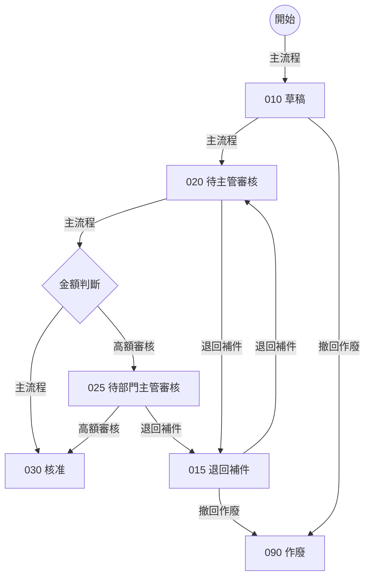
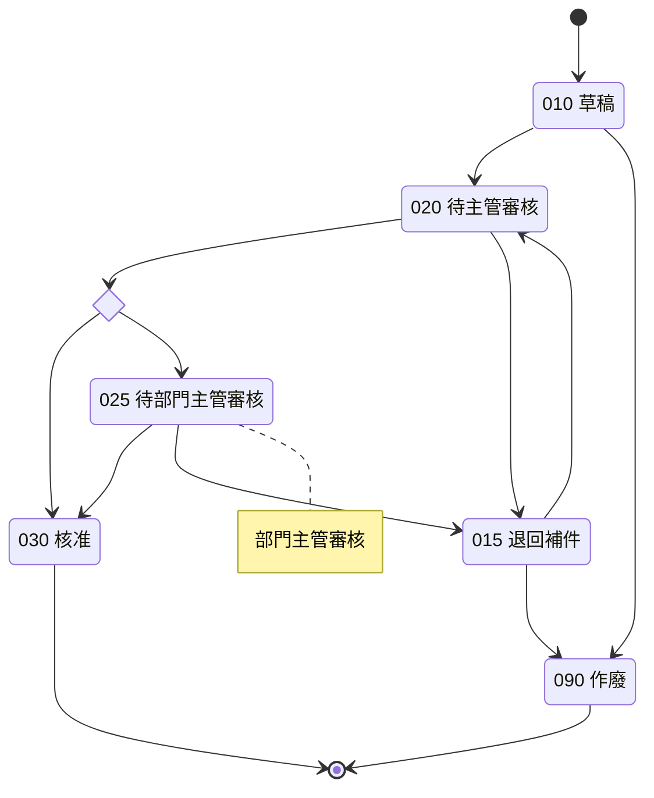

# 貫穿範例：申請／審核（合成）

> [設計提案](../spec-schema-framework.md)的附件。全部是合成資料：
>
> - Component：`TW_DEMO_REQ`（申請）、`TW_DEMO_APV`（審核）。
> - 狀態碼：010～090。
> - 人員：E1001 申請人、E2001 直屬主管、E3001 部門主管。
>
> 本範例的檔案：
>
> - [input/](examples/walkthrough/input/)：使用者提供的輸入。
> - [canonical/](examples/walkthrough/canonical/)：外環產生的 JSON。
> - [rendered/](examples/walkthrough/rendered/00-index.md)：讀者看到的 Markdown。
> - [gate-report.json](examples/walkthrough/gate-report.json)：檢核結果。
>
> 以上全部由 `tools/build.py` 重建與驗證；本頁的表格與程式碼區塊也是同一次產生的。

## 1. 情境

- **主流程**：員工在申請畫面建立申請單（金額、事由），存檔後是草稿（010）。送出後（020）由直屬主管審核：
  - 金額不超過 50000：核准即結案（030）。
  - 金額超過 50000：轉給部門主管再審（025），部門主管核准後結案（030）。
- **退回**：審核者可以填意見退回（015）；申請人補件後重新送出，回到直屬主管審核。
- **撤回**：草稿或退回中的申請單可以撤回作廢（090）。

舊系統另有幾個「產品內建、業務沒在用」或「圖上沒有」的東西，用來示範 §8.6 的處理：

- 審核 Component 載入時，有一段程式在特殊參數下會把核准單改回草稿（030→010），狀態圖沒有這條轉移。
- PROD 還有舊制的狀態碼 099 的資料。
- 狀態欄位的值域另定義了 040、050，但沒有資料，也沒有核心程式使用。
- 申請單主檔有兩個原生欄位（`OLD_REF_NO`、`PRIORITY_CD`）全表沒有值，核心程式也沒有引用。

## 2. 輸入

[STATUS 文件](examples/walkthrough/input/status-REQ_STATUS.md)內有兩張圖。flowchart 的邊標情境類型：



stateDiagram-v2 沒有邊標籤，金額分岔用 `<<choice>>`：



[專案輸入檔](examples/walkthrough/input/project.md)提供目標、決策責任（業務單位主管、業務承辦窗口），並把狀態實體 `REQ_STATUS` 綁到 `TW_DEMO_REQHDR.REQ_STATUS`。

## 3. 外環先做的事：解析與比對

研究開始前，外環解析兩張圖。收合時：

- `D1{金額判斷}` 與 `amount_check` 都是虛擬節點，會被收合。
- 收合後的情境類型取最後一段邊的標籤；例如 `N020 →（主流程）D1 →（高額審核）N025` 歸「高額審核」。

<!-- GEN:parse -->
| 項目 | 結果 |
|---|---|
| flowchart 邊數 | 11 |
| stateDiagram-v2 邊數（含 [*] 與 choice） | 13 |
| 狀態碼 | 010、015、020、025、030、090 |
| 正規化後的狀態轉移 | *>010、010>020、010>090、015>020、015>090、020>015、020>025、020>030、025>015、025>030（共 10 條） |
| 終點狀態 | 030、090 |
| 兩圖狀態碼一致 | 是 |
| 兩圖轉移一致 | 是 |
| 情境「主流程」 | *>010、010>020、020>030 |
| 情境「撤回作廢」 | 010>090、015>090 |
| 情境「退回補件」 | 015>020、020>015、025>015 |
| 情境「高額審核」 | 020>025、025>030 |
<!-- /GEN -->

兩圖一致，所以研究可以開始。這 10 條轉移與 4 種情境就是 04 的分母：研究只能補細節，不能增減。

## 4. ID 派發

外環依自然鍵的字元碼順序派號（主文件 §7.2）。所以 FR-001 是「核准」而不是「建立」：ID 不代表順序，17 另有 `order` 欄。

<!-- GEN:ids -->
| ID | 自然鍵 | 名稱 |
|---|---|---|
| STATE-001 | `REQ_STATUS:010` | 010 草稿 |
| STATE-002 | `REQ_STATUS:015` | 015 退回補件 |
| STATE-003 | `REQ_STATUS:020` | 020 待主管審核 |
| STATE-004 | `REQ_STATUS:025` | 025 待部門主管審核 |
| STATE-005 | `REQ_STATUS:030` | 030 核准 |
| STATE-006 | `REQ_STATUS:090` | 090 作廢 |
| TRN-001 | `REQ_STATUS:*>010` | 新建→010 |
| TRN-002 | `REQ_STATUS:010>020` | 010→020 |
| TRN-003 | `REQ_STATUS:010>090` | 010→090 |
| TRN-004 | `REQ_STATUS:015>020` | 015→020 |
| TRN-005 | `REQ_STATUS:015>090` | 015→090 |
| TRN-006 | `REQ_STATUS:020>015` | 020→015 |
| TRN-007 | `REQ_STATUS:020>025` | 020→025 |
| TRN-008 | `REQ_STATUS:020>030` | 020→030 |
| TRN-009 | `REQ_STATUS:025>015` | 025→015 |
| TRN-010 | `REQ_STATUS:025>030` | 025→030 |
| FLOW-001 | `REQ_STATUS:主流程` | 主流程 |
| FLOW-002 | `REQ_STATUS:撤回作廢` | 撤回作廢 |
| FLOW-003 | `REQ_STATUS:退回補件` | 退回補件 |
| FLOW-004 | `REQ_STATUS:高額審核` | 高額審核 |
| FR-001 | `TW_DEMO_APV:APPROVE` | 核准申請 |
| FR-002 | `TW_DEMO_APV:RETURN` | 退回申請 |
| FR-003 | `TW_DEMO_REQ:CREATE` | 建立申請 |
| FR-004 | `TW_DEMO_REQ:SUBMIT` | 送出申請 |
| FR-005 | `TW_DEMO_REQ:WITHDRAW` | 撤回申請 |
<!-- /GEN -->

## 5. 從一個功能往下看（反向追溯）

issue 裡「FR-001 往下展開」的樹，在這套設計中不是誰手寫的。FR-001 只記錄自己往上游的參照：實現的轉移、操作者。下面這棵樹由外環從下游項目的參照反查得到，00-index 的追溯矩陣也是同樣算法。

<!-- GEN:fr-tree:FR-001 -->
```text
FR-001 核准申請
 ├─ 角色：ROLE-001 審核主管
 ├─ 衍生概念：DRV-002 申請人的直屬主管、DRV-001 申請人的部門主管
 ├─ 狀態轉移：TRN-007 020→025、TRN-008 020→030、TRN-010 025→030
 ├─ 情境：FLOW-001 主流程、FLOW-004 高額審核
 ├─ 畫面元件：UI-001 申請單審核、UI-002 金額、UI-003 審核意見、UI-004 申請事由、UI-005 核准
 ├─ 操作契約：OP-001 核准申請
 ├─ 寫入／讀取的欄位（經 TRN、OP）：FLD-010 TW_DEMO_REQHDR.AMOUNT、FLD-011 TW_DEMO_REQHDR.APPROVER_EMPLID、FLD-012 TW_DEMO_REQHDR.APPROVE_DT、FLD-013 TW_DEMO_REQHDR.COMMENTS、FLD-016 TW_DEMO_REQHDR.REQ_ID、FLD-017 TW_DEMO_REQHDR.REQ_STATUS
 ├─ 測試案例：TC-001 金額剛好 50000 時一次核准、TC-002 金額 50000.01 時轉部門主管、TC-003 具審核角色但不是直屬主管者看不到申請單、TC-004 高額案件兩段核准
 └─ 工作項：TASK-002 核准申請
```
<!-- /GEN -->

## 6. 「長官」怎麼寫

轉移 020→030（TRN-008）的操作者條件不寫「需要長官審核」，而是兩個運算元：

- 使用者具有審核主管角色（ROLE-001）。
- 使用者是〈申請人的直屬主管〉（DRV-002）。

<!-- GEN:item:TRN-008 -->
```json
{
  "id": "TRN-008",
  "key": "REQ_STATUS:020>030",
  "lifecycle": "ACTIVE",
  "basis": "AUTHORITATIVE_DOC",
  "certainty": "CONFIRMED",
  "evidence": [
    "EV-0050",
    "EV-0051",
    "EV-0018",
    "EV-0019"
  ],
  "entityKey": "REQ_STATUS",
  "from": "STATE-003",
  "to": "STATE-005",
  "via": [
    "amount_check"
  ],
  "trigger": {
    "kind": "USER_ACTION",
    "object": "OBJ-002",
    "action": "按「核准」（TW_DEMO_REQWRK.APPROVE_PB）",
    "event": "FIELD_CHANGE"
  },
  "actor": {
    "all": [
      {
        "left": {
          "ctx": "CURRENT_USER_OPRID"
        },
        "op": "HAS_ROLE",
        "right": {
          "role": "ROLE-001"
        }
      },
      {
        "left": {
          "drv": "DRV-002"
        },
        "op": "EQ",
        "right": {
          "ctx": "CURRENT_USER_EMPLID"
        }
      }
    ]
  },
  "guard": {
    "left": {
      "fld": "FLD-010"
    },
    "op": "LE",
    "right": {
      "const": "50000",
      "type": "NUMBER"
    }
  },
  "writes": [
    {
      "field": "FLD-017",
      "value": {
        "const": "030",
        "type": "CHAR"
      }
    },
    {
      "field": "FLD-011",
      "value": {
        "ctx": "CURRENT_USER_EMPLID"
      }
    },
    {
      "field": "FLD-012",
      "value": {
        "ctx": "CURRENT_DATE"
      }
    }
  ],
  "sideEffects": {
    "na": "轉移本身沒有其他副作用；送出通知由 09 的規則觸發"
  },
  "implementedAt": [
    {
      "object": "OBJ-012",
      "event": "FieldChange"
    }
  ],
  "reentry": "核准後按鈕隱藏；兩位審核者同時核准時，後存檔者被拒絕（見 08 的併發行為）。"
}
```
<!-- /GEN -->

「申請人的直屬主管」在 07 定義成一筆衍生概念，寫明：

- 從哪張表、用什麼串接、取哪一欄。
- 有效日怎麼取（目前有效列、只取有效狀態）。
- 查不到時結果為空，由 09 的規則在送出時擋下。
- 為什麼不會有多筆。

<!-- GEN:item:DRV-002 -->
```json
{
  "id": "DRV-002",
  "key": "REQUESTER_SUPERVISOR",
  "lifecycle": "ACTIVE",
  "basis": "CODE",
  "certainty": "CONFIRMED",
  "evidence": [
    "EV-0026",
    "EV-0014"
  ],
  "name": "申請人的直屬主管",
  "meaning": "申請人目前任職資料上登記的直屬主管；送出時必須存在，020 由此人審核。",
  "inputs": [
    {
      "name": "REQUESTER",
      "from": {
        "fld": "FLD-015"
      }
    }
  ],
  "resultType": "PERSON_ID",
  "resolution": {
    "sources": [
      "ENT-002"
    ],
    "joins": [
      {
        "left": "FLD-008",
        "right": {
          "param": "REQUESTER"
        }
      }
    ],
    "filter": "ALWAYS",
    "effectiveDating": [
      {
        "entity": "ENT-002",
        "rule": "CURRENT_ROW",
        "asOf": {
          "ctx": "CURRENT_DATE"
        },
        "effStatusActiveOnly": true
      }
    ],
    "pick": "FLD-009",
    "tieBreak": {
      "na": "鍵（EMPLID＋EFFDT）加目前有效列規則保證只有一列"
    }
  },
  "whenNotFound": {
    "result": "EMPTY",
    "note": "查無目前有效的任職列，或 SUPERVISOR_ID 為空白時結果為空；送出時由 09 的規則擋下。"
  },
  "whenMultiple": {
    "rule": "UNIQUE_BY_KEY",
    "note": "目前有效列規則下每位員工只有一列。"
  },
  "implementedAt": [
    "OBJ-014",
    "OBJ-012",
    "OBJ-013"
  ]
}
```
<!-- /GEN -->

讀者在 04 看到的是外環渲染出的句子：

<!-- GEN:rendered:04-workflow:TRN-008 -->
```markdown
### TRN-008　020→030

- 自然鍵：`REQ_STATUS:020>030`
- 狀態實體：REQ_STATUS
- 起始狀態（新建為 INITIAL）：STATE-003（020 待主管審核）
- 目標狀態：STATE-005（030 核准）
- 收合掉的 choice／fork／join 節點：amount_check
- 觸發方式、所在物件與動作原名：
  - 種類：USER_ACTION
  - 物件：OBJ-002（TW_DEMO_APV）
  - 動作：按「核准」（TW_DEMO_REQWRK.APPROVE_PB）
  - 事件：FIELD_CHANGE
- 誰能觸發（角色、資格的判定方式）；只有批次觸發可以是 NA：（目前使用者帳號 具有角色 ROLE-001（審核主管））且（〈申請人的直屬主管〉（DRV-002） ＝ 目前使用者員工編號）
- 轉移條件（選擇此目標的條件）：FLD-010（TW_DEMO_REQHDR.AMOUNT） ≤ 50000
- 轉移時寫入的欄位與值：FLD-017（TW_DEMO_REQHDR.REQ_STATUS） ← '030'、FLD-011（TW_DEMO_REQHDR.APPROVER_EMPLID） ← 目前使用者員工編號、FLD-012（TW_DEMO_REQHDR.APPROVE_DT） ← 系統日期
- 其他副作用（通知、介面等於 06／09 反查）：不適用：轉移本身沒有其他副作用；送出通知由 09 的規則觸發
- 原系統實作位置：
  - 物件：OBJ-012（TW_DEMO_REQWRK.APPROVE_PB.FieldChange）；事件：FieldChange
- 重複觸發或同時操作時的行為：核准後按鈕隱藏；兩位審核者同時核准時，後存檔者被拒絕（見 08 的併發行為）。
- 來源：狀態權威文件；證據 EV-0050、EV-0051、EV-0018、EV-0019
- 被引用（外環反查）：OBJ-012；FLOW-001；FR-001；OP-001；TC-001、TC-003、TC-010；TASK-002；DOD-003
```
<!-- /GEN -->

## 7. 圖外發現怎麼處理

| 發現 | 證據 | 處理 |
|---|---|---|
| PROD 有狀態碼 099 的資料，圖上沒有 | 狀態欄位的 distinct 值查詢 | Q-001，OFF_DIAGRAM_STATE，HIGH，INFO，OPEN；不進 04，也不進 07 的值域 |
| `TW_DEMO_APV.PostBuild` 在特殊參數下把 030 改回 010 | 程式段落 | Q-002，OFF_DIAGRAM_TRANSITION，LOW，INFO；人工裁決 DEC-001「不重建」後標 ANSWERED。這支程式在 09 的處置是 OFF_DIAGRAM_ONLY |
| 值域有 040、050，但沒有資料、核心程式不用 | 值域定義 | 不列題，90 與 00-index 只顯示「只計數的定義值 2」 |
| `OLD_REF_NO`、`PRIORITY_CD` 全表非預設 0 筆、核心路徑沒有指名引用 | 資料彙總與交叉參照 SQL | 07 的 XF-001；01 的 Record 判定寫「排除 2 欄」；其他文件不得出現這兩個欄位名（R04） |

圖外問題都是 INFO，不擋完成；HIGH 級要人逐一裁決。

## 8. 檢核結果

L1～L3 由 `tools/assemble_check.py` 實際執行。L4、L5 是示意值：範例假設已執行並通過，沒有真的跑覆核與讀者。

<!-- GEN:gate -->
| 文件 | 狀態 | L1 | L2 | L3 | L4 | L5 |
|---|---|---|---|---|---|---|
| 01 專案概覽 | in_review | PASS | PASS | PASS | PASS | NOT_APPLICABLE |
| 02 功能需求 | in_review | PASS | PASS | PASS | PASS | PASS |
| 03 角色與權限 | in_review | PASS | PASS | PASS | PASS | PASS |
| 04 流程與狀態機 | in_review | PASS | PASS | PASS | PASS | PASS |
| 05 畫面與互動 | in_review | PASS | PASS | PASS | PASS | PASS |
| 06 系統架構（技術中立） | in_review | PASS | PASS | PASS | PASS | PASS |
| 07 資料設計 | in_review | PASS | PASS | PASS | PASS | PASS |
| 08 操作契約（API） | in_review | PASS | PASS | PASS | PASS | PASS |
| 09 業務邏輯 | in_review | PASS | PASS | PASS | PASS | PASS |
| 14 測試與驗收 | draft | PASS | PASS | FAIL | PASS | NOT_APPLICABLE |
| 16 AI 實作指引 | in_review | PASS | PASS | NOT_APPLICABLE | NOT_APPLICABLE | NOT_APPLICABLE |
| 17 工作拆解與相依 | in_review | PASS | PASS | PASS | NOT_APPLICABLE | NOT_APPLICABLE |
| 18 完成定義 | in_review | PASS | PASS | PASS | NOT_APPLICABLE | NOT_APPLICABLE |
| 19 決策紀錄 | in_review | PASS | PASS | NOT_APPLICABLE | NOT_APPLICABLE | NOT_APPLICABLE |
| 90 問題清單 | in_review | PASS | PASS | NOT_APPLICABLE | NOT_APPLICABLE | NOT_APPLICABLE |

未通過的檢核：

- `14-testing/L3` C07 TRN-005（015>090）沒有測試案例
- `14-testing/L3` C07 TRN-009（025>015）沒有測試案例
<!-- /GEN -->

範例故意少寫兩個測試案例：「退回補件中撤回」（015→090）、「部門主管退回」（025→015）。L3 的 C07 抓到後，14 停在 draft，整體狀態是 DRAFT，00-index 的「未通過的檢核」也會列出來。補上兩個案例重跑，14 才會變成 in_review。

### 壞範例：刻意破壞後由哪一層擋下

`tools/negative_check.py` 對上面的範例做 9 種破壞，每一種都必須被對應的檢核擋下，`tools/build.py` 會驗證這一點。這就是 issue 完成標準所說的「能檢查缺欄位、缺引用或含未確認假設」。

<!-- GEN:negative -->
| 破壞方式 | 預期 | 結果 | 檢核訊息 |
|---|---|---|---|
| 缺欄位：TRN-008 刪掉 guard | L1 S01 | 擋下 | TRN-008 （項目）：'guard' is a required property |
| 模糊條件：BR-006 的條件寫成「需要長官審核」 | L1 S01 | 擋下 | BR-006 condition：'需要長官審核' is not valid under any of the given schemas |
| 填充字：FR-004 的說明寫「待確認」 | L1 S01 | 擋下 | FR-004 description：命中禁用的填充字 |
| 未標示推論：DRV-002 改成 INFERRED 卻沒寫推論鏈 | L1 S01 | 擋下 | DRV-002 （項目）：'inference' is a required property |
| 推測寫成事實：OP-001 的併發行為寫「應該是後存檔者覆蓋」 | L1 S07 | 標出（警告） | OP-001 CONFIRMED 項目出現推測用語「應該是」（警告，交覆核） |
| 缺引用：OP-004 的檢核清單指向不存在的 BR-099 | L2 R01 | 擋下 | OP-004 參照不存在的 BR-099 |
| 往下游參照：FLD-010 宣稱推導自 TC-001 | L2 R03 | 擋下 | FLD-010 往下游參照 TC-001 |
| 不建置欄位寫進正文：BR-003 的邊界提到 OLD_REF_NO | L2 R04 | 擋下 | BR-003 正文寫到不建置欄位 OLD_REF_NO |
| 圖外轉移寫進 04：新增 030→010 | L3 C01 | 擋下 | 04 有狀態圖沒有的轉移 ['030>010'] |
<!-- /GEN -->

「推測寫成事實」是 L1 的警告（S07）而不是失敗：用語比對無法證明一句話是假設，所以只負責把它標出來，交給 L4 覆核確認，或改開問題。

## 9. 乾淨讀者（示意）

下面三個情況示範 L5 怎麼判定。範例資料是修正後的最終版；Q-003 記錄了第一個情況，狀態是 WITHDRAWN。

**情況一：描述太簡略（UNDERSPECIFIED）**

第一版 OP-001 的併發行為只寫「原系統有檢查」。O2 題「兩人同時核准會怎樣」：

| 讀者 | 答案 | 引用 |
|---|---|---|
| 實作者 | NOT_IN_SPEC | — |
| 測試者 | 「後存檔者失敗」，但說不出訊息與資料狀態 | 08-api.md#OP-001 |

- **判定**：UNDERSPECIFIED。外環開 Q-003（BLOCKING），工單退回操作研究。
- **修正**：補成「開啟後到存檔之間若已被他人更新，存檔被拒絕並顯示 MSG-004，該筆維持先存檔者的結果」。
- **重問**：兩位都答出 STALE_DATA_CHECK 與 MSG-004，判定 CONSISTENT；Q-003 改為 WITHDRAWN。

**情況二：有歧義（DIVERGENT）**

第一版 BR-003 的邊界只寫「金額須為正數」。B4 題「空白、0、邊界怎麼算」：

| 讀者 | 答案 |
|---|---|
| 實作者 | 最小 0.01 |
| 測試者 | 最小 1（以為是整數） |

- **判定**：DIVERGENT，退回規則研究。
- **修正**：補成「0 拒絕；最小可接受 0.01（小數 2 位）；未輸入時存 0，視同 0 拒絕」，並由 TC-007 覆蓋 0.01。

**情況三：讀者腦補（HALLUCINATION_SUSPECT）**

F2 題「核准後會發生什麼」，有一位讀者答「寄信通知申請人」，但沒有有效引用（文件沒有這件事）。

- 只有一位這樣答：丟棄那個答案、重問。
- 兩位都這樣答：表示文件沉默反而引人假設，視同 UNDERSPECIFIED，要研究端把「核准後不通知任何人」寫成明確的否定事實（若程式確實如此）。

## 10. 讀者看到的檔案

| 檔案 | 內容 |
|---|---|
| [00-index.md](examples/walkthrough/rendered/00-index.md) | 閱讀順序、各文件檢核、ID 前綴對照、追溯矩陣、問題摘要、欄位統計 |
| [04-workflow.md](examples/walkthrough/rendered/04-workflow.md) | 由資料重新產生的狀態圖與情境圖；狀態、轉移、情境明細 |
| [07-database.md](examples/walkthrough/rendered/07-database.md) | 實體、欄位、衍生概念（直屬主管、部門主管）、不建置欄位 |
| [09-business-logic.md](examples/walkthrough/rendered/09-business-logic.md) | 程式處置表、規則、訊息 |
| [14-testing.md](examples/walkthrough/rendered/14-testing.md) | 14 個案例；開頭標示 draft 與 L3 FAIL |
| [90-questions.md](examples/walkthrough/rendered/90-questions.md) | 3 個問題與只計數的定義值 |

其餘文件（01、02、03、05、06、08、16、17、18、19）在同一個目錄。每個項目末尾的「被引用」都由外環反查。
